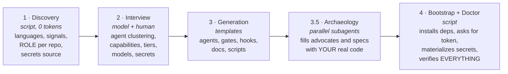
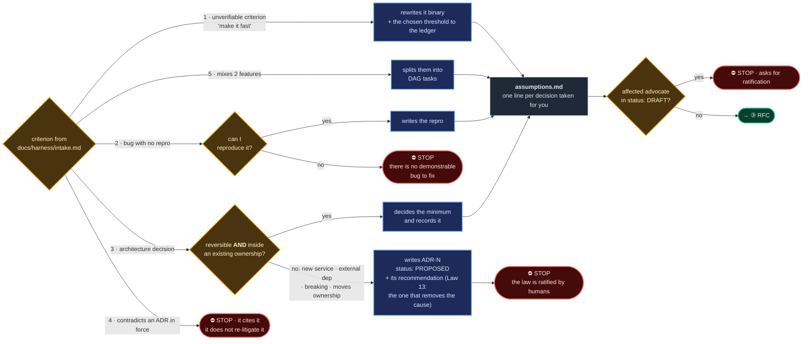
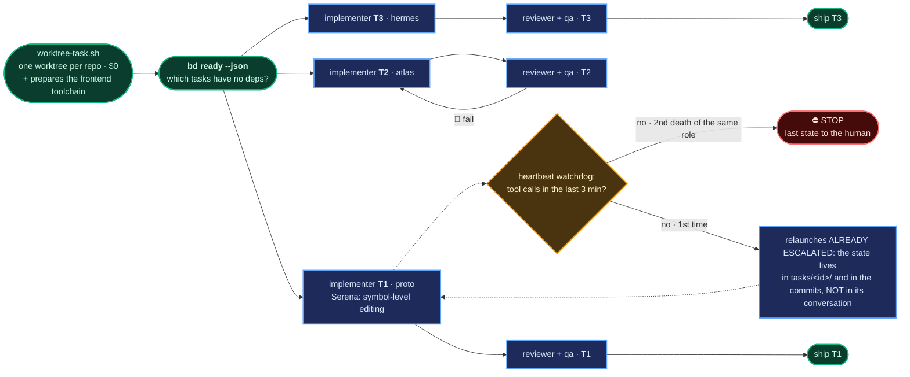
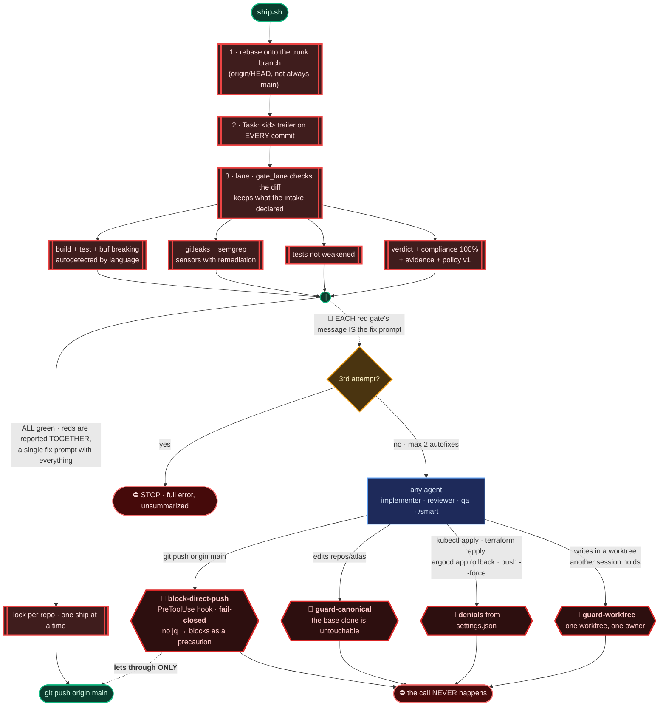
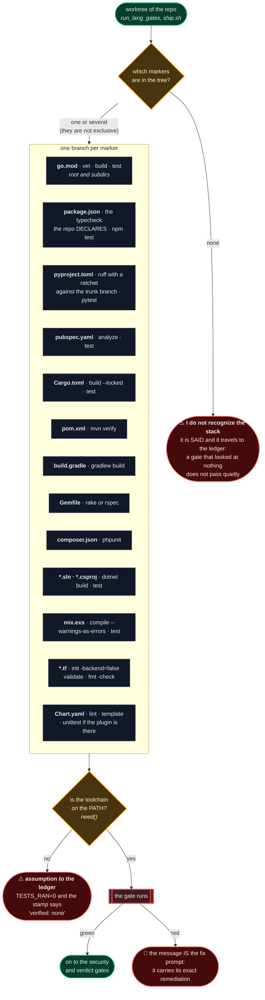
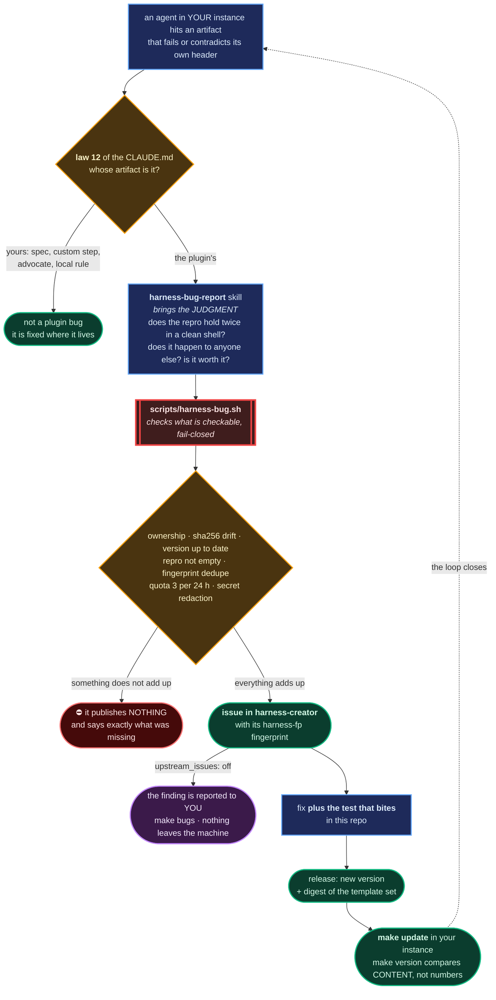
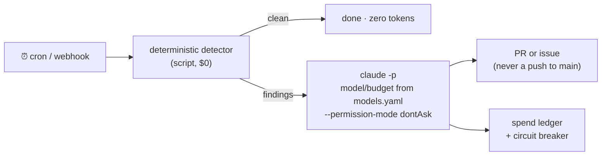
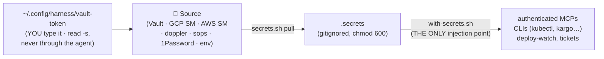

# harness-creator

🇪🇸 [Versión en español](README.md)

**Universal installer for multi-repo agentic engineering harnesses**, shipped as a Claude Code plugin.

You point it at a folder holding your repositories and it generates a complete *harness* adapted to your stack: agents with real knowledge of your code, deterministic gates that protect `main`, a ticket-to-production pipeline **sized to the blast radius** (a small task runs with 2 LLM sessions; a multi-service migration runs the full pipeline), memory, secrets, nightly self-healing and living documentation. It works for any project, a 24-repo multi-tenant SaaS or a small monorepo, because it **discovers** your stack instead of assuming it. It targets Claude Code, but it generates `AGENTS.md` (the multi-tool standard): Cursor, Kimi Code, Codex or any other agent can read and operate the same harness.

> **Philosophy (one line):** *agents propose, deterministic systems verify.* Every check a script can make, a script makes; models only bring judgment where judgment is needed. And laws are not prose: each one has a hook or a gate behind it.
>
> **Speed corollary:** because safety lives in the gates, the canary and the rollback, and not in the number of LLM phases, the pipeline cuts deliberation without cutting verification: lanes by blast radius, parallel gates, reviewer and qa at the same time, deterministic prefetch and warm starts.

---

## Glossary: the ten words you need before going on

If you have never worked with coding agents, this section saves you the rest of the document. Each term comes with what it means and **why it exists here**.

| Word | What it means | Why it matters in this harness |
|---|---|---|
| **Harness** | Everything wrapped around the model so its work becomes trustworthy. Rules, automatic checks, limits and memory. | A model on its own writes code. A model with a harness writes code **that something verified**. This repo is not an agent: it is the factory that builds that harness around your repos. |
| **Deterministic** | A program that, given the same input, always produces the same output. A shell script is deterministic; a language model is not. | It is the line that divides the whole design. What a script can check, a script checks (it costs $0 and does not fail differently each time). The model only steps in where criteria are required. |
| **Gate** | A check that **blocks**. If it comes back red, the work does not move forward. Example: "tests must pass before touching `main`". | It is the difference between asking for something and guaranteeing it. A gate cannot be talked into anything. |
| **Hook** | A program that fires **before or after** an agent uses a tool, and can cancel the call. | Writing "do not push to `main`" in a document is a suggestion an agent can rationalize away. A hook intercepts the call and cancels it: the command never runs. |
| **Worktree** | An independent working copy of the same git repository, in another folder and on another branch. | Every task works in its own. Two tasks never step on each other's files, and the original clone stays untouched. |
| **Blast radius** | How much a change can break if it goes wrong. Changing a label has a small radius; moving a database between services has a large one. | The pipeline is sized to this. A small task does not pay the same ceremony toll as a migration. |
| **Lane** | The process size assigned to a task according to its blast radius: `quick`, `express`, `standard` or `full`. | It is the concrete mechanism for the line above. In `express` a task uses 2 model sessions instead of 6, and in `quick` there is no deliberation at all, always with the **same** gates. |
| **DAG** | Directed acyclic graph. In plain terms: a list of tasks with their dependencies, where nothing can depend on itself. | It says what can run **in parallel** and what has to wait. It is the only authority over work order. |
| **Canary** | Deploying the change first to a reduced group (one customer, one environment) before everyone. | If something goes wrong, it goes wrong small. The name comes from the canary in the mine: it finds out before you do. |
| **Fail-open / fail-closed** | What a component does when **it itself** fails. *Fail-closed* blocks as a precaution. *Fail-open* lets through. | This is not a detail: it is a per-component design decision. A broken security hook must block. A broken telemetry hook must let through, because taking down a deploy over a statistics problem would be absurd. |

<details>
<summary><b>Eleven more terms, for when you reach the technical sections</b> (click to open)</summary>

| Word | What it means | Why it matters |
|---|---|---|
| **Agent / subagent** | A model session with its own role, instructions and tools. A subagent is one that another agent launched. | The harness does not use "an AI": it uses several, each with one job and a bounded context. |
| **Idempotent** | Safe to repeat: running it twice leaves the same result as running it once. | The installer is. If something is interrupted, you run it again and it picks up, without duplicating or breaking what was already there. |
| **Assumption ledger** | A file where the agent records every thing it **assumed**, with what evidence and what undoing it would cost. | It is the first thing you read at the end. In 30 seconds you see every decision taken without you. |
| **Compliance matrix** | A table pairing each requirement with the test that proves it. | "The review approved" is an opinion. "Requirements covered: 100%, and here is the test for each" is machine-verifiable. |
| **Evidence** | The record that something actually ran: which command, on which exact commit, with what output. | It stops an agent from saying "tests pass" without having run them. The proof is tied to the commit and expires with it, so it is recorded with a clean tree: with uncommitted changes the stamp would name one commit and have proven something else. |
| **Spec / EARS** | The specification of system behavior. EARS is a fixed sentence format: *WHEN X happens, THE SYSTEM SHALL do Y*. | Written that way, a requirement cannot be read two ways, and you can point at it in an argument. |
| **Spec-rot** | Specification rot: the document says one thing and the code does another, because nobody updated the document. | It is the classic failure of this approach. Here the spec merge is automatic at the end of every task, precisely so it does not depend on anyone's discipline. |
| **ADR** | *Architecture Decision Record*: a short document recording an important decision, its context and its alternatives. | It is where the law lives. A decision that is not in an ADR does not exist, even if it was discussed in a chat. |
| **Rollback** | Going back to the previous version that worked. | Facing a broken deploy the order is not negotiable: first go back, then investigate. Diagnosing with the fire still burning is the worst possible use of 20 minutes. |
| **Forge** | Where your repositories and their CI live: GitHub, GitLab, Bitbucket. Not the same as git, which is the tool. | The harness delivers its work there (PRs, issues) and asks it about CI state, so it has to know which one it is talking to. It is detected from the remote. |
| **Prefetch** | Preparing ahead of time, in the background, what will be needed later. | While the architect thinks, scripts are already cloning, installing dependencies and building summaries. When the implementer starts, the table is already set. |

</details>

---

## Index

1. [Quickstart](#quickstart)
2. [How the installer works](#how-the-installer-works)
3. [What it generates: anatomy of an instance](#what-it-generates-anatomy-of-an-instance)
4. [The master diagram: what happens when you run `/smart`](#the-master-diagram-what-happens-when-you-run-smart)
5. [How to read the diagram](#how-to-read-the-diagram)
6. [The panel: `make ui`](#the-panel-make-ui)
7. [Components, one by one](#components-one-by-one)
8. [Self-healing: the cronjobs](#self-healing-the-cronjobs)
9. [Secrets](#secrets)
10. [How flexible it is](#how-flexible-it-is)
11. [Updates](#updates)
12. [Structure of this repo](#structure-of-this-repo)
13. [Tests](#tests)

---

## Quickstart

**Path A, the web wizard (recommended):**

```bash
brew install andresgarcia29/agm/harness
harness init          # opens the wizard at http://127.0.0.1:7180/#/init
```

The wizard takes you from zero to harness: folder, GitHub (`gh` or token), cloning repos, requirements, auto-discover, pre-filled interview with evidence, agents and archaeology, MCPs with certified secrets, first tasks, doctor green. All idempotent and resumable: if something dies, `harness init` picks up at the exact step. Scriptable without a UI: `harness discover` + `harness generate --answers answers.json`.

**Path B, the Claude Code plugin (the conversational interview):**

```bash
# 1. Prepare the workspace: your repos cloned under repos/
mkdir my-workspace && cd my-workspace
mkdir repos && git clone <your-repos> repos/

# 2. Install the plugin (inside a Claude Code session)
/plugin marketplace add andresgarcia29/harness-creator
/plugin install harness-creator@harness

# 3. Install the harness (guided interview, ~10 min)
/harness-init .

# 4. One-pass onboarding (deps, credentials, secrets, health)
make init
```

After that, the day to day is **a single line**:

```
/smart COR-123                                  # a Linear ticket
/smart "add per-tenant rate limiting to the gateway, 100 req/min"   # or a literal prompt
/smart COR-123 --model deep                     # same task, model chosen by you
```

`/smart` runs the whole pipeline (enrichment, lane, RFC if it applies, implementation, review and, if the declared delivery authorizes it, ship, deploy and archive) sized to the blast radius: a 1-repo change with no contracts goes down the express lane, which skips the RFC, and `gate_lane` verifies the diff keeps that promise. (This command used to be `/auto`: the name collided with Kimi Code's `/auto`, and the harness is multi-tool by design. `/auto` stays one cycle as a deprecation pointer that redirects to `/smart` with the same arguments.)

**Your only intervention happens at the beginning.** The first step, the *enrichment*, investigates your code, understands the task and asks you **a single round of questions**, only if there is something your own repository cannot answer. From there it runs alone until the final report. If you prefer to drive phase by phase, the individual commands are still there: `/feature`, `/rfc`, `/implement`, `/review`, `/ship`, `/archive`.

And there is a shortcut for the other extreme: **`/quick "<what>"`**, for the trivial thing you already sized: zero deliberation, same gates. One repo, up to 8 files and 200 changed lines (the ceilings live in `harness-policy.json`); if the diff goes over, `gate_lane` stops it and sends you to `harness-policy.py escalate --to express`.

### The invocation declares the delivery, not a chat mid-flight

Same pipeline, same gates, three different endings, and you pick the ending **when you invoke**:

| Invocation | What you get | What it does NOT do |
|---|---|---|
| `/smart <ticket \| "prompt">` | finished, auditable work: commits in the worktree, review verdict and sealed evidence | does not push, does not open a PR, does not touch `main` |
| `/smart-pr <ticket \| "prompt">` | the same, plus the branch published and the PR opened | does not merge |
| `/smart-main <ticket \| "prompt">` | the same, landed on `main` by `ship.sh` with all its gates | leaves nothing half done |

**Why it changed** (and this is the real case, not a hypothesis): agents would finish implementing and ask in the chat *"I did not commit or ship, should I take it through `/review` + ship?"*. It was not model timidity: **delivery was not declared anywhere mechanical**, so asking was the right thing to do. Today the invocation declares it and it travels as typed data in `tasks/<id>/state.json` (`delivery: review | prs | trunk`, the same vocabulary as the `flow` knob), so **asking permission to commit or publish is now forbidden** in the closed list of stops: the invocation already answered that question. Mind the behavior change: until today `/smart` reached `main`; now `/smart` publishes nothing.

The "go" after a `/smart` is not a chat sentence either, it is a recorded command: `harness-policy.py delivery tasks/<id> --to prs --actor <you>` (or `--to trunk`) leaves the authorization in the task history, with actor and timestamp, like any other transition. It is audited like everything else.

Two things do **not** change. A task without a `delivery` field (older ones, and `/quick` ones) behaves exactly as before: `ship.sh` follows the `flow` you chose in the interview. And `autonomy: checkpoint` overrides the invocation, because it is workspace policy and not task policy: with checkpoint on, even `/smart-main` makes its single legitimate stop before publishing.

**Requirements**: macOS or Linux, `git`, `jq` (`brew install jq`), Claude Code. Everything else is installed by the bootstrap.

---

## How the installer works

Five phases. The deterministic ones are scripts (zero tokens); the model only steps in where there are decisions.



- **Discovery** (`scripts/discover.sh`): scans `repos/` and produces `inventory.json`. Per repo: languages, signals (buf, helm, argocd, kargo, docker) and an **inferred role** (service, frontend, mobile, library, contracts, infra-module, infra-live, ci-library, docs). It also detects your **secrets source** (`.sops.yaml`, `doppler.yaml`, `op://`, terraform with secret managers, `VAULT_ADDR`).
- **Interview**: the installer **recommends with evidence** ("I detected `buf.yaml` in `proto`, I propose the buf-breaking gate") and you decide. It never asks what the inventory already answers.
- **Generation**: instantiates the file set from templates. Idempotent: if something exists, it shows the diff and asks.
- **Light archaeology**: one subagent per service reads what is dense and cheap (README, migrations, protos) and fills the advocates' constitutions and the specs with **real ownership, invariants and requirements, citing evidence**. Everything lands in `DRAFT` state: archaeology proposes, the human ratifies.
- **Bootstrap + Doctor**: `make init` installs what is missing, asks for credentials interactively (values never pass through the agent), materializes secrets and ends in a health report where **every failure carries its exact remediation**.

**The installer is idempotent**: `/harness-init .` on an already installed workspace enters *update mode*. It does not re-ask anything, it migrates schemas, and every change is presented as a diff.

### The key decision: dynamic agent clustering

The installer does **not** create one agent per repo. It creates *advocates* per ownership domain:

| Detected role | Rule |
|---|---|
| `service` (owns data) | 1 advocate per service |
| `contracts` (proto) | no advocate, it is the referee; the architect and `buf` guard it |
| `infra-module`, `infra-live`, `ci-library`, helm | **ONE** single `infra` advocate for all of them |
| `frontend`, `mobile` | **ONE** `frontends` advocate (they own no data; they defend consumption contracts and experience) |
| `library` | no advocate, its consumers defend it |

Ceiling of about 12 agents; if there are more services, it proposes grouping by business domain. **20 terraform modules are 1 agent, not 20.** More agents is not a better harness: every agent is context and maintenance.

---

## What it generates: anatomy of an instance

```
my-workspace/
├── README.md                 ← onboarding for HUMANS (make init, where the token comes from)
├── CLAUDE.md                 ← map for Claude Code (≤110 lines; the laws, where the truth lives)
├── AGENTS.md                 ← the SAME map in the multi-tool standard (Cursor, Kimi, Codex)
├── manifest.yaml             ← canonical repo list + dependency DAG
├── models.yaml               ← THE model knob: provider + aliases fast|smart|deep + role→alias
├── harness-answers.yaml      ← ALL your interview decisions (input for updates)
├── harness-policy.json       ← the executable laws of the flow (phases, lanes, limits, stops)
├── Makefile                  ← human interface: init, doctor, secrets, wt, ship, watch
├── .mcp.json                 ← chosen MCPs (authenticated ones wrapped in with-secrets)
├── .claude/
│   ├── agents/               ← architect, reviewer, implementer, qa + advocates per cluster
│   ├── commands/             ← /smart (the whole pipeline) + /quick (the trivial)
│   │                           + /feature /rfc /implement /review /ship
│   │                           /promote /archive
│   ├── hooks/                ← block-direct-push, guard-canonical, guard-worktree
│   │                           (laws with teeth) + track-read, ui-emit,
│   │                           session-summary (observers, fail-open)
│   ├── skills/               ← skill-creator (the guide) + custom-build-skill and
│   │                           custom-edit-skill (create and change skills from
│   │                           a request in prose) + custom-build-rule and
│   │                           custom-edit-rule (your workspace's own laws)
│   │                           + the ones skill-miner extracts from your
│   │                           repeated procedures
│   ├── rules/                ← your custom rules: one law per file, with its
│   │                           tooth declared (the doctor verifies it)
│   └── settings.json         ← registered hooks + denials (kubectl apply, terraform apply)
├── docs/
│   ├── constitution.md       ← non-negotiable principles, injected into ALL agents
│   ├── architecture/map.md   ← data ownership per service (Law 3)
│   ├── harness/              ← pipeline.md, intake.md, testing-policy.md, cronjobs.md
│   ├── adr/                  ← decisions; nothing is official outside here
│   └── changelog/            ← generated daily digest
├── specs/<capability>/       ← master EARS + Gherkin specs, one per domain
├── scripts/
│   ├── bootstrap.sh          ← onboarding: deps + token + secrets + doctor
│   ├── doctor.sh             ← total health, every failure with remediation
│   ├── ship.sh               ← THE only door to main (gates)
│   ├── harness-policy.py     ← the phase engine: transition, rollback, pause, stale, validate-ship
│   ├── orchestrator-watch.sh ← watches the orchestrating session: relaunches what is stuck and runs the phase handoff
│   ├── verdict-scaffold.sh   ← deterministic verdict skeleton (+ --rebase)
│   ├── evidence.py           ← runs and seals evidence tied to an exact commit
│   ├── harness-version.sh    ← make version: up to date? + task state
│   ├── forge.sh              ← forge layer: CI, issues and PRs (github · gitlab)
│   ├── worktree-task.sh      ← one task = one worktree per repo
│   ├── secrets.sh            ← materializes secrets from your source
│   ├── with-secrets.sh       ← single secret injection point
│   ├── quiet.sh              ← truncates noisy outputs (token economy)
│   ├── deploy-watch.sh       ← watches Actions→Kargo→ArgoCD→rollout→smoke; safe rollback
│   ├── ticket-pull/close.sh  ← Linear bridge (GraphQL, zero tokens)
│   ├── ui/                   ← local read-only panel (make ui)
│   └── cronjobs/             ← cron-runner + chosen self-healing jobs
├── semgrep/rules.yaml        ← custom sensors WITH remediation in the message
├── repos/                    ← your clones (regenerable, protected by a hook)
├── .harness/
│   ├── events.jsonl          ← the harness event bus (the panel reads it)
│   ├── sessions/<id>.md      ← summary of each session on close, derived from the bus
│   └── claims/               ← which session holds each worktree
├── worktrees/<task>/<repo>   ← where the real work happens
└── tasks/<id>/               ← per-task state: task.md, enrichment.md, assumptions.md,
                                 state.json (phase + lane + session, moved by harness-policy.py),
                                 agents.json (ids to continue agents), handoff.json
                                 (phase handoff), plan.md, verdicts, evidence, logs
```

---

## The master diagram: what happens when you run `/smart`

First the **backbone**: the three entry points, where each agent wakes up, what blocks it, and the central fact: **every exit toward a human is enumerated in `/smart`, and they all live in a single red node**. Each block has its zoom in the next section. Colors matter; the legend is below.

```mermaid
flowchart TD

E1["🎫 <b>COR-123</b><br/>Linear ticket"]:::human
E2["💬 <b>'add per-tenant rate limiting<br/>to the gateway, 100 req/min'</b><br/>literal prompt"]:::human
E3["♻️ <b>AUTO-20260716-rate-limit</b><br/>task-id of a dead run"]:::human

E1 --> P0
E2 --> P0
E3 --> P0

P0{"<b>① /smart · step 0</b><br/>ticket, prompt or resume?"}:::dec

P0 -->|"COR-N or URL"| TP(["<b>ticket-pull.sh</b> · GraphQL · $0<br/>materializes task.md · label → in-harness"]):::script
P0 -->|"free text"| PR["<b>drafts the intake</b> · id AUTO-date-slug<br/>binary criteria · minimum scope · repos via the graph"]:::agent
P0 -->|"existing task-id"| RE(["<b>RESUME</b> · enters at the 1st phase<br/>with no valid artifact · nothing is regenerated"]):::script

TP --> TASK
PR --> TASK
TASK["<b>tasks/&lt;id&gt;/task.md</b>"]:::art --> ENR

ENR["<b>② ENRICHMENT</b> · the ONLY interaction with you<br/>first the TERRAIN (graph, briefs, ADR, ownership),<br/>then the task · resolves with evidence whatever is resolvable"]:::agent
ENR --> Q{"is there anything left<br/>that ONLY you know?"}:::dec
Q -->|"yes · max 5 questions, ONE round,<br/>each with its default"| ASK(["🙋 <b>one round of questions</b><br/>silence is a valid answer"]):::human
Q -->|"no · the common case"| LED
ASK --> LED

LED["<b>enriched task.md</b> + <b>enrichment.md</b> (auditable)<br/><b>assumptions.md</b> · the ledger for whatever comes AFTER<br/>ASSUMED · BECAUSE ⟨evidence⟩ · IF FALSE ⟨cost⟩"]:::art

LED --> PARA
LED --> LANE{"<b>②b LANE</b> by blast radius<br/>deterministic signals from inventory/graph<br/>when in doubt: the LARGER lane"}:::dec

PARA(["<b>⛔ THE 10 EMERGENCY STOPS</b><br/>ADR contradicted · irreversible decision<br/>DRAFT advocate · unreproducible bug<br/>RFC that will not converge · budget exhausted<br/>gate red x2 · dead subagent x2<br/>deploy 🔴 · nonexistent ticket"]):::stop

LANE -->|"<b>express</b> · 1 repo · 1 domain · no contracts<br/>orchestrator mini-plan · SKIPS the RFC"| IMP
LANE -->|"standard · architect without advocates<br/>full · complete pipeline"| RFC["<b>③ RFC</b> · advocates ONLY for crossed domains, in PARALLEL<br/>one JSON answer each · they never implement<br/><b>architect</b> = thin thread in <b>ultrathink</b>: splits into probes,<br/>workers answer in parallel, it synthesizes → plan.md · DAG · delta-spec<br/><b>plan-lint.sh</b> green or there is no implement · <i>prefetch in background ($0)</i>"]:::agent
RFC -.-> PARA

RFC --> IMP["<b>④ IMPLEMENT</b> · bd ready rules · warm start<br/>(worktree+deps+brief already prefetched) · 1 implementer =<br/>1 task = 1 worktree = 1 repo · what is parallel is NOT serialized<br/>heartbeat watchdog (~3 min with no tool calls)<br/><b>ship.sh --precheck</b> before delivering: red does NOT reach review"]:::agent
IMP -.-> PARA

IMP --> REV["<b>⑤ REVIEW</b> · queues on finish, not at the end<br/><b>reviewer ∥ qa</b> IN PARALLEL · mechanical merge of the qa field<br/>reviewer: verdict.json + compliance matrix 100% · <b>round 1 is exhaustive</b><br/>REAL incremental re-review: <b>verdict-scaffold --rebase</b><br/>carries the judgment the delta did not touch"]:::agent
REV -->|"🔴 fail · the error IS the fix prompt"| IMP
REV -.-> PARA

REV --> DEL{"<b>delivery</b> · declared by the INVOCATION<br/>data in state.json, never a question to the human"}:::dec
DEL -->|"<b>review</b> · /smart · nothing is published"| REP
DEL -->|"<b>prs</b> /smart-pr · <b>trunk</b> /smart-main<br/>or task with no field: the workspace flow rules"| CHK{"<b>autonomy</b> in harness-answers.yaml"}:::dec
CHK -->|"checkpoint · ONE extra pause before main"| GO(["10-line summary → 'go'"]):::human
CHK -->|"full · none"| SHIP
GO --> SHIP

SHIP(["<b>⑥ ship.sh</b> · THE only door to main · $0<br/>serial: rebase → trailer → lane (gate_lane)<br/>IN PARALLEL: build/test ∥ buf ∥ gitleaks ∥ semgrep<br/>∥ tests-not-weakened ∥ verdict+evidence · then lock → push"]):::script
HOOK{{"<b>🚫 hooks + denials</b> · fail-closed<br/>block-direct-push · guard-canonical · guard-worktree<br/>kubectl/terraform apply · push --force"}}:::hook
HOOK -.->|"block EVERY agent"| IMP
HOOK -.->|"let through ONLY"| SHIP
SHIP -->|"🔴 gate · max 2 autofixes"| IMP
SHIP -.-> PARA

SHIP --> DW(["<b>⑦ deploy-watch.sh</b> · $0, CPU only<br/>Actions → Kargo → ArgoCD health → pod rollout → canary smoke<br/>whatever it could NOT verify is declared as an assumption"]):::script
DW -->|"🔴"| RB(["<b>ROLLBACK FIRST</b> · abort-to-stable or revert<br/>diagnosis AFTER · never argocd app rollback"]):::script
RB --> PARA
DW -->|"🟢 · tasks left in the DAG"| SHIP

DW -->|"🟢 · DAG complete"| ARCH["<b>⑧ /archive</b> · merges the delta-spec into the<br/>master spec ← this is why there is no spec-rot<br/>ticket-close.sh · mem_save"]:::agent

ARCH --> REP(["<b>FINAL REPORT</b> · the only thing you read<br/>what was delivered (and how to publish it, if it stayed in review)<br/><b>the full ledger</b> · stops · ccusage cost"]):::human
REP -.->|"<b>/promote</b> weekly · the loop closes:<br/>false assumption → semgrep rule · mature decision → ADR"| SHIP

classDef script fill:#0b3d2e,stroke:#10b981,stroke-width:2px,color:#d1fae5
classDef agent fill:#1e2a5a,stroke:#60a5fa,stroke-width:2px,color:#dbeafe
classDef dec fill:#4a3410,stroke:#f59e0b,stroke-width:2px,color:#fef3c7
classDef hook fill:#2d0f0f,stroke:#dc2626,stroke-width:3px,color:#fecaca
classDef stop fill:#450a0a,stroke:#f87171,stroke-width:3px,color:#fee2e2
classDef human fill:#3b1a4a,stroke:#c084fc,stroke-width:2px,color:#f3e8ff
classDef art fill:#1f2937,stroke:#9ca3af,stroke-width:1px,color:#e5e7eb
```



### Legend

| Shape and color | What it is | Cost |
|---|---|---|
| 🟩 **green, rounded** | deterministic script | **$0**, zero tokens, CPU only |
| 🟦 **blue, rectangle** | agent (LLM) | tokens, model per `models.yaml` |
| 🟨 **amber, diamond** | decision the system makes **on its own** | nothing |
| 🟥 **red, double border** | `ship.sh` **gate**, blocks the push | $0 |
| 🟥 **dark red, hexagon** | **hook or denial**, blocks the agent before it acts | $0 |
| 🔴 **⛔ STOP** | the **10 emergency exits** to a human. The list is closed | nothing |
| 🟪 **purple** | the only points where a human touches the flow: the enrichment at the start and the report at the end | nothing |
| ⬜ **gray** | on-disk artifact (the real state) | nothing |

---

## How to read the diagram

Nine blocks (the eight pipeline ones plus the lane, which decides how much ceremony each task deserves). What follows explains **why** each one is the way it is. The diagram says what happens; this says why.

### ① Entry: three ways to start, none of them makes you work

A Linear ticket, a literal prompt in quotes, or the `task-id` of a run that died. `/smart` figures out which one it is without asking. The third case is the one you will be most grateful for: because **all state lives in `tasks/<id>/` and in the worktree commits, never in an agent conversation**, a session that dies mid-pipeline is resumed with `/smart <task-id>`, and it enters at the first phase whose artifact is missing. A valid artifact is never regenerated.

### ② Enrichment: the only time the harness talks to you

This is the step that makes everything else possible, and the trade it proposes is worth understanding: **the harness concentrates everything it needs from you at the start, so it does not have to interrupt you later**. The alternative, which is what almost every tool does, is asking you mid-flight, when you already lost the context of what you asked for and the interruption costs double.

It happens in four beats:

**1. Understand the terrain before the task.** The prefetch already set the table, so the agent starts from the code graph, the per-repository summaries, the `CLAUDE.md` of each affected repo, the ownership map and the ADRs in force. The rule is written in the command: *asking you something your own repository already answers is its work being billed to you*.

**2. Understand the task.** It validates the ticket against the input contract. A criterion that cannot be checked ("make it fast") gets rewritten as binary ("p95 under 300 ms on `/x`, measured by the smoke test"). Every ambiguity evidence can settle, it settles: there is a strict precedence, *master spec > ADR in force > the repo `CLAUDE.md` > the code pattern*, and on a tie the reading that is easiest to undo wins.

**3. Ask only what evidence cannot answer.** Here is the quality bar, which is what separates this phase from an annoying form. A question is legitimate only if it meets **both** conditions: the answer **changes what gets built**, and it is **not** in any of those four sources. If both possible answers lead to the same work, it is not asked. And there are three hard rules:

- **Five questions maximum, all in a single message.** It is not a conversation, it is one round. There is no second.
- **Every question carries the default** the agent will take if you do not answer. Silence is a valid answer and "use the defaults" is a one-word reply. The pipeline never stalls waiting for you.
- **If nothing qualifies, it does not ask.** It says so in one line and moves on. Manufacturing questions to look diligent turns this phase into ceremony, which is exactly what it came to avoid.

**4. Enrich.** It rewrites `tasks/<id>/task.md` with what it learned and leaves in `tasks/<id>/enrichment.md` what it asked, what you answered and what changed relative to your original prompt. That file is what makes the phase auditable: without it, "I enriched the prompt" would be a claim without evidence, and this harness does not accept claims without evidence anywhere else.

From here to the final report, the harness does not talk to you again unless it hits one of the ten emergency stops.

**Whatever comes up after that is no longer asked**, because you already left. It goes to the **assumption ledger** (`tasks/<id>/assumptions.md`), one line per decision: what it assumed, on what evidence, and what undoing it would cost if it was false. It is the first thing in the final report. And it feeds the system: an assumption that turned out false is material for `/promote`, which turns it into a semgrep rule or an ADR, so the next `/smart` does not repeat it. That is why the dotted arrow from the report goes back to the gates: **the loop closes**.

**Zoom: the five bounce criteria, and what `/smart` does with each.**



### ②b Lanes: the pipeline is sized to the blast radius

The safety of this harness lives in the deterministic gates, the canary and the rollback, **not in the number of LLM phases**. Hence the structural speed change: fixing a typo does not pay the same toll as a multi-service migration.

| Lane | Signals (deterministic: inventory, graph, manifest) | What it skips |
|---|---|---|
| **quick** | none: it is not inferred, the human declares it with `/quick`. Hard ceilings in `harness-policy.json`: **1 repo, 8 files, 200 changed lines** against the merge-base | **all deliberation**: enrichment, advocates, RFC, DAG, briefs and plan. Worktree, implementer, independent reviewer and QA remain |
| **express** | 1 repo, 1 domain, no contracts, migrations or infra | the entire RFC: the orchestrator writes a mini-plan and a minimal delta-spec, then implementer and reviewer. **2 LLM sessions** |
| **standard** | 2 to 3 repos, non-crossed domains, no breaking changes | the advocates (there is no border to defend) |
| **full** | crosses ownership, breaking, new service, migration | nothing |

Three nets make it safe. When in doubt between two lanes, the larger one wins. The classification is a *proposal* that `ship.sh` verifies: **`gate_lane`** compares the real diff against the lane declared in `state.json`, and an express that touched a `.proto` or a migration does not pass. And escalating is cheap and pre-approved: `harness-policy.py escalate` moves the lane up the ladder `quick → express → standard → full` and re-routes where the destination lane recovers the deliberation (`/rfc` if it declares it; `quick → express` lands in `intake`), keeping the worktree. **Getting the lane wrong costs one re-entry, never a ship without the deliberation it deserved.** The gates, the compliance matrix, the evidence, the canary and the rollback are identical across the four lanes: the lane cuts deliberation, never verification.

**`quick` is the minimum entry, and `/smart` classifies it on its own.** No enrichment, no advocates, no RFC or plan: worktree and implement, in a single session. What is not touched is the verification: trailer, precheck, every `ship.sh` gate, independent reviewer and deterministic QA. And the promise is measured: a diff over 8 files or 200 changed lines is `gate_lane` in red, with the remediation written out (`harness-policy.py escalate --to express`). The task is not lost, it moves up a lane.

For a while this was the one lane the harness did **not** classify, on the argument that what quick saves is precisely the deliberation that sizes the work, so sizing belonged to the human. A number turned that around: standard costs $119 per task against $35 for express, and a large share of what came in through standard were mechanical single-repo changes. Requiring someone to type `/quick` to get the cheap lane means the task nobody classified pays the full ceremony, and that is most tasks.

What holds that automatic classification up is three brakes and one declared limit. `POLICY-LANE-005` rejects a second repo on the spot (quick generates no DAG, so nothing would order the ship). `POLICY-LANE-004` went back to being a **hard rejection** for quick: a repo of kind `infra-*` does not get in, because the floor of a lane a machine picks cannot rest on a judgement call (in `express` and `triado` it stays a warning, which is right there). And `gate_lane` stops contracts, migrations and infra by file pattern. **The limit, said out loud: no gate stops an ownership crossing inside the same repo.** A quick that writes another service's tables passes everything. That is why classifying quick demands positive evidence that the change does not write someone else's data; without that evidence, `express`. `/quick` still exists as the entry for the human who already sized the work: what changed is that it stopped being the only one.

### ③ RFC: why the advocates exist, and when they do not

A single agent implementing a feature crosses data boundaries with nobody objecting: it has nobody to argue with. The **advocates** (`svc-*`, `infra`, `frontends`) are a tech lead per ownership domain who **defends invariants in the RFC and never implements**. They answer **once, in parallel, in JSON**. It is not a conversation, it is a brief.

The exact counterpart: the advocate exists to defend borders, so **if the task crosses none, none is summoned** (standard lane). An advocate reading ten minutes of context to answer "no objection" about a domain nobody touched is pure cost, in tokens and on the critical path. While the architect drafts, the orchestrator already runs the **prefetch** in the background ($0): worktrees, per-repo summaries and dependency warmup, so implementers start with the table set.

When they clash, the tiebreaker **is not consensus or the architect's opinion**: it is evidence. Contracts, the proto repo is the referee. Data, `docs/architecture/map.md`. Two rounds maximum; if they do not converge, the positions go to a human in clean form, because a real disagreement between two domains *is* a business decision, and models do not make those.

**The architect is a thin thread that thinks deep.** Those are two opposite, deliberate decisions. It thinks deep: every planning artifact (the plan, the RFC synthesis, the express lane mini-plan, the ADRs) is written in **ultrathink** mode, because it is the only thing N implementers will execute without being able to ask anything; the editing loop, by contrast, never uses it, because there the value is in the diff and overthinking is latency you bought. And it reads little: instead of opening 20 files until its window fills, it **splits the uncertainty into scoped sub-questions** (`probes.json`), cheap workers answer them in parallel citing `file:line`, and it synthesizes over that package. If it lacks a fact, it issues another probe; it does not open the file. Two rounds maximum, and whatever is still missing after the second is not a context hole: it is a decision for a human.

Before a single implementer goes out, the plan passes through **`plan-lint.sh`** (deterministic, $0): every task declares repo, requirement IDs, files, binary criteria, complexity and dependencies; zero "TBD", "to be defined" or "investigate whether"; and every cited requirement really exists in the delta-spec. The reason is speed, not bureaucracy: **whatever the plan does not decide gets decided by a lone implementer, blind, and comes back as a blocking an hour later**. It is the only plan review that does not cost a round.

The stop on an advocate in `DRAFT` looks like bureaucracy and is the opposite: an advocate's constitution was proposed by the archaeology reading your code, but until a human ratifies it **nobody signed it**. Litigating by citing an unsigned law is theater. That is why `/smart` stops there, and it is the first thing you will ratify after installing.

### ④ Implement: parallel by default, minimum context by design

An implementer is one task, in one worktree, of one repo. Short, disposable sessions that **never reach context compaction**, and isolation that makes scope creep impossible. `bd ready --json` (beads) says which tasks have no dependencies between them, and **all of those start at once**: serializing what is parallelizable is the most expensive way to lose time.

The start is **warm**: the prefetch already left the worktree, the dependencies installed and the summary (`repo-brief.sh` distills structure, test commands and conventions into `.cache/briefs/<repo>.md`, cached by HEAD, $0 tokens). The implementer receives its plan entry, its criteria and the summary, and **does not explore the repo from scratch**: its first minutes are editing, not archaeology. Serena covers the symbol level. And if any identifier in the repo also exists **in another repo**, the summary says so before anyone edits: it is the fact a single-repo worktree cannot see, and the one that turns a text replacement into an incident.

Before delivering, the implementer **records its own evidence** with `evidence.py --runner implementer` on the final commit, **with a clean tree**. That detail is not ceremony: the whole evidence contract is "this result belongs to this commit", and with uncommitted changes what runs is the commit plus the working tree, while the stamp would name only the commit. `evidence.py` refuses to seal under those conditions. It is not bureaucracy and nobody else can do it for them: `ship.sh` requires at least one implementation runner to appear in the verdict, because whoever reviews cannot also be whoever proves. The evidence stays tied to the exact commit, so it goes after the last commit or it expires. The same rule reaches what the command NAMES: if the stamp is going to say "commit P" and the test that ran is not in P yet (a new file, that is, untracked), `evidence.py` refuses all the same. And the tree has to be one the harness recognizes: the task's or the instance's. A throwaway tree spun up in `/tmp` to measure something no longer inherits the shared-tree concession, which is where a green stamp came from that appeared to support the opposite of what was being measured.

Because several sessions usually run in the same workspace, **`guard-worktree` claims the worktree for whoever writes first**. Another session trying to write in the same tree is blocked with a notice of who holds it. Without that guard, two implementers in the same folder step on each other's files and git index, and the symptom you see later is "changes that undo themselves", by which point it is impossible to know which of the two sessions lost them.

The **watchdog** is the lesson of a real crisis, now by **heartbeat**: a healthy agent calls tools constantly, so about three minutes with not a single call means it is stuck. It is interrupted and relaunched **already on the escalation model**, because repeating the same experiment with the same model is repeating the same jam. There is a hard 10-minute limit as a backstop.

**Before killing, it checks whether a call is in flight.** "No new tool calls" and "not working" are not the same: a browser gate is ONE blocking call of nine or ten minutes that, by definition, produces no events while it runs. The bus emits the start of every Bash, so the check is deterministic, and the clock is counted from there. Killing a healthy agent costs double: you lose its in-flight work and relaunch on the expensive model. It is safe *precisely* because its conversation was not the state: the state is the commits. Two deaths of the same role in the same task do escalate to a human.

**And there is a second clock, the one of the SESSION that orchestrates.** The watchdog watches subagents; nobody watched the session that launches them, and that is where the wall-clock lives. Measured over a single-repo task with one migration: 45.4 h of wall time, of which 39.6 h were the orchestrator alone (688 turns, 440k average context, 758k peak) against 5.8 h of real subagent work. Two mechanisms attack it, both in `orchestrator-watch.sh`. The first is the bus gap: over 12 minutes without a single event and with no call in flight means a dead session, and it is relaunched on its own with an atomic lease. The second is the **phase handoff**: when `transition` actually advances, it leaves `tasks/<id>/handoff.json`, the orchestrator closes its turn and the watcher starts a fresh session with clean context. Something outside has to run it, because a prompt cannot end itself nor relaunch itself. The two signals are orthogonal: one catches the agent that died quietly, the other the session that is still alive dragging a context it no longer uses. And the deploy wait moved off the hot path: up to 2820 s per ship are now waited on by a bash process at zero tokens, not by a session with its window loaded. Handoff markers **expire** (`HARNESS_ORCH_HANDOFF_TTL`, 6 h by default): an orphan marker from an old task is not a pending handoff, and without expiry they pile up until starting the watcher fires one session per marker. The watcher also has a **ceiling** now, and it had none: its two limits (the lease and the retries) were per task, so with a backlog of old tasks crossing the silence threshold at once it does not relaunch one session, it relaunches dozens. Measured: 125 sessions in 71 minutes, 29 in a single pass, at 1.15 GB each with its full MCP fleet, meaning 140 GB requested against 12 of RAM, and the machine had to be rebooted by hand. There are four brakes now and each covers what the others do not: a cap on **live** sessions (`HARNESS_ORCH_MAX_LIVE`, counting leases with a live PID, which the lease already recorded), a **per-pass** cap so it ramps instead of stepping (`HARNESS_ORCH_MAX_PER_PASS`), a **free memory floor** which is the real fail-safe when the cap is miscalibrated for the machine (`HARNESS_ORCH_MIN_FREE_MB`), and an **age ceiling** (`HARNESS_ORCH_MAX_AGE_H`): a task that has spent days in the same phase is not a session that died a moment ago, it is an abandoned task, and it escalates to a human through the path that already exists, which also removes it from the queue. When the cap bites, the order is fair (fewest attempts first, ties broken by longest silence) so the back of the queue advances. And the lease stopped trusting a bare PID: it also stores the process start instant, because after a reboot PIDs get recycled and an old lease would answer "this task has an owner" for a session that does not exist. Measured: 19 old markers were enough that nobody dared start it, and the whole pipeline ran in a single session with context climbing from 230k to 357k, which is the phase handoff disabled in practice by garbage that accumulates on its own.

**Zoom: the real fan-out, and why review does not wait.**



T1 is already shipping while T2 goes back to implementation over a red review. Nobody waits for anybody: **the DAG is the only authority over order**.

And before delivering, each implementer runs **`ship.sh --precheck <task> <repo>`**: the same mechanical ship gates (build, tests, lint, gitleaks, tests not weakened) over its worktree, with no verdict and no push. The arithmetic is the whole reason: a broken test caught by a script costs seconds and zero tokens; the same broken test caught by a reviewer costs a full round of 10 to 20 minutes. That is why a red precheck **does not consume loop budget** (the reviewer saw nothing) and `/review` simply does not launch anyone until the `precheck-<repo>.json` stamp is green on the current HEAD.

### ⑤ Review: against self-declared "done"

The number one failure mode of agents is declaring themselves finished. Against that, two layers that do not overlap: the **reviewer** emits the JSON `ship.sh` requires, with a **compliance matrix**, each delta-spec requirement paired with the test that proves it. "The review approved" is fuzzy; "requirements covered: 100%" is machine-verifiable. And **qa** does not read code: it exercises your acceptance criteria like a user, with Playwright if there is a frontend, locally and on the canary.

Both layers run **in parallel**, because qa exercises behavior and does not need the verdict; serializing them handed the whole phase to the critical path. Each writes its own file (`verdict-<repo>.json`, `qa-<repo>.json`) and merging the `qa` field is mechanical (with `jq`, same commit required).

**Incremental re-review is a mechanism, not an intention.** When the implementer fixes and commits, the evidence expires: it is tied to an exact commit, and any new commit invalidates it entirely. That is fine, it is proof and it expires. What was not fine is that the only way back also erased the **judgment**: the full compliance matrix, including requirements the fix never touched. A one-line blocking cost an entire re-review. Now `verdict-scaffold.sh --rebase` separates the two: it **regenerates the evidence** against the new HEAD and **carries the judgment** the delta did not touch, marked with `carried_from` so it stays auditable. Only what the change really affected goes back to pending. The bias is deliberately conservative: if it cannot be shown that an entry is unrelated to the delta, it is re-judged, because carrying too much would be a false green and carrying too little only costs a re-read.

**Round 1 is exhaustive, and that is the anti-drip contract.** The real cost of a review is not the reviewer's pass: it is the rounds it causes. A blocking that shows up in round 3 and was already visible in round 1 cost the project two full implementer cycles. That is why the reviewer reviews the entire diff before writing its first blocking and delivers the complete list at once; in later rounds it may only open new findings for code the fix touched, for regressions, or for something the fix made observable. What does not prevent shipping goes to `non_blocking` and from there to a follow-up bead, **never to another round**. And if something arrives late it is still reported (hiding a real defect would be worse), but marked `[late]`: that count shows up in the final report next to `review_rounds`, because it is the metric that says whether the plan was any good.

Each task queues its review **when it finishes**, not when all of them finish: T1 can be in review while T4 is being implemented. It is a pipeline, not a barrier.

### ⑥ Ship: the laws with teeth

`ship.sh` is the **only** door to main. Serially it runs only what has a real order (rebase, trailer, lane); **every independent gate runs in parallel** (build and test, buf, gitleaks, semgrep, tests not weakened, verdict and evidence) and the reds are reported **together**: the implementer gets a single fix prompt with all the errors, instead of discovering them gate by gate over successive rounds. What still matters most is that **each gate's error message is the fix prompt**: it carries its exact remediation, so the agent corrects in one iteration.

A gate that **cannot run does not report red**, and that distinction costs rounds when it is missing. Real, measured example: a freshly created worktree is born without `node_modules` or the types `astro sync` generates, so the typecheck spat out eight errors that looked like old debt and were ghosts. With dependencies installed the gate passed without touching a line of code. A false red does not just cost one round: it teaches the agent to distrust the gates, which is the asset holding everything else up. Today the gate **prepares the toolchain itself** and continues, and it keeps the boundary with a proof instead of a promise: it compares the versioned tree before and after, and if preparing moved a file under git control (a desynchronized lockfile, for example), it stops and tells you which one. Preparing is not verifying; installing dependencies does not touch the artifact being published, it is the condition for being able to look at it.



**Zoom: how the language gate decides what to run.** This is the part that grows most as the harness meets new stacks, and the shape never changes: a marker in the tree picks the branch, `need()` asks whether the toolchain is actually there, and whatever could not run is declared instead of being painted green.



On top of that, and only if the repo declares them, come the contract and architecture gates: `buf lint` and `buf breaking`, `import-linter` (`.importlinter`), `go-arch-lint` (`.go-arch-lint.yml`) and `squawk` over the new SQL migrations in the diff. Config present without the tool installed is an honest warning, never a faked gate.

**Hooks** are the difference between a rule and a law. "Do not push to main" in a `CLAUDE.md` is a suggestion an agent can rationalize away at 3 in the morning. `block-direct-push` is a PreToolUse hook that intercepts the call **before it happens**, and it is *fail-closed*: if `jq` is missing, it blocks as a precaution. Same for `guard-canonical` (the `repos/` clone is untouchable; work happens in worktrees).

Notice the asymmetry in the diagram, because it is **the whole** design: the same hook that blocks *any* agent is the one that **lets `ship.sh` through**. There are not two paths to main with different severity. There is one, and it is paved with gates.

**Task state has law too.** `harness-policy.py` is the only thing that moves phases, and it now does so under an exclusive lock, because with several sessions open two concurrent commands on the same task could read the same state and overwrite each other. On top of that, every move is recorded in `history[]`, and `validate-ship` checks that the current phase is the one the last recorded move left. Editing `state.json` by hand stops being a silent shortcut: it fails with `POLICY-STATE-003` and tells you how to rebuild the move. For the legitimate case of having jumped ahead there is `harness-policy.py rollback`, which only goes backwards, requires a reason, leaves a record and **does not charge a review round** that never happened.

In multi-repo tasks there is a trap the harness now closes: `ship.sh` runs once per repo and requires the `review` phase, so advancing the phase before the last repo had published left the remaining ones with no way back. `POLICY-SHIP-004` rejects that advance while any repo still has a verdict and no entry in `ship.log`, and it tells you which ones are missing.

### ⑦ Deploy: rollback first, diagnosis after

`deploy-watch.sh` is a script, so **the green path does not spend a single token**. And it does not assume one way of deploying: **it dispatches by driver**. `gitops` follows the chain Actions, Kargo, ArgoCD health and canary smoke; `actions` stops at the workflow conclusion, which is the most universal and works without Kubernetes in the picture; and `none` declares that this repo is not verified here. The driver comes from what you declared in `harness-answers.yaml`, and failing that, from the repo `kind` in the manifest. A terraform repo no longer receives a Kubernetes model: it used to be waited on for an ArgoCD app that would never exist, and out of that came a proposal to revert correct commits. On red, the order is not negotiable: **rollback first** (Argo Rollouts abort-to-stable or a git revert, never `argocd app rollback`, which is a cannon) and diagnosis after, with production already healthy. An agent diagnosing with the fire still burning is the worst possible place to spend 20 minutes.

And there is one question none of those signals answers: **are the pods running YOUR artifact?** ArgoCD's `Synced + Healthy` says the cluster matches the *manifest* of that revision, and with image promotion (Kargo) the tag is bumped by a separate commit, so the two things drift apart on their own. Measured in the field: 🟢 declared with `updated=2 ready=3 available=2` and an old pod serving a third of the traffic, meaning the guard the change added was "live" while one pod kept accepting exactly what the guard rejects. So, when `kubectl` is available, the cluster green crosses two things and not one: that the rollout **finished** (`observedGeneration` up to date, `updated == ready == available == replicas`, a single image set across the pods) and that the pods are **newer than your commit**. A replica counter answers "whatever rollout there was finished", not "my change is serving". If the rollout does not finish within `DEPLOY_ROLLOUT_TIMEOUT`, that is not red (nothing is sick, it is incomplete) and it is not green either: the cluster leg is declared absent. If it cannot be looked at (no `kubectl`, no RBAC on the Deployment, or the Deployment lives in another Application and `DEPLOY_K8S_WORKLOADS` was not declared), that is declared blindness and the green degrades to the manifest one. The other two signals learned the same lesson. **Actions picks the run by who builds, not by who finishes first**: a push fires several workflows with the same sha, and taking the first one on the list made the watcher call green while looking at `e2e` with `Deploy` still in flight, 7m41s before the image existed. With a single run there is no ambiguity to resolve; with several, the ones carrying a critical job are chosen (the same `critical_jobs` declaration that already exists), the workflow can be pinned by hand (`DEPLOY_WORKFLOW` or `deploy: <repo>: workflow:`), and if none is recognizable it declares blindness instead of guessing. **And an empty Kargo promotion list stopped reading as a warning**: if there is no freight newer than your ship, the artifact has not arrived yet, and that is an unverified leg, not a green one. The smoke, which is the last line of defense, does not run when the rollout came out incomplete: it would interrogate the pods of the previous version and pass without saying anything about your change.

**The ArgoCD app name is resolved, not composed.** Deducing it from a prefix plus the repo name looks reasonable and breaks the moment the cluster does not follow that convention: measured on a real one with 17 apps, the configured prefix matched **none**. Then `argocd app wait` waited fifteen minutes for an app that did not exist, and out of that came a proposal to revert a healthy deploy. The source of truth is the cluster: it looks for the Application whose `repoURL` points at this repo, with `kubectl`, which also does not need the CLI login. `ARGOCD_APP` forces a name if your case is unusual, and with no cluster the script does not invent one.

**And "I could not look" is not "it is broken".** Verification has **three** outcomes, not two: I observed and it is healthy, I observed and it is NOT healthy, or I could not observe. Only the second justifies proposing a rollback. The third (no `kubectl`, no credentials, or an app that does not show up) is declared as an assumption and the watcher proposes nothing destructive, because an irreversible action hanging off a diagnosis the system could not make is the most expensive mistake it can make.

**And the closing line says what was verified, not what the driver promises.** If no stretch could be observed, the deploy is not declared green: it says there is no evidence either that it is healthy or that it is broken. A deploy we know nothing about is exactly that, not a success.

**A skipped pipeline job is measured by what it does, not by the fact of being skipped.** A `build` in `skipped` leaves the run in `success` and production on the old binary: that is red, and that is why the watcher looks at each job's conclusion and not only the run's. But treating **all** jobs the same turned a conditional `docs-dry-run` into the same red, and a verifier that cries wolf gets ignored on the very day it is right. The jobs that produce or deploy the artifact are a declared axis: `critical_jobs` per repo in `harness-answers.yaml`, `DEPLOY_CRITICAL_JOBS` for a one-off run, and `build` by default (compared by token, so it covers `build-and-push` and not `rebuild-cache`). A non-critical skip is stated and does not stop anything; if **no** job in the run is recognized as critical, the watcher declares blindness and says how to declare it, instead of inventing a green or a red.

When a stretch **cannot be verified**, the watcher says so instead of going quiet. If Kargo does not answer (an expired token, for example), the deploy still leans on ArgoCD health, but an **assumption** is emitted to the ledger: *the promotion was not verified*. It shows up at the top of the session summary, under "audit this first". The silence of a blind verifier reads exactly like a green, and that confusion is expensive.

### ⑧ Archive: the piece that prevents spec-rot

When the canary comes back green, `/archive` **merges the delta-spec into the master spec automatically**. This is why this harness's SDD does not die: if that merge depended on human discipline, in a quarter the specs would be lying, and a rotten spec is worse than none, because agents execute it with confidence. What does not get merged is a delta no reviewer saw: `POLICY-ARCHIVE-001` compares the **hash** of today's `delta-spec.md` against the one each verdict declares having reviewed (`delta_spec_sha256`). It used to compare mtimes, and the flow itself defeated that, because merging the `qa` field into the verdict is a step that happens after the reviewer's judgment: 17 seconds of window were enough for an amendment to the delta to pass green.

### The 10 emergency stops: the list is closed, and that is the point

Two things that look alike and are not:

- **Enrichment** is the **planned** interaction: it happens at the start, it is a single round, and often it is not even needed.
- **The ten stops** are **emergency** exits: something the harness has no authority to decide, or an exhausted budget.

`/smart` only stops on the closed list that lives in its command, and **each case is a law of the harness, not a preference**. That template is the source of truth: adding or removing a stop requires changing the contract and its tests, not correcting a number repeated in prose.

**One question left the list forever**: "should I commit? should I ship?". Inside a run with a declared delivery (`delivery` in `state.json`) asking for that authorization is **forbidden**, because the invocation already gave it or already denied it: `/smart` delivers without publishing, `/smart-pr` publishes branch and PR, `/smart-main` lands on `main`. An agent that asks anyway is requesting permission for something the data already answers.

The rule that makes this work is negative: **if the reason to stop is not on that list, it is not a reason, decide.** Interrupting you mid-flight is a design failure, not prudence. The net holding this up is not you: it is the deterministic gates, the canary and the rollback. And `autonomy: checkpoint` in `harness-answers.yaml` gives you **one** extra pause, a ten-line summary before the first ship to main, for the first weeks while you build trust. It graduates *when main is touched*, not *how much the agent thinks*.

**The budgets are yours and they are now respected.** `loop_budget` in `harness-answers.yaml` governs the implementer and reviewer loop iterations. Until recently there was a different number hidden in the policy (a fixed `3`) that won silently, so raising the budget did nothing and the pipeline stopped earlier than agreed without explaining why. Today the policy limit is derived from your configuration.

---

## The panel: `make ui`

`/smart` runs on its own, but "on its own" should not mean "blind". `make ui` opens the local panel (by default `127.0.0.1:7180`) that lets you see, while the harness works: **which agents are alive right now** and in parallel, what phase each task is in, the text they are producing, tokens and cost per agent, the graph of who launched whom, and **the assumption ledger** of each task.

```
make ui          # or: make ui PORT=8080
```

Two zones in the sidebar, and the distinction is the entire architecture:

- **OBSERVE**: Summary (what is waiting for you, the concurrency curve, the latest decisions), Tasks (pipeline, assumption ledger and the step-by-step history written by `ship.sh` and `/smart`), Sessions (each terminal with its agent gantt, spawn tree and per-turn text), Spend (per day by model, per session, price table).
- **OPERATE**: New task (a form that writes `tasks/<id>/task.md` and launches `claude -p "/smart <id>"` headless with a known `--session-id`, so the task shows up by itself under Sessions), answering an agent that is waiting for you (resumes **its** session with `claude --resume`), Connections (Linear or OpenRouter: the token is **validated against the provider before being saved**, goes to `~/.config/harness/` with `chmod 600`, and is never displayed nor passed through an agent) and syncing real prices from OpenRouter for observed models with no price.

Also, when each session closes, the `session-summary.sh` hook leaves in `.harness/sessions/<id>.md` a readable summary of **what the harness decided**: unconfirmed assumptions first, then stops, red gates, decisions and phase changes. It is deterministic on purpose, derived from the event bus and not from the agent's memory, because whoever summarizes is the same one who decided and tends to omit exactly what needs auditing. Because the bus is shared across every session in the workspace, attribution is done by session id for Claude Code events and by task for harness events, and the summary itself declares that limit in a footnote.

### Where the panel comes from: three repos (ADR-0003)

The panel does not live in this repo. It is a three-repository stack with a strictly one-way dependency, the same `infra → service → frontend` DAG the harness imposes on the user's platform:

| Repo | Role |
|---|---|
| **harness-creator** (this one) | Generates the *policy* (agents, pipeline, gates, hooks, docs) and its on-disk output. It does not contain the panel. |
| **harness-daemon** | **Per-machine** observer. Serves the panel on `127.0.0.1` and **owns the API contract**. |
| **harness-ui** | **Fleet** client (Vite and React). Connects to N daemons over SSH; consumes the contract via codegen. |

**The dependency law:** the daemon *does not contain the harness rules*, it **reads them as data**. Its input is the **on-disk state contract** this repo produces in every workspace: `tasks/<id>/` (task.md, plan, verdicts, assumptions), `.beads/` (issues), `.harness/runs.jsonl` (session-to-task provenance) and the agent transcripts. The daemon observes that state and reports it; the UI displays it. Changing the *shape* of that on-disk state is a contract change that hits the daemon, not an internal detail of harness-creator.

**Auth:** none at the application level. Multi-machine goes over SSH tunnels, so SSH keys are the authentication and each daemon stays `127.0.0.1-only`. `make ui` prefers the brew-installed `harness` (the daemon binary, versioned on its own) over any vendored binary; see `templates/ui/panel.sh`.

**The unit of execution is the machine, not the container.** One complete harness per VPS, with **disjoint projects** across machines. This is not a limitation waiting to be lifted, it is the decision: all coordination between concurrent sessions lives in the local filesystem (the per-repo `ship.sh` lock, the `guard-worktree` claims, the `state.json` `flock`, the build slot, the bus appends). On a shared network volume those primitives do not fail cleanly, they degrade: `mkdir` is still atomic but reclaiming orphan locks uses `kill -0` on a pid, and a pid that does not exist in your container may be very much alive in another, meaning you steal the lock from a `ship` in progress. And `O_APPEND` is not atomic over NFS, so the bus and `evidence.log` interleave.

With disjoint projects per machine, **every primitive stays valid without touching a line**, and multi-machine is solved where there is nothing to coordinate: by aggregating the ledgers into a **read-only** view. That is why every bus event and every `runs.jsonl` entry carries `host`: a pid only identifies a process within one machine, and once N ledgers are merged "the panel did it" does not answer which one. It is pinned with `HARNESS_HOST_ID` when the hostname says nothing useful.

**Availability:** what this repo generates works **completely and offline** with the vendored server (`server.py`, Python stdlib plus a precompiled frontend): tasks, live agents, costs, ledger. The Go daemon ([harness-daemon](https://github.com/andresgarcia29/harness-daemon)) and the fleet client ([harness-ui](https://github.com/andresgarcia29/harness-ui)) are separate repos, **also open source (MIT)**, and they add multi-machine and live terminals. `panel.sh` downloads the binary from their public releases and falls back automatically to `server.py` if it is not available.

### The five laws of the panel

A panel in a system whose philosophy is "agents propose, deterministic systems verify" has to earn its place. These are its rules, and they explain almost all of its design:

1. **Operating creates work, never merges** (daemon ADR-0010). The panel can *create* a task and *pass context* to an agent, exactly what you could already do from a terminal, but everything it launches goes through the same gates: main is reached only through `ship.sh`. There is no approve button, no merge button, no skip-a-gate button; the operator also cannot edit `ship.sh`, hooks or `settings.json` from here. Creating work is not publishing work.
2. **`127.0.0.1` only.** Never `0.0.0.0`. And now that there are endpoints that act: every start generates an anti-CSRF token that travels in the HTML and must come back in the `X-Corvux-Token` header (a form on another page cannot set its own headers), and the `Host` header is verified against DNS rebinding attacks. All three controls have tests.
3. **It never shows secret values.** It does not read `.secrets`, `connections` exposes presence (`true` or `false`) and never the value, and all text goes through redaction (GitHub, Vault, JWT, AWS, Slack, Linear) before leaving. The law of secrets applies to pixels too. *(The suite injects a token from each family and verifies it comes out `[REDACTED]`, and it already caught a real bug: `sed`'s `\b` does not exist on macOS and four families traveled unredacted.)*
4. **Zero runtime dependencies.** The frontend is React with shadcn/ui but it ships **compiled and vendored** in `dist/`: the server is Python stdlib serving static files and the user never runs `npm install`. Node exists only to build the panel (repo `harness-ui`; the installer brings it in with `scripts/sync-ui.sh`).
5. **Degrade, do not explode.** It reads two sources with two confidence levels: `.harness/events.jsonl` and `tasks/` are **ours** (stable); the Claude Code transcripts are **borrowed** (internal format, changes between versions). If parsing fails, the panel stays alive with what the harness does control and tells you in red at the top.

The New task form writes preferences `/smart` **honors as law**: `review_before_ship: true` forces a pause before the first ship, `assumptions_ok: false` turns every ambiguity into a stop instead of an assumption, `max_parallel` bounds the implementers and `budget_usd` turns going over budget into a stop.

### What the panel does not do, and why

**There is no token-by-token streaming.** We measured it: a live agent's transcript sat still for 36 seconds and then jumped 52 KB at once, because Claude Code writes messages when it **closes** them. The panel shows text per turn, which is the most live thing that exists without lying. Putting a typewriter effect on top would be theater, in the one tool whose job is to observe honestly.

**Cost is an estimate.** The official scale is still `ccusage`; the panel computes with `scripts/ui/pricing.json` (editable, re-read on its own) so you can see the trend without leaving. Two things we learned building it, against real data:

- One API response is written across **several records that repeat the same `usage`**. Summing them naively inflates the bill. It is deduplicated by `message.id`. *(A 4x inflation is quoted around; we measured 1.01x on real transcripts: the error exists, the magnitude going around does not.)*
- The `ephemeral_5m` and `ephemeral_1h` breakdown wins over the flat field: the 5-minute cache is written at 1.25x and the 1-hour one at 2x, and the flat field does not tell them apart.

**And an honest warning:** the panel reads a format Anthropic documents as **internal and subject to change between versions** (verified against Claude Code 2.1.211). That is why transcripts are the *enrichment* layer, never the truth layer: if they change one day, you lose the agent cards and the tokens, not the phases, the gates or the tasks.

---

## Components, one by one

### The agents (`.claude/agents/`)

| Agent | What it is | Why it exists |
|---|---|---|
| **advocates** (`svc-*`, `infra`, `frontends`) | A "tech lead" per domain who **defends ownership and invariants in the RFCs**. Never implements. Its constitution was filled by the archaeology with real data from your code and ratified by you. **They are summoned only when the task crosses ownership borders** (full lane): with no border crossed there is no litigation worth their tokens. | Without advocates, an agent implementing a feature crosses data borders with nobody objecting. With them, every multi-service change is *litigated* citing specs, not opinions. |
| **architect** | Turns the RFC into an executable plan: tasks per repo with dependencies (beads), publishing order, per-task criteria. | Somebody has to synthesize the debate and draw the DAG. Expensive model because N downstream agents consume its output. |
| **implementer** | Executes one task, in one worktree, of one repo. Minimum context: the plan and the repo `CLAUDE.md`. | Short, disposable sessions mean never reaching context compaction. Isolation prevents scope creep. |
| **reviewer** | Emits the JSON verdict `ship.sh` requires: correctness plus a **compliance matrix** (each delta-spec requirement with the test that proves it). | "The review approved" is fuzzy; "requirements covered: 100%" is machine-verifiable. |
| **qa** | Exercises the acceptance criteria **as a real user** (Playwright on frontends), locally and on the canary after deploy. | The number one agent failure mode is self-declared "done". QA does not opine on code: it checks behavior. |

### The SDD layer (Spec-Driven Development)

- **`docs/constitution.md`**: non-negotiable principles injected into *every* agent: do not assume, minimum code, surgical changes (every line traces to the request), verifiable execution. It is the tiebreaker for any RFC. It includes the rule that **correct beats fast**, with a clarification that matters: minimum code is about *scope* (do not build more than was asked) and this rule is about the *class of fix* within that scope (attack the cause, not the symptom). Neither cancels the other.
- **`specs/<capability>/spec.md`**: the system's current behavior in EARS notation (`WHEN <event> THE SYSTEM SHALL <result>`) plus Given/When/Then scenarios, each requirement linked to its test. It is what the advocates **cite** ("this violates AUTH-3").
- **Delta-specs**: every RFC produces its changes as ADDED, MODIFIED or REMOVED sections against the master spec. The delta **is** the formal definition of the blast radius. *(In the express lane the orchestrator drafts it, 2 to 6 EARS lines from the criteria: express cuts LLM sessions, never artifacts; the compliance matrix and `gate_evidence` work the same in all four lanes.)*
- **`/archive`**: when the deploy comes back green, it merges the delta into the master spec automatically. **This piece is why this harness's SDD does not die of spec-rot.**

### Token economy (context is the scarce resource)

| Tool | What it is | What it is for here |
|---|---|---|
| **Serena** (MCP) | Server exposing **LSP** (Language Server Protocol, the same engine behind "go to definition" or "find references" in your editor) as agent tools. | The implementer navigates and edits **by symbol** (`find_symbol`, `find_referencing_symbols`) instead of reading whole files or grepping text. It is the largest token saving in implementation. In multi-repo it is enabled **per worktree**. |
| **Graphify** (CLI) | Cross-repo code knowledge graph (Tree-sitter and community detection). | *Comprehension* questions ("who consumes this service?", "what path connects A to B?") are answered with the graph (about 71 times fewer tokens, [figure reported by Graphify](https://github.com/Graphify-Labs/graphify)) instead of massive searches. The architect and the orchestrator use it; implementers do not need it because Serena covers the symbol level. **The graph maintains itself**: `graph-refresh.sh` runs in the `/smart` prefetch, in harness-janitor and in `make graph`; the doctor warns if graphify is installed with no graph built. |
| **context7** (MCP) | On-demand, versioned library documentation. | The agent does not invent APIs or repeat web searches for the same library. |
| **quiet.sh** | Wrapper for noisy CLIs (`kubectl logs`, `gh run view`, `gcloud`). | If the output goes past about 120 lines, it shows the start and the end and saves the full dump in `.cache/quiet/` to read on demand. |
| **harness-cost.py** | The scale: real cost per agent, per role and per task, reading the transcripts. Zero model tokens. | `task <id>` gives the breakdown, `day` the totals, and `check <id>` is the **gate** `transition` runs on its own: it exits 3 if spend exceeds the budget, if average context passes the ceiling or if cache hit rate falls below the floor. Measured over 663 transcripts: 87% of the spend lives in the orchestrating session and the top 10% of sessions takes 66%, so what was missing was not a lower price but a breaker for the tail. **Every term has its own auditable exit**: `budget --to` moves the dollar ceiling (and only the budget term), and `harness-policy.py cost-waive --band cache\|ctx --agent <role>` accepts, with actor and reason, what can no longer be remediated, because it comes from the transcripts of a closed agent. The cache floor is not charged to an agent that is too short: with T turns the maximum reachable is `(T-1)/T`, so below `1/(1-floor)` turns the threshold would be measuring the cache window and not waste. **And both rate terms measure the CURRENT PHASE**, not the whole history: they are averages over immutable transcripts, so without a window the first agent that closes below the floor freezes the task forever (two single-answer RFC advocates locked a task that was globally at 94.4%). `transition` stamps `phase_since` and the check measures from there; whatever falls outside the window is declared on every run. **And each transcript's task comes from the PATHS it names** (`worktrees/<id>/`, `tasks/<id>/`), not from the per-session pointer the hook writes: that pointer is one per session and last-write-wins, so in a sweep where one orchestrator launches several tasks, one took the whole spend and its siblings read zero (measured: an express task with a 12-line diff carrying 477 orchestrator turns and eight foreign implementers, while the four tasks that did the real work reported "no transcripts"). Because paths are immutable data, attribution also survives the session closing, which is exactly when a task is archived. The report also flags the `general-purpose` agent, which is forbidden in the pipeline. |
| **finding.sh** | The broadcast channel between sibling repos of the same task. | `publish` deduplicates and redacts secrets; `read` returns a **bounded** list (it fits in an agent window). It exists because three repos wrote the same broken guard separately and the only broadcaster was the human. |
| **task-note.py** | The note that outlives the task: `docs/tasks/<id>.md`, versioned. | `tasks/` is gitignored, so the ledger, the verdicts and `history[]` die with the machine, and with N engineers that is N machines with no shared learning. The script fills in what is verifiable (real cost, rounds, assumptions separating measured from assumed, late findings) and flags what takes judgment. The `[[links]]` turn `docs/` into an Obsidian vault with no new infrastructure. **It does not store the process**: a reasoning trace decays in days, what compounds is the surprise. |
| **harness-sink.py** | The data destination: `docs/metrics/<task>.jsonl` always, Postgres optional. `setup` asks and **tests the connection**. | One row per AGENT with cost, tokens, context, cache hit, lane, rounds and the ticket link. Starting from the file does not close the door to the database; starting from the database does close the door to simplicity: `duckdb -c "SELECT lane, avg(cost_usd) FROM read_json_auto('docs/metrics/*.jsonl') GROUP BY 1"` is your whole company queryable with zero infrastructure. |
| **repo-brief.sh** | Deterministic per-repo summary (`.cache/briefs/<repo>.md`, cached by HEAD): stack, test commands, structure, conventions, and the repo's **homonyms** (identifiers also defined in another repo, read from the graph). | Every implementer or reviewer cold start rediscovered the same thing on every task, and that is minutes and thousands of exploration tokens. The summary is generated once with $0 tokens and travels in the prompt: the agent starts editing, not exploring. The homonyms go here and not in a prompt for a measured reason: asking the agent to query the graph costs 2 or 3 tool calls at full context, and the grep it already has answers something in one, so the grep wins. The answer travels already resolved. |
| **Lanes** (quick, express, standard, full) | The pipeline sized to the blast radius (see ②b). | The largest saving of all: a small task goes from about 6 LLM sessions to 2, and in `quick` there is no deliberation phase at all. Fewer sessions means fewer cold starts, that is fewer tokens **and** fewer minutes, with the same gates. |
| **ccusage** | The scale: cost per session and per task. | You do not optimize what you do not measure. |
| **models.yaml + stamp-models.sh** | The model knob: `fast`, `smart` and `deep` aliases per provider (anthropic, vertex, bedrock, kimi, openrouter), role to alias, per-agent overrides. `make models` stamps; `resolve` translates. | Changing a model, an agent or the entire provider is one line and one command. Nobody edits frontmatter by hand and the doctor detects drift. |

**And these tools replace AGENTS, which is where the money was.** A question about the code (where is X, who calls Y, what does Z do) is not work for a subagent: it is a query. An agent costs its startup context plus all of its turns; a query costs one tool call. Measured in ONE task: 34 `general-purpose` subagents burned 3134 turns and $357, the most expensive line of its $953 total, while the single `Explore` in that same task resolved its part in 33 turns and $2. No harness prompt ever named it: it was used because it is the Agent tool's default and nothing said otherwise. Today `general-purpose` is **forbidden** in the pipeline, `Explore` is the agent for when one is genuinely needed, and `harness-cost.py` flags the row if it shows up, so the criterion verifies itself. For the same reason agents are **continued** instead of relaunched: the ids live in `tasks/<id>/agents.json` and the next round is a message to the same agent, because a new one pays again for the context the previous one already had (measured: 25 implementers and 16 reviewers where roughly 2 and 2 were due).

**The catalog rule (anti empty advice):** every tool a prompt cites must have its full chain: *who installs it* (bootstrap, from the catalog), *who feeds it* (indexes and configs with their own lifecycle, like `graph-refresh.sh`), *who watches it* (the doctor, with remediation) and *who actually runs it* (a gate, an agent, or a harness-cronjobs detector). A tool cited without that chain is empty advice: the query fails and the agent falls back to the expensive path the tool existed to avoid. Capabilities with no automatic consumer (cosign, sloth, jscpd) declare it in their catalog entry: what nobody runs is not sold.

### Models: one knob, five providers

The whole harness speaks in **aliases** (`fast`, `smart`, `deep`) and their semantics are about roles, not price: **deep thinks** (plan, RFC, litigation, escalation), **smart produces** (all the code, review, QA) and **fast dispatches** the very specific and judgment-free (digest, triage). On Anthropic, deep and smart are the same model and what separates them is reasoning effort (`ultrathink`), not the identifier; on providers with a separate reasoning tier, the alias does change model. `models.yaml` documents the usage rules of the deep tier and translates each alias to the real identifier of the active provider (Anthropic, Vertex, Bedrock, Kimi, MiniMax, OpenRouter). Three levels of control, all one line:

```yaml
provider: anthropic        # ← switch the whole provider: THIS line
roles:
  implementer: smart       # ← change one role: this line + make models
overrides:
  svc-atlas: fast          # ← per-agent exception: one line + make models
```

```
/smart COR-123 --model deep       # ← a single task, touching nothing
```

`scripts/stamp-models.sh` materializes the policy into the agents' frontmatter (deterministic, $0 tokens), `resolve <alias|role>` translates it for headless runs and cronjobs, and `check` (run by the doctor) detects whether somebody edited an agent by hand.

### Multi-tool: Claude Code first, nobody left out

The harness targets Claude Code (hooks, agents, native commands), but **its truth layer is agnostic**: gates, policy engine, worktrees and tickets are shell and Python any agent can execute. The instance generates **`AGENTS.md`**, the standard read by Cursor, Kimi Code, Codex, Gemini CLI and friends, with the laws, the map of the truth and one key point: the commands in `.claude/commands/*.md` **are markdown playbooks**, so a tool without slash commands opens them and follows them as they are, and the agents in `.claude/agents/` serve as role system prompts. One important piece of honesty: the hooks that stop direct pushes only run in Claude Code. `AGENTS.md` warns about it and recommends branch protection on the remote as the equivalent net for other tools.

### Skills in three layers (what is custom survives the update)

An instance mixes skills from three owners, and provenance is **verifiable, not taken on faith**: the **upstream** ones come with the plugin (renewed by `harness update`); the **shared** ones live in your repos, are declared in `skills.yaml` and installed by `make skills` with a `.managed` marker (exact repo, ref and sha); the **local** ones (`.claude/skills/<name>/` with no marker) are touched by nobody, neither update nor sync. On a name collision the local one always wins, with an explicit error. And there is promotion, the `/promote` of skills: a local one that proved its worth moves to the shared repo and all your instances inherit it. The doctor watches for drift in the shared layer.

### Memory (three kinds, three places)

| Kind | Where it lives | Tool |
|---|---|---|
| **Semantic** (decisions) | `docs/adr/`, git is the only durable truth | ADRs |
| **Work state** (what is where) | Task DAG backed by git | **beads** (`bd ready --json`): the architect's plan is beads with dependencies |
| **Episodic** (what we learned) | Local database with full-text search | **engram** (MCP): `mem_search` when starting the task, `mem_save` when closing it. Only in orchestrator and architect profiles, never in implementers, for context cost |

The weekly **`/promote`** ritual closes the loop: *memory proposes, git disposes*. Mature decision, ADR; repeated error, semgrep rule or gate; noise, expires.

### Gates and hooks (the laws with teeth)

- **`ship.sh`**: the only door to main. Serially what has a real order: rebase, `Task:` trailer, **lane** (`gate_lane`, the diff respects what the intake declared). Then, **in parallel**: build and test per language plus `buf breaking`, `gitleaks` and `semgrep`, **tests not weakened**, and verdict with compliance, **evidence** and policy. The language gates cover Go (root and subdirectories), Node/TS, Python, Dart, Rust, Java, Ruby, PHP, .NET, Elixir, Terraform (`init -backend=false` + `validate` + `fmt -check`) and Helm (`lint` + `template`, and `unittest` if the plugin is there; never `dependency update`, which would rewrite the `Chart.lock` of the tree the gate judges), and if they do not recognize the stack **they say so**: a gate that compiled and tested nothing cannot come out green quietly. At the end: per-repo lock and push. Reds are reported together and **each gate's error is a prompt**: it includes its remediation, so the agent fixes everything in one iteration (maximum 2 autofix rounds).
- **Config-activated gates**: the repo's config is the opt-in; with it present they are hard gates, without it there is silence. They are `import-linter` (layer boundaries in Python, `.importlinter`), `go-arch-lint` (dependency graph in Go, `.go-arch-lint.yml`) and `squawk` (lint of new SQL migrations in the diff; old ones are not re-litigated). Config present without the tool installed is an honest warning, never a faked gate.

  The three integrity gates exist because someone asked us an uncomfortable question: *our gates trust things the agent can edit.*

  - **`gate_tests_untouched`**: the test gate trusts the test suite, and the suite is a file. The cheapest way to turn it green is not fixing the code: it is deleting the assertion. It is measured in the literature (in [SWE-Bench+](https://arxiv.org/abs/2410.06992), close to 31% of "successful" patches passed thanks to weak tests) and harnesses that only write *"do not delete tests"* in prose write it because they have no gate. This one blocks removed assertions, added `skip`s and deleted tests, **unless** the delta-spec declares the change as `MODIFIED` or `REMOVED`, because then it is not cheating: it is following the spec. Tests are the contract; changing one is an RFC. The other exception needs no declaration and is of a different nature: `skip`s in an **ADDED** test file are not counted, because a file that did not exist cannot weaken anything, and the environment guard the runners themselves ask for (`test.skip(!reachable, …)`, `t.Skip`) made every new spec come out red with no legitimate way out. The file is still named in the output, and the residue (a brand new spec skipped entirely) is handled by `gate_test_muerde` with the coverage and gaps its own comment documents.
  - **`gate_evidence`**: the compliance matrix is written by an agent. Nothing checked that it had *opened* the test it cites. In other words: **the verifier was proposing**, exactly what the philosophy forbids. The `track-read.sh` hook records which artifacts were actually read and the gate intersects what is cited with what was read: if a requirement says `covered: true` citing a file nobody opened (or that does not exist), it does not pass. Zero LLM, zero opinion, it is a set intersection. That record covers both worktree files and workspace files, so a script or an ADR can back a requirement too.
  - **`gate_test_muerde`**: the previous two watch the tests that exist; nothing watched the ones arriving. The cheapest way to "cover" a requirement is not deleting an assertion: it is writing one that cannot fail (field case: an assert that evaluated before the data arrived cost a full round, with commit, precheck, two evidence stamps and two agents, proving nothing). In the precheck, every NEW test in the diff (and every test the delta-spec names under `ADDED`) is also run against the BASE tree with your tests on top: if it passes there, it does not prove the new behavior, and the red carries its remediation (write the test so it fails first; if it is a test refactor, declare it `MODIFIED` and it leaves the scope). Modified tests that are not named stay out on purpose: that is where the false reds would live. Where there is no unambiguous targeted runner, the gate declares it as an assumption instead of faking a verdict. And it counts what actually ran: if the WHOLE scope ended unlooked-at (the base does not resolve its modules, no runner collects the file), the gate says so in those words instead of closing with a ✅, which was the same message it printed when it had measured. A vacuous test and a good one got the same answer.
- **Hooks, in two families with opposite laws.** The ones that **block** are *fail-closed*: `block-direct-push` (no `git push` to the trunk branch survives, and the trunk branch is resolved from `origin/HEAD`: in a repo with `master` the law applies the same, which was not the case before) and `guard-canonical` (the base clone is untouchable, **and so are `ship.sh`, the hooks and `settings.json`**, because an agent stuck on a gate that "fixes" `ship.sh` is not passing the gate: it is deleting it, and with it all the others forever). Without `jq`, they block as a precaution. A third one, `guard-worktree`, blocks a second session trying to write in an already claimed worktree, but it is *fail-open* about its own problems: it coordinates rather than forbids, and a collision is recoverable with git, so stopping every write for a missing `jq` would be worse than the problem. The ones that **observe** are *fail-open* and asynchronous: `track-read.sh` (the evidence logbook), `ui-emit.sh` (the panel bus) and `session-summary.sh` (the closing summary). They always exit 0: a telemetry hook that can take down the pipeline is a bug, not a feature.
- **Denials**: `kubectl apply`, `terraform apply`, `argocd app rollback`, `git push --force` and blind snapshot regeneration are denied to agents in `settings.json`. Infrastructure writes, only through GitOps.
- **semgrep/rules.yaml**: custom sensors where **every rule includes its remediation in the message**. It grows on its own: the `rule-miner` cronjob extracts new rules from each month's bugs.

### The way back: a harness bug does not die on your machine

The harness runs on every user's machine, so its own failures stay there: the agent applies a local patch, moves on with its task, and the next user trips over the same thing. That is why the instance ships an **automatic rule** (law 12 of the `CLAUDE.md`): if an artifact **of the plugin** fails or contradicts what its own header documents, the agent verifies it and files the issue in this repo, without anyone asking.

That rule has a companion worth reading next to it. **Law 13** says that when an agent presents you with options, the one it marks as recommended must be **the one that removes the cause**, even if it is more work, and never the fastest one. The shortcut can be listed, never as the recommendation, and always with its debt written down. And if the only short path breaks a workspace law, that is not permission to skip it: it means the harness is missing a path, that is, there is a harness bug to report. Both come from a real case: facing a phase advanced by mistake, an agent recommended editing the state by hand because there was no command-line way back. Today that way back exists (`harness-policy.py rollback`) precisely because the gap was reported.

The delicate part is not reporting: it is not turning the channel into spam. That is why judgment and verification are separated. Judgment is provided by the `harness-bug-report` skill (does the repro hold twice in a clean shell? is it the plugin's or your instance's? does it happen to anyone else? is it worth fixing?) and the verifiable part is done by `scripts/harness-bug.sh`, which is **fail-closed** and publishes nothing if something does not add up:



| Check | Why it exists |
|---|---|
| **Artifact ownership** (plugin or instance) | your spec, your custom step or your advocate are not plugin bugs, even if they hurt the same |
| **Drift against the template** (sha256) | a file you patched is not reproducible upstream: it requires `--force` with justification |
| **Version up to date** | reporting an already fixed bug is the most common failure of these channels |
| **Repro attached and not empty** | a report with no repro is a complaint |
| **Fingerprint dedupe** (local and remote search) | the same bug on 20 machines is one issue, not 20 |
| **Quota of 3 issues per 24 h** | an automated storm buries the real reports |
| **Secret redaction** (the same, already tested, bus patterns) | the repro is usually a command's output, and it goes to a public repo |

It is the only harness action that publishes anything outward, so it is declared in the interview and turned off with one line: `upstream_issues: off` in `harness-answers.yaml` (or `HARNESS_UPSTREAM_ISSUES=off`), and findings are reported to you. What was already reported is seen with `make bugs`.

---

## Self-healing: the cronjobs

They live in a separate repo, [andresgarcia29/harness-cronjobs](https://github.com/andresgarcia29/harness-cronjobs): their unit of execution is not "each one of us" but "once", and with several installations the same finding arrived as N duplicate PRs. Non-negotiable architecture: **a deterministic detector (a script, zero LLM) produces findings; the agent only wakes up if there is something to fix**, with model and dollar budget defined in `models.yaml`, and everything lands as a PR or an issue, never as a direct push. `cron-runner.sh` brings a circuit breaker (3 failures and it shuts down with a notice) and a spend log the digest reports: **the harness audits itself**.



| Job | Detects | The agent |
|---|---|---|
| **ci-doctor** | red runs on the trunk branch, through the forge layer (GitHub and GitLab). Repos it cannot query are NAMED: an invisible CI is not reported as clean | surgical fix or revert PR |
| **dep-shepherd** | Renovate PRs without automerge | risk matrix, search for real imports, merge or fix |
| **vuln-watch** | new vulnerabilities (osv-scanner and trivy). A scan that could not run is an error, not a "clean": the baseline is untouched, because overwriting it with an empty scan would make everything old reappear as new the next day | upgrade PR with tests |
| **flake-warden** | tests that pass **and** fail on the same commit, reading the JUnit XML with a parser (not with `grep`, which attributed the failure to the neighboring test and quarantined a healthy one) | immediate quarantine and root cause analysis |
| **daily-digest** | (always) | the day's changelog and the night's spend to Slack |
| **dead-code-reaper** | dead code (knip, vulture, deadcode) | deletes in batches with tests; false positives to a whitelist |
| **ratchet-keeper** | metrics that can only improve | raises the floor or opens a regression issue |
| **mutation-sentinel** | mutants no test kills | writes the missing test |
| **doc-gardener** | broken links, lost symbols, outdated diagrams | gardening PR |
| **slo-watchdog** | SLO burn-rate (webhook) | read-only diagnosis and revert PR |
| **harness-janitor** | orphan worktrees, branches and locks, bloated memory | distills the memory |
| **rule-miner** | the month's bugs (fix or revert commits) | **extracts semgrep rules that would have caught them**: the system improves itself every month |
| **skill-miner** | identical assumptions across 3 or more tasks, repeated decisions and stops in the bus | **packages the repeated procedure as a skill**, following the skill-creator guide; the PR is the human ratification |

They run wherever you choose: local crontab, Kubernetes CronJobs (manifest included, keyless authentication through Workload Identity) or a GitHub Actions schedule. They are optional and enabled later with an update.

---

## Secrets

Rules: **values never touch the repo, the chat or the logs**. Only references.



- **Discovery detects** your source (signals: `.sops.yaml`, `doppler.yaml`, `op://`, secret managers in terraform, `VAULT_ADDR`) and the interview recommends with evidence.
- The generator **verifies the real layout** of your Vault (path and field names, never values) before writing the mappings.
- `make init` detects a **missing or expired** token (it validates with `vault token lookup`, not just its existence), shows you how to get one, asks for it interactively and validates it on save.
- Materialization is **honest**: if a key could not be read, it fails with the detail, it does not say "done".

---

## How flexible it is

The flow is fixed (discovery, interview, generation, verification); **everything else is data, not code**:

| You want | You touch |
|---|---|
| Support a new tool (CLI or MCP) | add an entry to `catalog/capabilities.yaml` (provider, bin/mcp, tier, profiles, detect, install); the interview will offer it when its signal shows up |
| Another language or stack | the gate covers Go (root and subdirs), Node/TS, Python, Dart, Rust, Java (Maven and Gradle), Ruby, PHP, .NET, Elixir, Terraform and Helm. A new one is one more branch in `run_lang_gates` (`ship.sh.tmpl`) and its marker in `discover.sh` |
| Another ticket manager | already there: `linear` and `github` come implemented in `ticket-pull` and `ticket-close`, and you choose in the interview. Adding Jira or GitLab is one more function in those two scripts, with the same exit contract |
| Another forge (GitLab, Bitbucket) | `scripts/forge.sh` dispatches by forge: `github` (gh) and `gitlab` (glab) come implemented, and the forge is detected from the remote. The detectors in [harness-cronjobs](https://github.com/andresgarcia29/harness-cronjobs), which lives separately, deliver through that layer |
| The trunk branch not to be called `main` | nothing: it is resolved from `origin/HEAD` in each repo. `HARNESS_BASE_BRANCH` forces another name if your remote does not declare it |
| Another secrets source | `secrets.sh` already brings 7; a new one is one more `pull_*` function |
| Change the model of a role, an agent or everything | one line in `models.yaml` (roles or overrides, in aliases) plus `make models` |
| Change provider | the `provider:` line of `models.yaml` plus `make models`; roles and commands are untouched |
| Model for one specific task | `/smart <id> --model deep` (or `model:` in the `task.md` frontmatter) |
| Use the harness from Cursor, Kimi Code or another agent | already there: `AGENTS.md` is the entry point, and the commands in `.claude/commands/` are playbooks anyone can read |
| More or fewer agents | clustering is decided in the interview and corrected in `harness-answers.yaml` |
| How many loop rounds before it escalates to you | `loop_budget` in `harness-answers.yaml`; the limit the policy engine applies comes from there too |
| What each run publishes | the invocation: `/smart` (nothing), `/smart-pr` (branch + PR), `/smart-main` (main). It is stored as `delivery` in `tasks/<id>/state.json` |
| Publish a `/smart` that already finished | `harness-policy.py delivery tasks/<id> --to prs --actor <you>` (or `--to trunk`): a recorded transition, not a chat sentence |
| Have `/smart` ask you for a "go" before touching main | `autonomy: checkpoint` or `full` in `harness-answers.yaml` (it overrides the invocation: it applies to `/smart-main` too) |
| Harden or relax what blocks the express lane | `LANE_GUARD_PATTERN` (a `ship.sh` environment variable) and the signals of the `/smart` lane step; the transitions live in `harness-policy.json` |
| Harden or relax laws | hooks and denials in `settings.json.tmpl`; gates in `ship.sh.tmpl` |

What is **not** negotiable, on purpose: pushing to main only through gates, worktrees, secret values out of the chat, safe rollback (never an automatic `argocd app rollback`, but Argo Rollouts abort-to-stable or a git revert), and laws being ratified by humans.

## Updates

Fixes are made in **this** repo and instances receive them as diffs:

```bash
make version                          # is it needed? and what is in flight
/plugin marketplace update harness    # refresh the plugin
/harness-init .                       # in the workspace: update mode
make doctor                           # final check
```

**`make version` answers first the two questions worth asking together**: whether your instance is behind upstream, and what is going on right now in the workspace (tasks with their phase, sessions, worktrees and who holds them, unconfirmed assumptions). Above all, it flags tasks whose phase **does not match their history**, which is exactly the one thing an update can make worse: `validate-ship` compares those two and a misaligned task cannot publish. Seeing it beforehand costs two commands; seeing it afterwards costs a stuck ship.

And it follows the house rule: if it cannot query the upstream version (no `gh`, no network, no auth), **it says so** instead of reporting "up to date". Its `--check` mode has three distinct exits, and the third one exists precisely so a script does not confuse "I could not compare" with "you are up to date".

### The version number is not enough: the template set

A version number is written by whoever generates, and therefore it can lie without meaning to. It happened in the most expensive possible way: a generator wrote `.harness-version` with the **new** version having generated from **old** templates. It reported "1 updated, 24 conflicts" and none of those 24 files carried the fixes the number promised. Nothing in the output said so, so the only way to find out was resolving the 24 diffs by hand and noticing they were missing.

That is why the repo publishes **`templates/MANIFEST.sha256`**: the sha256 of each of the 111 files that end up inside an instance, plus a `digest:` identifying the complete set. And every generator **must** write that digest into `.harness-templates` when generating. (That 111 is also verified by the suite against the real manifest: see the end of this section.)

With that, `make version` compares **content**, not just numbers:

```
✅ instance 0.59.3 · upstream 0.59.3: up to date
⬆️  templates 200c9fe534c2 · upstream 4a1f88b0d213: DIFFERENT
```

That pair of lines is the case that used to be invisible: the version matches and the files do not. There is a third state, and it is the most important of the three:

```
⚠️  this instance does NOT declare which template set it was generated with
```

It means whoever generated it left no trace of its source. It is not just any missing file: it implies **the version number above cannot be trusted**, because nobody can verify what the instance really contains. `make doctor` reports it too, with that same remediation.

The manifest is verified on every suite run (`tests/test_docs.sh`), and **the number above is verified there against the real manifest** as well: a count that only lives in prose ages quietly, which is exactly the defect this paragraph denounces one line earlier. An outdated manifest is worse than none: it would claim an instance was generated with a set that is not the one used, which is precisely the failure it exists to prevent. If you touch a template, `scripts/templates-manifest.sh generate` brings it up to date.

And there is a third axis that neither the number nor the digest covers: **the generator**. `/harness-update` prefers the `harness` binary from the tap over manual re-instantiation, and rightly so, because it is deterministic; but that binary carries its own copy of the templates and its own number. In the field it reported `0.60.0` while the latest upstream tag was `0.59.3`: a version that exists in no origin. Generating with it would have written unpublished templates and stamped that number into `.harness-version`, and the later `--verify` would have gone red without explaining why. That is why `scripts/harness-version.sh --generator` asks before anything is written, with an exit-code contract: **0** its version is the latest published tag, **1** it is not (does not exist, is a pre-release, or is an old tag), **2** could not be checked. Exit 2 does not authorize: it is a check that did not run. This used to be three paragraphs of prose asking a human to compare by hand, and the `0.60.0` incident happened with that prose already written.

Update mode **does not re-ask** what you already answered, migrates schemas without touching your decisions, **reconciles** (a new answer propagates diffs to the manifest, `CLAUDE.md` and DAG) and distinguishes ownership: plugin scripts are updated with upstream; your answers, models, specs and constitutions are local law and are preserved. Nothing is overwritten without confirmation, with one declared exception: **tied packages** (lanes, models, deep-plan-with-short-loop) are accepted or rejected together, because half-applied they would break the instance. On apply, the update re-stamps models and runs the doctor again.

> **Migration note.** Since `validate-ship` checks that the current phase matches the last recorded move, a task whose `state.json` was edited by hand will fail with `POLICY-STATE-003` when trying to publish. Before updating it is worth checking:
>
> ```bash
> jq -r '"phase=\(.phase)  history[-1].to=\(.history[-1].to)"' tasks/<id>/state.json
> ```
>
> If the two values differ, return `phase` to the one the history declares and redo the move with `harness-policy.py rollback`, which does leave a record.

## Structure of this repo

```
.claude-plugin/    plugin manifest + marketplace
commands/          /harness-init · /harness-doctor · /harness-update
skills/            harness-init/SKILL.md: the brain, phases, clustering, interview, generation table
catalog/           capabilities.yaml (the menu): capabilities with detect/tier/profiles/install
scripts/           discover.sh · doctor.sh · templates-manifest.sh (deterministic, portable macOS/Linux, bash 3.2)
                   doctor.sh is COPIED into the instance, so it counts as a template
tests/             the suite (./tests/run.sh): see "Tests" below
templates/         everything that gets generated:
  ├── MANIFEST.sha256   the set fingerprint: sha256 per file + digest of the whole.
  │                Every generator writes that digest into the instance's
  │                .harness-templates; without that trace nobody can know what it contains
  ├── CLAUDE.md, README, manifest, models, answers, settings, Makefile, semgrep
  ├── policy.json.tmpl  the executable laws of the flow (phases, lanes, limits, stops)
  ├── agents/      architect · implementer · reviewer · qa · svc-agent (generic advocate)
  ├── commands/    auto (autonomous pipeline: ticket or prompt → prod) · feature · rfc
  │                implement · review · ship · promote · archive
  ├── docs/        constitution · spec (EARS) · pipeline · intake · testing-policy · quality · ADR · cronjobs
  ├── scripts/     bootstrap · ship (+ --precheck) · harness-policy · verdict-scaffold · evidence
  │                forge (github|gitlab) · tickets (linear|github)
  │                plan-lint · worktree · repo-brief · stamp-models · secrets · with-secrets
  │                quiet · deploy-watch · tickets
  ├── skills/      skill-creator (guide) · custom-build-skill · custom-edit-skill
  │                custom-build-rule · custom-edit-rule
  │                pipeline-step-creator · harness-bug-report
  ├── hooks/       block-direct-push · guard-canonical · guard-worktree (fail-closed: they block)
  │                track-read · ui-emit · session-summary (fail-open: they observe)
  ├── ui/          server.py · pricing.json · web/ (React source) · dist/ (vendored build)
```

## Tests

```
./tests/run.sh        # everything (about 10 min: the lock proves its 15 s grace in real time)
./tests/run.sh fast   # skips the slow lock test
```

The suite tests **the real template code**, not copies or mocks of the system under test, and each test creates its temporary workspace and deletes it: nothing touches your workspace or the network. The clock is the full run measured on a laptop (9 m 53 s on macOS): it grows with the suite, so read it as an order of magnitude and not as a promise.

The table below does not list them all (there are 64 files): these are the ones that best explain what is protected and why. The number is verified by the suite itself (`test_docs.sh` counts the files and compares against that line), because a count written by hand in prose falls behind in three PRs and nobody notices.

| Test | What it protects |
|---|---|
| `test_emit.sh` | The bus: event shape, `ok` as a boolean, **redaction of the 7 secret families**, fail-open, and that it can be sourced from `sh` or `zsh` with `set -u` |
| `test_track_read.sh` | The evidence: the task is derived from the PATH both in `worktrees/<id>/` and in `tasks/<id>/` (where the most citable artifacts live: the precheck stamp, the evidence manifests, the delta-spec), loose workspace files are attributed by session, outside the workspace there is no evidence, and malicious identifiers do not build paths |
| `test_session_summary.sh` | The end-of-session summary: it comes from the ledger and not from the agent's memory, **it does not claim the work of other sessions** in the workspace, it survives bus rotation, and it is fail-open against an empty, corrupt or absent bus |
| `test_guard_worktree.sh` | One worktree, one owner: the second writer is blocked with a notice of who holds it, the claim expires if its owner stops working, and outside a worktree the hook has no opinion |
| `test_ship_lock.sh` | The ship lock: the two death windows that cost an immortal lock, and that a live owner never loses its lock |
| `test_ship_gates.sh` | The `ship.sh` gates extracted from the real template: `gate_lane` (an express touching contracts or migrations does not pass), the parallel gates (one red does not hide the others), the type gate (it prepares the toolchain itself, but stops if preparing touched a versioned file; and it refuses if it cannot find what to verify) and `check_verdict` (every rejection names its cause) |
| `test_verdict_scaffold.sh` | The verdict skeleton: the reviewer only brings judgment, the mechanical fields come from verifiable sources, and **`--rebase` preserves judgment unrelated to the delta** and re-judges only what the change touched |
| `test_policy.py` | The phase engine: lanes and transitions, review budget derived from `loop_budget`, `rollback` backwards only and with a reason, `POLICY-SHIP-004` (no advancing with unpublished repos), `POLICY-STATE-003` (a phase nobody declared does not publish) and mutual exclusion between sessions |
| `test_deploy_watch.sh` | The Kargo stretch: when it cannot be verified, it is declared as an assumption in the ledger instead of being buried in a log |
| `test_stamp_models.sh` | The model knob: role to alias to identifier, per-agent overrides, provider change in one line, `resolve`, `check` detects drift with remediation, and a nonexistent alias fails instead of stamping garbage |
| `test_graph_refresh.sh` | The graph lifecycle: fail-open without the binary, initial build, incremental refresh, and zero calls when no HEAD changed |
| `test_discover.sh` | Phase 1 against real fixtures: every role family is inferred correctly (it is the input of the clustering) and the empty case fails with remediation instead of inventorying lies |
| `test_doctor.sh` | The doctor does not lie in either direction: a broken workspace is a non-zero exit with remediation per failure, model drift detected, and the full-chain checks exist |
| `test_plan_lint.sh` | The plan is executable or it is not a plan: a task with no files or with invented complexity is red, a requirement the delta-spec does not define is red, and legitimate Spanish prose is not confused with a code TODO |
| `test_precheck.sh` | `ship.sh --precheck`: it runs the mechanical gates without requiring a verdict, leaves a stamp tied to the reviewed HEAD, and touches neither the trunk branch nor the ship lock |
| `test_silent_green.sh` | What could not be verified does NOT come out green: the secrets materializer that said "done" with every key failed, the vulnerability scan that reported "clean" with no network **and destroyed its baseline**, the migration lint that was skipped silently, and the doctor that could never validate token freshness |
| `test_prompt_gate_contract.sh` | That no gate demands something the responsible prompt does not ask for: the DAG schema is run AGAINST the real validator, and every manual-flow command moves the phase it should |
| `test_vendor_neutrality.sh` | That this stays a universal installer: a client-name ratchet, and every axis that varies between projects (secrets, package managers, languages, models, deploy) with at least two implementations. An axis wired to a vendor does not pass |
| `test_forge_tickets.sh` | The two axes that were missing: tickets in Linear and GitHub with the same contract (including that the untrusted-content envelope survives the new driver), and the forge layer with GitHub and GitLab drivers |
| `test_base_branch.sh` | That the trunk branch is not called `main` by decree: the full pipeline over a repo with `master`, and that an invalid base branch FAILS instead of letting every diff gate pass green |
| `test_concurrency.sh` | Ten sessions over the same workspace: atomic writes where other sessions are reading, the graph lock, and that a failed fetch does not uninstall skills |
| `test_worktree_task.sh` | That `--rm` does not destroy unpublished work, including the multi-repo case where shipping one repo took the other's ready branch with it |
| `test_dead_knobs.sh` | That an option you are asked about does something: the flow to main, an MCP tier, the memory profiles and the escalation alias |
| `test_ui_emit.sh` | The start/close pair of every call, which is what lets the watchdog tell "stuck" apart from "working on something slow" |
| `test_docs.sh` | That the laws exist and do not fall over in a rewrite: law 13, the enrichment phase with its quality bar, the instance `.gitignore` as a verifiable template, the em dash ratchet, and **the counts this README sings, derived from the tree instead of from memory** |
| `test_server.py` and `test_op_http.py` | The panel: a model with no price never inherits someone else's rate, bus normalization, and the whole operating plane (validation, dedupe, tokens with 600 permissions, token rejection, Host and CSRF) |

The suite paid for itself on day one: it caught that `sed`'s `\b` does not exist on macOS (four secret families traveled unredacted), six templates with no execute bit, and a `_record_run` that silently depended on call order.

## Reference canon

This design distills: OpenAI *Harness engineering* · Anthropic *Effective harnesses for long-running agents* and *Building effective agents* · Boeckeler (martinfowler.com) *harness engineering + sensors* · Stripe *Minions* · Yegge *beads/Gas Town* · GitHub Spec Kit / OpenSpec / Kiro (EARS) · Hashimoto *My AI Adoption Journey* · Manus *Context engineering*.

---

**License**: MIT · **Author**: Andres Garcia · Built by iterating against a real installation: every friction of the first instance turned into a version of this plugin.
