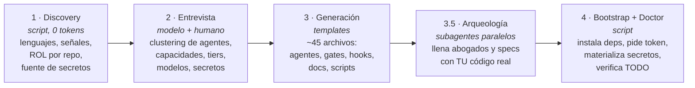
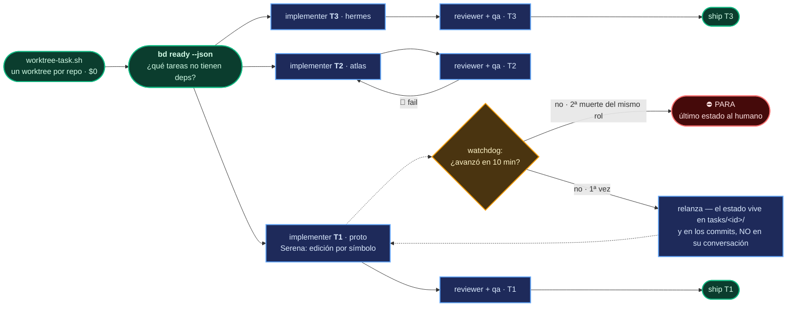
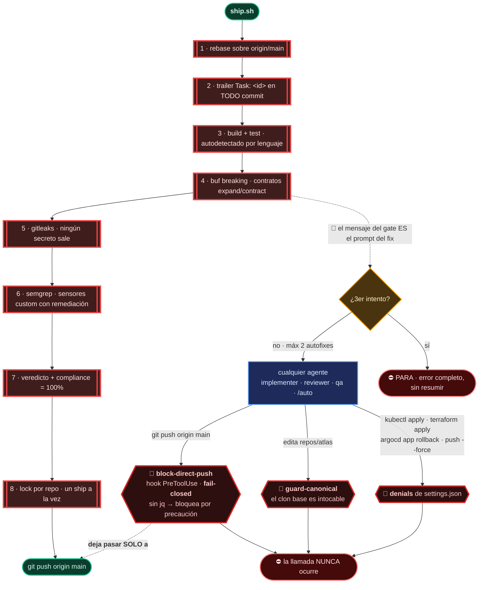
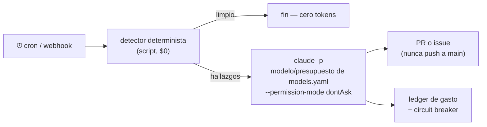

# harness-creator

**Instalador universal de harnesses de ingeniería agéntica multi-repo**, como plugin de Claude Code.

Le apuntas a una carpeta con tus repositorios y genera un *harness* completo y adaptado a tu stack: agentes con conocimiento real de tu código, gates deterministas que protegen `main`, un pipeline de trabajo de ticket a producción, memoria, secretos, self-healing nocturno y documentación viva. Funciona para cualquier proyecto — un SaaS multi-tenant de 24 repos o un monorepo chico — porque **descubre** tu stack en vez de asumirlo.

> **Filosofía (una línea):** *los agentes proponen, los sistemas deterministas verifican.* Todo check que un script pueda hacer, lo hace un script; los modelos solo ponen juicio donde hay juicio. Y las leyes no son prosa: tienen hook o gate.

---

## Índice

1. [Quickstart](#quickstart)
2. [Cómo funciona el instalador](#cómo-funciona-el-instalador)
3. [Qué genera: anatomía de una instancia](#qué-genera-anatomía-de-una-instancia)
4. [El diagrama maestro: qué pasa cuando corres `/auto`](#el-diagrama-maestro-qué-pasa-cuando-corres-auto)
5. [Cómo leer el diagrama](#cómo-leer-el-diagrama)
6. [El panel: `make ui`](#el-panel-make-ui)
7. [Componentes, explicados uno por uno](#componentes-explicados-uno-por-uno)
8. [Self-healing: los cronjobs](#self-healing-los-cronjobs)
9. [Secretos](#secretos)
10. [Qué tan flexible es](#qué-tan-flexible-es)
11. [Actualizaciones](#actualizaciones)
12. [Estructura de este repo](#estructura-de-este-repo)
13. [Tests](#tests)

---

## Quickstart

```bash
# 1. Prepara el workspace: tus repos clonados bajo repos/
mkdir mi-workspace && cd mi-workspace
mkdir repos && git clone <tus-repos> repos/

# 2. Instala el plugin (dentro de una sesión de Claude Code)
/plugin marketplace add andresgarcia29/harness-creator
/plugin install harness-creator@harness

# 3. Instala el harness (entrevista guiada, ~10 min)
/harness-init .

# 4. Onboarding de una pasada (deps, credenciales, secretos, salud)
make init
```

Después de eso, el día a día es **una sola línea**:

```
/auto COR-123                                  # un ticket de Linear
/auto "agrega rate limiting por tenant al gateway, 100 req/min"   # o un prompt literal
```

`/auto` corre el pipeline entero — intake, RFC, implementación, review, ship, deploy, archive — **sin preguntarte nada**. Si prefieres conducir fase por fase, los comandos sueltos siguen ahí: `/feature` → `/rfc` → `/implement` → `/review` → `/ship` → `/archive`.

**Requisitos**: macOS o Linux, `git`, `jq` (`brew install jq`), Claude Code. Todo lo demás lo instala el bootstrap.

---

## Cómo funciona el instalador

Cinco fases. Las deterministas son scripts (cero tokens); el modelo solo interviene donde hay decisiones.



- **Discovery** (`scripts/discover.sh`): escanea `repos/` y produce `inventory.json` — por repo: lenguajes, señales (buf, helm, argocd, kargo, docker…) y un **rol inferido** (service · frontend · mobile · library · contracts · infra-module · infra-live · ci-library · docs). También detecta tu **fuente de secretos** (`.sops.yaml`, `doppler.yaml`, `op://`, terraform con secret managers, `VAULT_ADDR`…).
- **Entrevista**: el instalador **recomienda con evidencia** ("detecté buf.yaml en `proto` → gate buf-breaking") y tú decides. Nunca pregunta lo que el inventario ya responde.
- **Generación**: instancia ~45 archivos desde templates. Idempotente: si algo existe, diff y pregunta.
- **Arqueología ligera**: un subagente por servicio lee lo denso y barato (README, migraciones, protos) y llena las constituciones de los abogados y las specs con **ownership, invariantes y requirements reales, citando evidencia**. Todo queda `DRAFT`: la arqueología propone, el humano ratifica.
- **Bootstrap + Doctor**: `make init` instala lo que falte, pide credenciales (interactivo — los valores jamás pasan por el agente), materializa secretos y termina en un reporte de salud donde **cada fallo trae su remediación exacta**.

**El instalador es idempotente**: `/harness-init .` sobre un workspace ya instalado entra en *modo update* — no re-pregunta nada, migra esquemas, y todo cambio se presenta como diff.

### La decisión clave: clustering dinámico de agentes

El instalador **no** crea un agente por repo. Crea *abogados* por dominio de ownership:

| Rol detectado | Regla |
|---|---|
| `service` (posee datos) | 1 abogado por servicio |
| `contracts` (proto) | sin abogado — es el árbitro; lo custodian el arquitecto + buf |
| `infra-module`, `infra-live`, `ci-library`, helm | **UN** solo abogado `infra` para todos |
| `frontend`, `mobile` | **UN** abogado `frontends` (no poseen datos; defienden contratos de consumo y UX) |
| `library` | sin abogado — la defienden sus consumidores |

Techo ~12 agentes; si hay más servicios, propone agrupar por dominio de negocio. **20 terraform modules = 1 agente, no 20.** Más agentes no es mejor harness: cada agente es contexto y mantenimiento.

---

## Qué genera: anatomía de una instancia

```
mi-workspace/
├── README.md                 ← onboarding para HUMANOS (make init, de dónde sale el token)
├── CLAUDE.md                 ← mapa para AGENTES (≤110 líneas; las leyes, dónde está la verdad)
├── manifest.yaml             ← lista canónica de repos + DAG de dependencias
├── models.yaml               ← política de ruteo de modelos (roles, escalación, tiers de cron)
├── harness-answers.yaml      ← TODAS tus decisiones de la entrevista (insumo de updates)
├── Makefile                  ← interfaz humana: init, doctor, secrets, wt, ship, watch
├── .mcp.json                 ← MCPs elegidos (los autenticados, envueltos en with-secrets)
├── .claude/
│   ├── agents/               ← architect, reviewer, implementer, qa + abogados por cluster
│   ├── commands/             ← /auto (todo el pipeline, sin intervención)
│   │                           /feature /rfc /implement /review /ship /promote /archive
│   ├── hooks/                ← block-direct-push, guard-canonical (leyes con dientes)
│   │                           track-read, ui-emit (observadores, fail-open)
│   └── settings.json         ← hooks registrados + denials (kubectl apply, terraform apply…)
├── docs/
│   ├── constitution.md       ← principios innegociables, inyectados a TODOS los agentes
│   ├── architecture/map.md   ← ownership de datos por servicio (la Ley 3)
│   ├── harness/              ← pipeline.md, intake.md, testing-policy.md, cronjobs.md
│   ├── adr/                  ← decisiones; nada es oficial fuera de aquí
│   └── changelog/            ← digest diario generado
├── specs/<capability>/       ← specs maestras EARS+Gherkin, una por dominio
├── scripts/
│   ├── bootstrap.sh          ← onboarding: deps + token + secretos + doctor
│   ├── doctor.sh             ← salud total, cada fallo con remediación
│   ├── ship.sh               ← LA única puerta a main (gates)
│   ├── worktree-task.sh      ← una tarea = un worktree por repo
│   ├── secrets.sh            ← materializa secretos desde tu fuente
│   ├── with-secrets.sh       ← único punto de inyección de secretos
│   ├── quiet.sh              ← trunca outputs ruidosos (economía de tokens)
│   ├── deploy-watch.sh       ← vigila Actions→Kargo→ArgoCD→smoke; rollback seguro
│   ├── ticket-pull/close.sh  ← puente Linear (GraphQL, cero tokens)
│   ├── ui/                   ← panel local de solo lectura (make ui)
│   └── cronjobs/             ← cron-runner + jobs de self-healing elegidos
├── semgrep/rules.yaml        ← sensores custom CON remediación en el mensaje
├── repos/                    ← tus clones (regenerables, protegidos por hook)
├── .harness/events.jsonl     ← bus de eventos del harness (lo lee el panel)
├── worktrees/<task>/<repo>   ← donde se trabaja de verdad
└── tasks/<id>/               ← estado por tarea: task.md, assumptions.md (ledger),
                                 plan.md, veredictos, logs
```

---

## El diagrama maestro: qué pasa cuando corres `/auto`

Primero la **espina dorsal**: las tres entradas, dónde despierta cada agente, qué lo bloquea, y el hecho central — **todas las salidas hacia un humano son diez, y están en un solo nodo rojo**. Cada bloque tiene su zoom en la sección siguiente. Los colores importan; la leyenda está debajo.

```mermaid
flowchart TD

E1["🎫 <b>COR-123</b><br/>ticket de Linear"]:::human
E2["💬 <b>'agrega rate limiting por<br/>tenant al gateway, 100 req/min'</b><br/>prompt literal"]:::human
E3["♻️ <b>AUTO-20260716-rate-limit</b><br/>task-id de una corrida muerta"]:::human

E1 --> P0
E2 --> P0
E3 --> P0

P0{"<b>① /auto · paso 0</b><br/>¿ticket, prompt o retomar?"}:::dec

P0 -->|"COR-N o URL"| TP(["<b>ticket-pull.sh</b> · GraphQL · $0<br/>materializa task.md · label → in-harness"]):::script
P0 -->|"texto libre"| PR["<b>redacta el intake</b> · id AUTO-fecha-slug<br/>criterios binarios · scope mínimo · repos vía grafo"]:::agent
P0 -->|"task-id ya existente"| RE(["<b>RETOMA</b> · entra por la 1ª fase<br/>sin artefacto válido · nada se re-genera"]):::script

TP --> TASK
PR --> TASK
TASK["<b>tasks/&lt;id&gt;/task.md</b>"]:::art --> INT

INT{"<b>② INTAKE</b> · ¿cumple el contrato?<br/>sin humano, la ambigüedad NO se rebota"}:::dec
INT -->|"6 leyes rotas"| PARA(["<b>⛔ LAS 10 PARADAS</b><br/>ADR contradicho · decisión irreversible<br/>abogado DRAFT · bug irreproducible<br/>RFC sin converger · loop agotado<br/>gate rojo x2 · subagente muerto x2<br/>deploy 🔴 · ticket inexistente"]):::stop
INT -->|"resuelto con evidencia"| LED["<b>assumptions.md</b> · el ledger<br/>SUPUESTO · PORQUE ⟨evidencia⟩ · SI ES FALSO ⟨costo⟩<br/>spec &gt; ADR &gt; CLAUDE.md &gt; código · empate → lo REVERSIBLE"]:::art

LED --> RFC["<b>③ RFC</b> · abogados afectados en PARALELO<br/>una respuesta JSON c/u · no implementan nunca<br/><b>architect</b> sintetiza → plan.md · DAG · delta-spec · beads"]:::agent
RFC -.-> PARA

RFC --> IMP["<b>④ IMPLEMENT</b> · bd ready manda<br/>1 implementer = 1 tarea = 1 worktree = 1 repo<br/>lo paralelo NO se serializa · watchdog 10 min"]:::agent
IMP -.-> PARA

IMP --> REV["<b>⑤ REVIEW</b> · encola al terminar, no al final<br/><b>reviewer</b>: verdict.json + compliance matrix 100%<br/><b>qa</b>: ejercita los criterios como usuario"]:::agent
REV -->|"🔴 fail · el error ES el prompt del fix"| IMP
REV -.-> PARA

REV --> CHK{"<b>autonomy</b> en harness-answers.yaml"}:::dec
CHK -->|"checkpoint · UNA pausa en todo el pipeline"| GO(["resumen de 10 líneas → 'go'"]):::human
CHK -->|"full · ninguna"| SHIP
GO --> SHIP

SHIP(["<b>⑥ ship.sh</b> · LA única puerta a main · $0<br/>8 gates: rebase → trailer → build/test → buf breaking<br/>→ gitleaks → semgrep → veredicto → lock → push"]):::script
HOOK{{"<b>🚫 hooks + denials</b> · fail-closed<br/>block-direct-push · guard-canonical<br/>kubectl/terraform apply · push --force"}}:::hook
HOOK -.->|"bloquean a TODO agente"| IMP
HOOK -.->|"dejan pasar SOLO a"| SHIP
SHIP -->|"🔴 gate · máx 2 autofixes"| IMP
SHIP -.-> PARA

SHIP --> DW(["<b>⑦ deploy-watch.sh</b> · $0, solo CPU<br/>Actions → Kargo → ArgoCD health → smoke canary"]):::script
DW -->|"🔴"| RB(["<b>ROLLBACK PRIMERO</b> · abort-to-stable o revert<br/>diagnóstico DESPUÉS · nunca argocd app rollback"]):::script
RB --> PARA
DW -->|"🟢 · quedan tareas en el DAG"| SHIP

DW -->|"🟢 · DAG completo"| ARCH["<b>⑧ /archive</b> · fusiona el delta-spec en la<br/>spec maestra ← por esto no hay spec-rot<br/>ticket-close.sh · mem_save"]:::agent

ARCH --> REP(["<b>REPORTE FINAL</b> — lo único que lees<br/>qué se shippeó · <b>el ledger completo</b><br/>paradas · costo ccusage"]):::human
REP -.->|"<b>/promote</b> semanal · el loop se cierra:<br/>supuesto falso → regla semgrep · decisión madura → ADR"| SHIP

classDef script fill:#0b3d2e,stroke:#10b981,stroke-width:2px,color:#d1fae5
classDef agent fill:#1e2a5a,stroke:#60a5fa,stroke-width:2px,color:#dbeafe
classDef dec fill:#4a3410,stroke:#f59e0b,stroke-width:2px,color:#fef3c7
classDef hook fill:#2d0f0f,stroke:#dc2626,stroke-width:3px,color:#fecaca
classDef stop fill:#450a0a,stroke:#f87171,stroke-width:3px,color:#fee2e2
classDef human fill:#3b1a4a,stroke:#c084fc,stroke-width:2px,color:#f3e8ff
classDef art fill:#1f2937,stroke:#9ca3af,stroke-width:1px,color:#e5e7eb
```



### Leyenda

| Forma / color | Qué es | Cuesta |
|---|---|---|
| 🟩 **verde, redondeado** | script determinista | **$0** — cero tokens, solo CPU |
| 🟦 **azul, rectángulo** | agente (LLM) | tokens, modelo según `models.yaml` |
| 🟨 **ámbar, rombo** | decisión que el sistema toma **solo** | — |
| 🟥 **rojo, doble borde** | **gate** de `ship.sh` — bloquea el push | $0 |
| 🟥 **rojo oscuro, hexágono** | **hook / denial** — bloquea al agente antes de actuar | $0 |
| 🔴 **⛔ PARA** | las **10 salidas** a un humano. La lista es cerrada | — |
| 🟪 **morado** | los únicos puntos donde un humano toca el flujo | — |
| ⬜ **gris** | artefacto en disco (el estado real) | — |

---

## Cómo leer el diagrama

Ocho bloques. Lo que sigue explica **por qué** cada uno es como es — el diagrama dice qué pasa, esto dice por qué.

### ① Entrada — tres formas de empezar, ninguna te hace trabajar

Un ticket de Linear, un prompt literal entre comillas, o el `task-id` de una corrida que se murió. `/auto` decide cuál es sin preguntarte. El tercer caso es el que más vas a agradecer: como **todo el estado vive en `tasks/<id>/` y en los commits del worktree — nunca en la conversación de un agente** — una sesión muerta a mitad del pipeline se retoma con `/auto <task-id>`, y entra por la primera fase cuyo artefacto falte. Un artefacto válido jamás se re-genera.

### ② Intake — la pieza nueva, y la que hace posible el resto

Aquí está el cambio conceptual. Con un ticket, el intake clásico **rebota** lo ambiguo: cuesta centavos rebotar y cuesta el pipeline entero implementar una ambigüedad. Pero cuando la entrada es tu prompt y tú ya te fuiste, **no hay a quién rebotarle**. La ambigüedad no desaparece por eso — así que en vez de rebotarse, se **resuelve, se declara y se hace barata de revertir**:

- **Se resuelve con evidencia, no con opinión.** Hay una precedencia estricta: *spec maestra > ADR vigente > el CLAUDE.md del repo > el patrón del código*. Un supuesto que no se apoya en ninguna de las cuatro no es un supuesto, es una invención — y las invenciones no se implementan.
- **Ante empate, gana lo reversible.** Entre dos lecturas de tu prompt, la que sea más fácil de deshacer, aunque haga menos. Esto es lo que vuelve segura la autonomía: no que el agente acierte siempre, sino que equivocarse sea barato.
- **Se declara en `tasks/<id>/assumptions.md`.** Cada línea dice qué asumió, con qué evidencia, y qué cuesta deshacerlo si era falso. El ledger es lo primero del reporte final: en 30 segundos ves todas las decisiones que se tomaron por ti.
- **Alimenta al sistema.** Un supuesto que resultó falso es material de `/promote`: se convierte en regla semgrep o en ADR, y el siguiente `/auto` ya no lo repite. Por eso la flecha punteada del reporte vuelve al gate de semgrep — **el loop se cierra**.

`/auto` también reescribe lo difuso en binario ("que ande rápido" → "p95 < 300ms en `/x`, medido por el smoke") y divide un prompt que mezcla dos features en dos tareas del DAG. Lo que **no** hace es fingir que un bug irreproducible es arreglable, ni tomar una decisión que la constitución reserva a humanos.

**Zoom: los cinco criterios de rebote, y qué hace `/auto` con cada uno.** Con ticket, los cinco rebotan. Con prompt no se relajan: se transforman.


### ③ RFC — por qué existen los abogados

Un solo agente implementando una feature cruza fronteras de datos sin que nadie objete: no tiene con quién discutir. Los **abogados** (`svc-*`, `infra`, `frontends`) son un tech lead por dominio de ownership que **defiende invariantes en el RFC y nunca implementa**. Responden **una vez, en paralelo, en JSON** — no es una conversación, es un alegato.

Cuando chocan, el desempate **no es consenso ni la opinión del arquitecto**: es evidencia. Contratos → el repo proto es el árbitro. Datos → `docs/architecture/map.md`. Máximo 2 rondas; si no convergen, las posiciones van en limpio a un humano — porque un desacuerdo real entre dos dominios *es* una decisión de negocio, y esas no las toma un modelo.

La parada por **abogado en `DRAFT`** parece burocracia y es lo contrario: la constitución de un abogado la propuso la arqueología leyendo tu código, pero hasta que un humano la ratifica **nadie la firmó**. Litigar citando una ley sin firmar es teatro. Por eso `/auto` para ahí — y es la primera cosa que vas a ratificar después de instalar.

### ④ Implement — paralelo por defecto, contexto mínimo por diseño

Un implementer = una tarea = un worktree = un repo. Sesiones cortas y desechables que **nunca llegan a compactación de contexto**, y aislamiento que hace imposible el scope creep. `bd ready --json` (beads) dice qué tareas no tienen dependencias entre sí, y **todas esas arrancan a la vez**: serializar lo paralelizable es la forma más cara de perder tiempo.

El **watchdog** es la lección de una crisis real: un subagente que no avanza en ~10 min se interrumpe y se relanza. Es seguro *precisamente* porque su conversación no era el estado — el estado son los commits. Dos muertes del mismo rol en la misma tarea sí escalan a un humano.

**Zoom: el fan-out real, y por qué el review no espera.**



T1 ya se está shippeando mientras T2 vuelve a implementación por un review rojo. Nadie espera a nadie: **el DAG es la única autoridad sobre el orden**.

### ⑤ Review — contra el "listo" autodeclarado

El modo de fallo #1 de los agentes es declararse terminados. Contra eso, dos capas que no se pisan: el **reviewer** emite el JSON que `ship.sh` exige, con una **compliance matrix** — cada requirement del delta-spec apareado con el test que lo prueba. "El review aprobó" es difuso; "requirements cubiertos: 100%" lo verifica una máquina. Y **qa** no lee código: ejercita tus criterios de aceptación como un usuario, con Playwright si hay frontend, local y en el canary.

Cada tarea encola su review **al terminar**, no al final de todas: T1 puede estar en review mientras T4 se implementa. Es un pipeline, no una barrera.

### ⑥ Ship — las leyes con dientes

`ship.sh` es la **única** puerta a main, y los ocho gates corren en orden de más barato a más caro. Lo importante no es la lista: es que **el mensaje de error de cada gate es el prompt del fix** — trae su remediación exacta, para que el agente corrija en una iteración. Presupuesto: 2 rondas de autofix; la tercera es tuya, con el error completo y sin resumir.



Los **hooks** son la diferencia entre una regla y una ley. "No pushees a main" en un CLAUDE.md es una sugerencia que un agente puede racionalizar a las 3am. `block-direct-push` es un hook PreToolUse que intercepta la llamada **antes de que ocurra**, y es *fail-closed*: si falta `jq`, bloquea por precaución. Mismo caso con `guard-canonical` (el clon de `repos/` es intocable; se trabaja en worktrees) y con los denials de `settings.json`.

Fíjate en la asimetría del diagrama, porque es **todo** el diseño: el mismo hook que bloquea a *cualquier* agente es el que **deja pasar a `ship.sh`**. No hay dos caminos a main con distinta severidad — hay uno solo, y está pavimentado de gates.

### ⑦ Deploy — rollback primero, diagnóstico después

`deploy-watch.sh` sigue la cadena Actions → Kargo → ArgoCD health → smoke del canary, y es un script: **el camino verde no gasta un solo token**. En rojo, el orden no se negocia: **rollback primero** (Argo Rollouts abort-to-stable o revert en git — nunca `argocd app rollback`, que es un cañón), y el diagnóstico después, con producción ya sana. Un agente diagnosticando con el incendio encendido es el peor lugar posible para gastar 20 minutos.

### ⑧ Archive — la pieza que evita el spec-rot

Cuando el canary queda verde, `/archive` **fusiona el delta-spec en la spec maestra automáticamente**. Esta es la razón por la que el SDD de este harness no muere: si esa fusión dependiera de disciplina humana, en un trimestre las specs mentirían — y una spec podrida es peor que ninguna, porque los agentes la ejecutan con confianza.

### Las 10 paradas — la lista es cerrada, y ese es el punto

`/auto` para en exactamente diez lugares, y **cada uno es una ley del harness, no una preferencia**: ticket inexistente, bug irreproducible, contradice un ADR, decisión irreversible o que mueve ownership (→ ADR `PROPOSED` y para), abogado en DRAFT, RFC sin converger, subagente muerto dos veces, presupuesto de loop agotado, gate rojo tras 2 autofixes, deploy rojo. Nada más.

La regla que lo hace funcionar es negativa: **si la razón para parar no está en esa lista, no es una razón — decide.** Preguntarte es un fallo de diseño, no prudencia. La red que sostiene esto no eres tú: son los gates deterministas, el canary y el rollback. Y `autonomy: checkpoint` en `harness-answers.yaml` te da **una** pausa —un resumen de 10 líneas antes del primer ship a main— para las primeras semanas, mientras le agarras confianza. Gradúa *cuándo se toca main*, no *cuánto piensa el agente*.

---

## El panel: `make ui`

`/auto` corre solo — pero "solo" no debería significar "a ciegas". `make ui` abre un panel local en `127.0.0.1:7717` que te deja ver, mientras el harness trabaja: **qué agentes están vivos ahora mismo** y en paralelo, en qué fase va cada tarea, el texto que van produciendo, tokens y costo por agente, el grafo de quién lanzó a quién, y **el ledger de supuestos** de cada tarea.

```
make ui          # o: make ui PORT=8080
```

Dos zonas en la barra lateral, y la distinción es la arquitectura entera:

- **OBSERVAR** — Resumen (qué te espera, la curva de concurrencia, las últimas decisiones), Tareas (pipeline + ledger de supuestos + la historia paso a paso que escriben `ship.sh` y `/auto`), Sesiones (cada terminal con su gantt de agentes, árbol de spawns y el texto por turno), Gastos (día × modelo, por sesión, tabla de precios).
- **OPERAR** — Nueva tarea (un formulario que escribe `tasks/<id>/task.md` y lanza `claude -p "/auto <id>"` headless con `--session-id` conocido: la tarea aparece sola en Sesiones), responder a un agente que te espera (reanuda SU sesión con `claude --resume`), Conexiones (Linear/OpenRouter: el token se **valida contra el proveedor antes de guardarse**, va a `~/.config/harness/` con chmod 600, y jamás se muestra ni pasa por un agente), y sincronizar precios reales desde OpenRouter para los modelos observados sin precio.

### Las cinco leyes del panel

Un panel en un sistema cuya filosofía es "los agentes proponen, los sistemas deterministas verifican" tiene que ganarse su lugar. Estas son sus reglas, y explican casi todo su diseño:

1. **OPERAR CREA TRABAJO, JAMÁS MERGES** (ADR-0010 del daemon). El panel puede *crear* una tarea y *pasarle contexto* a un agente — exactamente lo que ya podías hacer desde una terminal — pero todo lo que lanza pasa por los mismos gates: a main solo se llega por `ship.sh`. No hay botón de aprobar, ni de mergear, ni de saltarse un gate; el operador tampoco puede editar `ship.sh`, hooks ni `settings.json` desde aquí. Crear trabajo ≠ publicar trabajo.
2. **Solo `127.0.0.1`.** Nunca `0.0.0.0`. Y como ahora hay endpoints que actúan: cada arranque genera un token anti-CSRF que viaja en el HTML y debe volver en el header `X-Corvux-Token` (un `<form>` de otra página no puede poner headers custom), y se verifica el header `Host` contra DNS rebinding. Los tres controles tienen test.
3. **Jamás muestra valores de secretos.** No lee `.secrets`, `connections` expone presencia (`true`/`false`), nunca el valor, y todo texto pasa por redacción (GitHub, Vault, JWT, AWS, Slack, Linear…) antes de salir. La ley de secretos también aplica a los píxeles. *(La suite mete un token de cada familia y verifica que sale `[REDACTADO]` — y ya cachó un bug real: el `\b` de sed no existe en macOS y cuatro familias viajaban sin redactar.)*
4. **Cero dependencias.** Stdlib de Python 3 y un HTML. Un panel que exige `npm install` se pudre en tres meses.
5. **Degrada, no explota.** Lee dos fuentes con dos niveles de confianza: `.harness/events.jsonl` + `tasks/` son **nuestros** (estables); los transcripts de Claude Code son **prestados** (formato interno, cambia entre versiones). Si el parseo falla, el panel sigue vivo con lo que el harness sí controla y te lo dice arriba en rojo.

El formulario de Nueva tarea escribe preferencias que `/auto` **respeta como ley**: `review_before_ship: true` fuerza una pausa antes del primer ship, `assumptions_ok: false` convierte cada ambigüedad en una parada en vez de un supuesto, `max_parallel` acota los implementers y `budget_usd` convierte pasarse de presupuesto en una parada.

### Lo que el panel NO hace, y por qué

**No hay streaming token por token.** Lo medimos: el transcript de un agente vivo se quedó quieto 36 segundos y luego saltó 52 KB de golpe — Claude Code escribe los mensajes al **cerrarlos**. El panel muestra el texto por turno, que es lo más en vivo que existe sin mentir. Poner un typewriter falso encima sería teatro, en la única herramienta cuyo trabajo es observar con honestidad.

**El costo es un estimado.** La báscula oficial sigue siendo `ccusage`; el panel calcula con `scripts/ui/pricing.json` (editable, se relee sola) para que veas la tendencia sin salir. Dos cosas que aprendimos construyéndolo, contra datos reales:

- Una respuesta de la API se escribe en **varios records que repiten el mismo `usage`**. Sumarlos ingenuamente infla la cuenta. Se deduplica por `message.id`. *(Se cita por ahí un 4× de inflado; nosotros medimos 1.01× en transcripts reales — el error existe, la magnitud que circula no.)*
- El desglose `ephemeral_5m` / `ephemeral_1h` gana sobre el campo plano: la caché de 5 min se escribe a 1.25× y la de 1 h a 2×, y el campo plano no los distingue.

**Y un aviso honesto:** el panel lee un formato que Anthropic documenta como **interno y sujeto a cambio entre versiones** (verificado contra Claude Code 2.1.211). Por eso los transcripts son la capa de *enriquecimiento*, nunca la de verdad: si un día cambian, pierdes las tarjetas de agentes y los tokens — no las fases, ni los gates, ni las tareas.

---

## Componentes, explicados uno por uno

### Los agentes (`.claude/agents/`)

| Agente | Qué es | Por qué existe |
|---|---|---|
| **abogados** (`svc-*`, `infra`, `frontends`) | Un "tech lead" por dominio que **defiende ownership e invariantes en los RFCs**. No implementa nunca. Su constitución la llenó la arqueología con datos reales de tu código y tú la ratificaste. | Sin abogados, un agente que implementa una feature cruza fronteras de datos sin que nadie objete. Con ellos, cada cambio multi-servicio se *litiga* citando specs, no opiniones. |
| **architect** | Convierte el RFC en un plan ejecutable: tareas por repo con dependencias (beads), orden de shipping, criterios por tarea. | Alguien tiene que sintetizar el debate y trazar el DAG. Modelo caro porque su output lo consumen N agentes aguas abajo. |
| **implementer** | Ejecuta UNA tarea, en UN worktree, de UN repo. Contexto mínimo: el plan y el CLAUDE.md del repo. | Sesiones cortas y desechables = nunca llegar a compactación de contexto. El aislamiento evita scope creep. |
| **reviewer** | Emite el veredicto JSON que ship.sh exige: correctness + **compliance matrix** (cada requirement del delta-spec ↔ el test que lo prueba). | "El review aprobó" es difuso; "requirements cubiertos: 100%" es verificable por máquina. |
| **qa** | Ejercita los criterios de aceptación **como usuario real** (Playwright en frontends), local y en el canary post-deploy. | El modo de fallo #1 de agentes es el "completado" autodeclarado. QA no opina de código: comprueba comportamiento. |

### La capa SDD (Spec-Driven Development)

- **`docs/constitution.md`** — principios innegociables inyectados a *todos* los agentes: no asumas, código mínimo, cambios quirúrgicos (cada línea traza a la solicitud), ejecución verificable. Es el desempate de cualquier RFC.
- **`specs/<capability>/spec.md`** — el comportamiento ACTUAL del sistema en notación EARS (`WHEN <evento> THE SYSTEM SHALL <resultado>`) + escenarios Given/When/Then, cada requirement enlazado a su test. Es lo que los abogados **citan** ("esto viola AUTH-3").
- **Delta-specs** — cada RFC produce sus cambios como secciones ADDED/MODIFIED/REMOVED contra la spec maestra. El delta ES la definición formal del blast radius.
- **`/archive`** — cuando el deploy queda verde, fusiona el delta en la spec maestra automáticamente. **Esta pieza es la razón por la que el SDD de este harness no muere de spec-rot**: si la fusión dependiera de disciplina humana, en un trimestre las specs mentirían — y una spec podrida es peor que ninguna, porque los agentes la ejecutan con confianza.

### Economía de tokens (el contexto es el recurso escaso)

| Herramienta | Qué es | Para qué sirve aquí |
|---|---|---|
| **Serena** (MCP) | Servidor que expone **LSP** (Language Server Protocol — el mismo motor de "ir a definición / encontrar referencias" de tu IDE) como herramientas del agente. | El implementer navega y edita **por símbolo** (`find_symbol`, `find_referencing_symbols`) en vez de leer archivos completos o grepear texto. Es el ahorro de tokens más grande en implementación. En multi-repo se activa **por worktree**. |
| **Graphify** (CLI) | Knowledge graph del código cross-repo (Tree-sitter + detección de comunidades). | Preguntas de *comprensión* ("¿quién consume este servicio?", "¿qué camino conecta A con B?") se responden con el grafo (~71× menos tokens) en vez de grep masivo. Lo usan arquitecto y orquestador; los implementers no lo necesitan (Serena cubre el nivel símbolo). |
| **context7** (MCP) | Documentación de librerías bajo demanda, versionada. | El agente no alucina APIs ni repite web-searches de la misma librería. |
| **quiet.sh** | Wrapper para CLIs ruidosos (`kubectl logs`, `gh run view`, `gcloud`). | Si el output pasa ~120 líneas: muestra head+tail y guarda el dump completo en `.cache/quiet/` para leer bajo demanda. |
| **ccusage** | La báscula: costo por sesión/tarea. | No optimizas lo que no mides. |
| **models.yaml** | Política de ruteo de modelos: el "sandwich de razonamiento". | Modelo caro donde el output tiene fan-out (planes, veredictos, constituciones), medio en implementación, barato en lo mecánico. Incluye **reglas de escalación** (implementer sube de modelo tras 2 fails) y presupuestos USD por cronjob. |

### Memoria (tres tipos, tres lugares)

| Tipo | Dónde vive | Herramienta |
|---|---|---|
| **Semántica** (decisiones) | `docs/adr/` — git es la única verdad duradera | ADRs |
| **Estado del trabajo** (qué va cómo) | DAG de tareas git-backed | **beads** (`bd ready --json`) — el plan del arquitecto son beads con dependencias |
| **Episódica** (qué aprendimos) | Base local con búsqueda FTS | **engram** (MCP): `mem_search` al iniciar tarea, `mem_save` al cerrar. SOLO en perfiles orquestador/arquitecto — nunca en implementers (costo de contexto). |

El ritual **`/promote`** (semanal) cierra el loop: *la memoria propone, git dispone* — decisión madura → ADR; error repetido → regla semgrep o gate; ruido → expira.

### Gates y hooks (las leyes con dientes)

- **`ship.sh`** — la única puerta a main. Gates en orden: rebase → trailer `Task:` → **tests-no-debilitados** → build/test por lenguaje → `buf breaking` (contratos) → `gitleaks` (secretos) → `semgrep` (sensores custom) → veredicto+compliance → **evidencia** → lock por repo → push. **El error de cada gate es un prompt**: incluye su remediación, para que el agente corrija en una iteración (máx 2 rondas de autofix).

  Los dos gates nuevos existen porque nos hicieron una pregunta incómoda: *nuestros gates confían en cosas que el agente puede editar.*

  - **`gate_tests_untouched`** — el gate de test confía en el test suite, y el test suite es un archivo. La forma más barata de pasar a verde no es arreglar el código: es borrar la aserción. Está medido en la literatura (en SWE-bench+, el 31% de los parches "exitosos" pasaban por tests débiles) y los harnesses que solo escriben *"no borres tests"* en prosa lo escriben porque no tienen gate. Este bloquea aserciones eliminadas, `skip`s añadidos y tests borrados — **salvo** que el delta-spec declare el cambio como `MODIFIED`/`REMOVED`, porque entonces no es trampa: es cumplir la spec. Los tests son el contrato; cambiar uno es un RFC.
  - **`gate_evidence`** — la compliance matrix la escribe un agente. Nada comprobaba que hubiera *abierto* el test que cita. O sea: **el verificador estaba proponiendo**, justo lo que nuestra filosofía prohíbe. Ahora el hook `track-read.sh` registra qué artefactos se leyeron de verdad y el gate intersecta lo citado con lo leído: si un requirement dice `covered: true` citando un archivo que nadie abrió (o que no existe), no pasa. Cero LLM, cero opinión — es una intersección de conjuntos.
- **Hooks, en dos familias con leyes opuestas.** Los que **bloquean** son *fail-closed*: `block-direct-push` (ningún `git push` a main sobrevive) y `guard-canonical` (el clon base es intocable **y ahora también `ship.sh`, los hooks y `settings.json`** — un agente atascado en un gate que "arregla" ship.sh no está pasando el gate: lo está borrando, y con él todos los demás para siempre). Sin `jq`, bloquean por precaución. Los que **observan** son *fail-open* y `async`: `track-read.sh` (el libro de a bordo de la evidencia) y `ui-emit.sh` (el bus del panel). Salen 0 siempre: un hook de telemetría que puede tumbar el pipeline es un bug, no una feature.
- **Denials** — `kubectl apply`, `terraform apply`, `argocd app rollback`, `git push --force` y la regeneración ciega de snapshots están denegados a los agentes en `settings.json`. Writes de infra: solo por GitOps.
- **semgrep/rules.yaml** — sensores custom donde **cada regla incluye su remediación en el mensaje**. Crece solo: el cronjob `rule-miner` mina reglas nuevas de los bugs de cada mes.

---

## Self-healing: los cronjobs

Arquitectura innegociable: **un detector determinista (script, cero LLM) produce hallazgos; el agente solo despierta si hay algo que arreglar**, con modelo y presupuesto USD de `models.yaml`, y todo aterriza como PR o issue — jamás push directo. El `cron-runner.sh` trae circuit breaker (3 fallos → se apaga y avisa) y un ledger de gasto que el digest reporta: **el harness se auto-audita**.



| Job | Detecta | El agente… |
|---|---|---|
| **ci-doctor** | runs rojos en main | fix quirúrgico o PR de revert |
| **dep-shepherd** | PRs de Renovate sin automerge | matriz de riesgo, grep de imports reales, merge o fix |
| **vuln-watch** | vulns nuevas (osv-scanner + trivy) | PR de bump con tests |
| **flake-warden** | tests que pasan Y fallan en el mismo commit | cuarentena inmediata + root-cause |
| **daily-digest** | (siempre) | changelog del día + gasto de la noche → Slack |
| **dead-code-reaper** | código muerto (knip/vulture/deadcode) | borra en lotes con tests; FP → whitelist |
| **ratchet-keeper** | métricas que solo pueden mejorar | sube el piso o issue de regresión |
| **mutation-sentinel** | mutantes que ningún test mata | escribe el test que falta |
| **doc-gardener** | links rotos, símbolos perdidos, diagramas drifteados | PR de jardinería |
| **slo-watchdog** | burn-rate de SLOs (webhook) | diagnóstico read-only + PR de revert |
| **harness-janitor** | worktrees/ramas/locks huérfanos, memoria inflada | destila la memoria |
| **rule-miner** | los bugs del mes (commits fix/revert) | **mina reglas semgrep que los habrían atrapado** — el sistema mejora solo cada mes |

Corren donde elijas: crontab local, K8s CronJobs (manifiesto incluido, auth keyless por Workload Identity) o GitHub Actions schedule. Son opcionales y se activan después con un update.

---

## Secretos

Reglas: **los valores jamás tocan el repo, el chat ni los logs**. Solo referencias.


- El **discovery detecta** tu fuente (señales: `.sops.yaml`, `doppler.yaml`, `op://`, secret managers en terraform, `VAULT_ADDR`) y la entrevista recomienda con evidencia.
- El generador **verifica el layout real** de tu Vault (nombres de paths y campos — nunca valores) antes de escribir los mapeos.
- `make init` detecta token **faltante o expirado** (lo valida con `vault token lookup`, no solo su existencia), te enseña cómo conseguir uno, te lo pide interactivo y lo valida al guardarlo.
- La materialización es **honesta**: si una clave no se pudo leer, falla con el detalle, no dice "✅".

---

## Qué tan flexible es

El flujo es fijo (discovery → entrevista → generación → verificación); **todo lo demás es dato, no código**:

| Quieres… | Tocas… |
|---|---|
| Soportar una herramienta nueva (CLI o MCP) | agrega una entrada a `catalog/capabilities.yaml` (provider, bin/mcp, tier, profiles, detect, install) — la entrevista la ofrecerá cuando su señal aparezca |
| Otro lenguaje/stack | agrega la detección de rol en `discover.sh` + el gate de lenguaje en `ship.sh.tmpl` |
| Otro tracker de tickets | los contratos de `ticket-pull/close` están especificados; se adaptan a `gh issue` o a cualquier API |
| Otra fuente de secretos | `secrets.sh` ya trae 7; una nueva es una función `pull_*` más |
| Cambiar modelos (todo Opus, todo barato, mixto) | `models.yaml` + `/harness-init .` re-estampa los agentes |
| Otro cronjob de self-healing | un archivo en `cronjobs/jobs/`: metadata + `detect()` + prompt. El runner hace el resto |
| Más/menos agentes | el clustering se decide en la entrevista y se corrige en `harness-answers.yaml` |
| Que `/auto` te pida un "go" antes de tocar main (o que no lo pida) | `autonomy: checkpoint \| full` en `harness-answers.yaml` |
| Endurecer/relajar leyes | hooks y denials en `settings.json.tmpl`; gates en `ship.sh.tmpl` |

Lo **no** negociable (a propósito): push a main solo por gates, worktrees, valores de secretos fuera del chat, rollback seguro (nunca `argocd app rollback` automático — Argo Rollouts abort-to-stable o revert en git), y que la ley la ratifiquen humanos.

## Actualizaciones

Los fixes se hacen en ESTE repo y las instancias los reciben por diff:

```bash
/plugin marketplace update harness    # refresca el plugin
/harness-init .                       # en el workspace: modo update
```

El modo update **no re-pregunta** lo respondido, migra el esquema de `harness-answers.yaml` sin tocar tus decisiones, **reconcilia** (una respuesta nueva propaga diffs a manifest/CLAUDE.md/DAG) y distingue propiedad: los scripts del plugin se actualizan con upstream; tus answers, models, specs y constituciones son ley local y se conservan. Nada se pisa sin confirmación.

## Estructura de este repo

```
.claude-plugin/    manifest del plugin + marketplace
commands/          /harness-init · /harness-doctor · /harness-update
skills/            harness-init/SKILL.md — el cerebro: fases, clustering, entrevista, tabla de generación
catalog/           capabilities.yaml — el menú: 57 capacidades con detect/tier/profiles/install
scripts/           discover.sh · doctor.sh (deterministas, portables macOS/Linux, bash 3.2)
tests/             la suite (./tests/run.sh) — ver "Tests" abajo
templates/         todo lo que se genera:
  ├── CLAUDE.md, README, manifest, models, answers, settings, Makefile, semgrep
  ├── agents/      architect · implementer · reviewer · qa · svc-agent (abogado genérico)
  ├── commands/    auto (pipeline autónomo: ticket o prompt → prod) · feature · rfc
  │                implement · review · ship · promote · archive
  ├── docs/        constitution · spec (EARS) · pipeline · intake · testing-policy · quality · ADR · cronjobs
  ├── scripts/     bootstrap · ship · worktree · secrets · with-secrets · quiet · deploy-watch · tickets
  ├── hooks/       block-direct-push · guard-canonical (fail-closed: bloquean)
  │                track-read · ui-emit (fail-open: observan)
  ├── ui/          server.py · app.html · pricing.json (el panel, `make ui`)
  └── cronjobs/    cron-runner + 12 jobs + manifiesto K8s
```

## Tests

```
./tests/run.sh        # todo (~40s: el lock prueba su gracia de 15s en tiempo real)
./tests/run.sh fast   # salta el test lento del lock
```

La suite prueba **el código real de los templates** — no copias ni mocks del sistema bajo prueba — y cada test crea su workspace temporal y lo borra: nada toca tu workspace ni la red.

| Test | Qué protege |
|---|---|
| `test_emit.sh` | El bus: shape del evento, `ok` booleano, **redacción de las 7 familias de secretos**, fail-open, sourceable desde sh/zsh con `set -u` |
| `test_track_read.sh` | La evidencia: la tarea se deriva de la ruta (jamás de estado compartido), cero contaminación entre tareas, ids maliciosos no construyen rutas |
| `test_ship_lock.sh` | El lock de ship: las dos ventanas de muerte que costaron un lock inmortal, y que un dueño vivo jamás pierde su lock |
| `test_server.py` | El panel: ADR-0004 (modelo sin precio = None, jamás tarifa de Opus), normalización del bus, y todo el plano de operar sin red (validación, frontmatter, dedupe de ids, tokens 0600) |
| `test_op_http.py` | El plano de operar por HTTP contra el server real: 403 sin token / token malo / Host raro, crear tarea lanza un `claude` de verdad (stub que graba sus args), responder reanuda LA sesión pedida |

La suite ya se pagó el primer día: cachó que el `\b` de sed no existe en macOS (cuatro familias de secretos viajaban sin redactar), seis templates sin bit de ejecución, y un `_record_run` que dependía en silencio del orden de llamadas.

## Canon de referencia

Este diseño destila: OpenAI *Harness engineering* · Anthropic *Effective harnesses for long-running agents* y *Building effective agents* · Böckeler (martinfowler.com) *harness engineering + sensors* · Stripe *Minions* · Yegge *beads/Gas Town* · GitHub Spec Kit / OpenSpec / Kiro (EARS) · Hashimoto *My AI Adoption Journey* · Manus *Context engineering*.

---

**Licencia**: MIT · **Autor**: Andres Garcia · Construido iterando contra una instalación real: cada fricción de la primera instancia se convirtió en una versión de este plugin.
