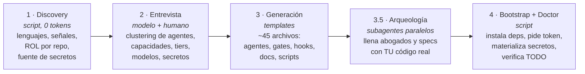
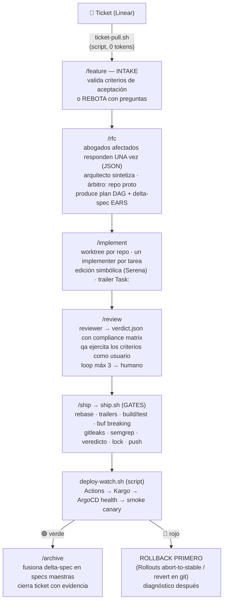
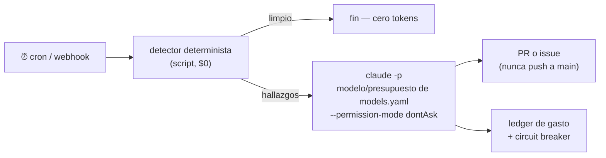

# harness-creator

**Instalador universal de harnesses de ingeniería agéntica multi-repo**, como plugin de Claude Code.

Le apuntas a una carpeta con tus repositorios y genera un *harness* completo y adaptado a tu stack: agentes con conocimiento real de tu código, gates deterministas que protegen `main`, un pipeline de trabajo de ticket a producción, memoria, secretos, self-healing nocturno y documentación viva. Funciona para cualquier proyecto — un SaaS multi-tenant de 24 repos o un monorepo chico — porque **descubre** tu stack en vez de asumirlo.

> **Filosofía (una línea):** *los agentes proponen, los sistemas deterministas verifican.* Todo check que un script pueda hacer, lo hace un script; los modelos solo ponen juicio donde hay juicio. Y las leyes no son prosa: tienen hook o gate.

---

## Índice

1. [Quickstart](#quickstart)
2. [Cómo funciona el instalador](#cómo-funciona-el-instalador)
3. [Qué genera: anatomía de una instancia](#qué-genera-anatomía-de-una-instancia)
4. [El pipeline de trabajo](#el-pipeline-de-trabajo)
5. [Componentes, explicados uno por uno](#componentes-explicados-uno-por-uno)
6. [Self-healing: los cronjobs](#self-healing-los-cronjobs)
7. [Secretos](#secretos)
8. [Qué tan flexible es](#qué-tan-flexible-es)
9. [Actualizaciones](#actualizaciones)
10. [Estructura de este repo](#estructura-de-este-repo)

---

## Quickstart

```bash
# 1. Prepara el workspace: tus repos clonados bajo repos/
mkdir mi-workspace && cd mi-workspace
mkdir repos && git clone <tus-repos> repos/

# 2. Instala el plugin (dentro de una sesión de Claude Code)
/plugin marketplace add andresgarcia29/harness-creator
/plugin install harness-creator@harness

# 3. Instala el harness (entrevista guiada, ~10 min)
/harness-init .

# 4. Onboarding de una pasada (deps, credenciales, secretos, salud)
make init
```

Después de eso, el día a día es: `/feature <ticket>` → `/rfc` → `/implement` → `/review` → `/ship` → `/archive`. Nada más.

**Requisitos**: macOS o Linux, `git`, `jq` (`brew install jq`), Claude Code. Todo lo demás lo instala el bootstrap.

---

## Cómo funciona el instalador

Cinco fases. Las deterministas son scripts (cero tokens); el modelo solo interviene donde hay decisiones.



- **Discovery** (`scripts/discover.sh`): escanea `repos/` y produce `inventory.json` — por repo: lenguajes, señales (buf, helm, argocd, kargo, docker…) y un **rol inferido** (service · frontend · mobile · library · contracts · infra-module · infra-live · ci-library · docs). También detecta tu **fuente de secretos** (`.sops.yaml`, `doppler.yaml`, `op://`, terraform con secret managers, `VAULT_ADDR`…).
- **Entrevista**: el instalador **recomienda con evidencia** ("detecté buf.yaml en `proto` → gate buf-breaking") y tú decides. Nunca pregunta lo que el inventario ya responde.
- **Generación**: instancia ~45 archivos desde templates. Idempotente: si algo existe, diff y pregunta.
- **Arqueología ligera**: un subagente por servicio lee lo denso y barato (README, migraciones, protos) y llena las constituciones de los abogados y las specs con **ownership, invariantes y requirements reales, citando evidencia**. Todo queda `DRAFT`: la arqueología propone, el humano ratifica.
- **Bootstrap + Doctor**: `make init` instala lo que falte, pide credenciales (interactivo — los valores jamás pasan por el agente), materializa secretos y termina en un reporte de salud donde **cada fallo trae su remediación exacta**.

**El instalador es idempotente**: `/harness-init .` sobre un workspace ya instalado entra en *modo update* — no re-pregunta nada, migra esquemas, y todo cambio se presenta como diff.

### La decisión clave: clustering dinámico de agentes

El instalador **no** crea un agente por repo. Crea *abogados* por dominio de ownership:

| Rol detectado | Regla |
|---|---|
| `service` (posee datos) | 1 abogado por servicio |
| `contracts` (proto) | sin abogado — es el árbitro; lo custodian el arquitecto + buf |
| `infra-module`, `infra-live`, `ci-library`, helm | **UN** solo abogado `infra` para todos |
| `frontend`, `mobile` | **UN** abogado `frontends` (no poseen datos; defienden contratos de consumo y UX) |
| `library` | sin abogado — la defienden sus consumidores |

Techo ~12 agentes; si hay más servicios, propone agrupar por dominio de negocio. **20 terraform modules = 1 agente, no 20.** Más agentes no es mejor harness: cada agente es contexto y mantenimiento.

---

## Qué genera: anatomía de una instancia

```
mi-workspace/
├── README.md                 ← onboarding para HUMANOS (make init, de dónde sale el token)
├── CLAUDE.md                 ← mapa para AGENTES (≤110 líneas; las leyes, dónde está la verdad)
├── manifest.yaml             ← lista canónica de repos + DAG de dependencias
├── models.yaml               ← política de ruteo de modelos (roles, escalación, tiers de cron)
├── harness-answers.yaml      ← TODAS tus decisiones de la entrevista (insumo de updates)
├── Makefile                  ← interfaz humana: init, doctor, secrets, wt, ship, watch
├── .mcp.json                 ← MCPs elegidos (los autenticados, envueltos en with-secrets)
├── .claude/
│   ├── agents/               ← architect, reviewer, implementer, qa + abogados por cluster
│   ├── commands/             ← /feature /rfc /implement /review /ship /promote /archive
│   ├── hooks/                ← block-direct-push, guard-canonical (las leyes con dientes)
│   └── settings.json         ← hooks registrados + denials (kubectl apply, terraform apply…)
├── docs/
│   ├── constitution.md       ← principios innegociables, inyectados a TODOS los agentes
│   ├── architecture/map.md   ← ownership de datos por servicio (la Ley 3)
│   ├── harness/              ← pipeline.md, intake.md, testing-policy.md, cronjobs.md
│   ├── adr/                  ← decisiones; nada es oficial fuera de aquí
│   └── changelog/            ← digest diario generado
├── specs/<capability>/       ← specs maestras EARS+Gherkin, una por dominio
├── scripts/
│   ├── bootstrap.sh          ← onboarding: deps + token + secretos + doctor
│   ├── doctor.sh             ← salud total, cada fallo con remediación
│   ├── ship.sh               ← LA única puerta a main (gates)
│   ├── worktree-task.sh      ← una tarea = un worktree por repo
│   ├── secrets.sh            ← materializa secretos desde tu fuente
│   ├── with-secrets.sh       ← único punto de inyección de secretos
│   ├── quiet.sh              ← trunca outputs ruidosos (economía de tokens)
│   ├── deploy-watch.sh       ← vigila Actions→Kargo→ArgoCD→smoke; rollback seguro
│   ├── ticket-pull/close.sh  ← puente Linear (GraphQL, cero tokens)
│   └── cronjobs/             ← cron-runner + jobs de self-healing elegidos
├── semgrep/rules.yaml        ← sensores custom CON remediación en el mensaje
├── repos/                    ← tus clones (regenerables, protegidos por hook)
├── worktrees/<task>/<repo>   ← donde se trabaja de verdad
└── tasks/<id>/               ← estado por tarea: task.md, plan.md, veredictos, logs
```

---

## El pipeline de trabajo



Reglas transversales, todas con enforcement:
- **Push a main SOLO vía ship.sh** — un hook PreToolUse bloquea cualquier `git push` a main.
- **Nunca se edita el clon canónico** — otro hook obliga a trabajar en worktrees.
- **Todo commit lleva `Task: <id>`** — gate en ship.sh (trazabilidad ticket↔commit↔deploy).
- **Presupuestos**: máx 3 iteraciones por loop, 2 rondas de RFC, 2 rondas de autofix → escala a humano.
- **Camino verde = cero tokens**: de ship.sh a producción solo corre CPU.

---

## Componentes, explicados uno por uno

### Los agentes (`.claude/agents/`)

| Agente | Qué es | Por qué existe |
|---|---|---|
| **abogados** (`svc-*`, `infra`, `frontends`) | Un "tech lead" por dominio que **defiende ownership e invariantes en los RFCs**. No implementa nunca. Su constitución la llenó la arqueología con datos reales de tu código y tú la ratificaste. | Sin abogados, un agente que implementa una feature cruza fronteras de datos sin que nadie objete. Con ellos, cada cambio multi-servicio se *litiga* citando specs, no opiniones. |
| **architect** | Convierte el RFC en un plan ejecutable: tareas por repo con dependencias (beads), orden de shipping, criterios por tarea. | Alguien tiene que sintetizar el debate y trazar el DAG. Modelo caro porque su output lo consumen N agentes aguas abajo. |
| **implementer** | Ejecuta UNA tarea, en UN worktree, de UN repo. Contexto mínimo: el plan y el CLAUDE.md del repo. | Sesiones cortas y desechables = nunca llegar a compactación de contexto. El aislamiento evita scope creep. |
| **reviewer** | Emite el veredicto JSON que ship.sh exige: correctness + **compliance matrix** (cada requirement del delta-spec ↔ el test que lo prueba). | "El review aprobó" es difuso; "requirements cubiertos: 100%" es verificable por máquina. |
| **qa** | Ejercita los criterios de aceptación **como usuario real** (Playwright en frontends), local y en el canary post-deploy. | El modo de fallo #1 de agentes es el "completado" autodeclarado. QA no opina de código: comprueba comportamiento. |

### La capa SDD (Spec-Driven Development)

- **`docs/constitution.md`** — principios innegociables inyectados a *todos* los agentes: no asumas, código mínimo, cambios quirúrgicos (cada línea traza a la solicitud), ejecución verificable. Es el desempate de cualquier RFC.
- **`specs/<capability>/spec.md`** — el comportamiento ACTUAL del sistema en notación EARS (`WHEN <evento> THE SYSTEM SHALL <resultado>`) + escenarios Given/When/Then, cada requirement enlazado a su test. Es lo que los abogados **citan** ("esto viola AUTH-3").
- **Delta-specs** — cada RFC produce sus cambios como secciones ADDED/MODIFIED/REMOVED contra la spec maestra. El delta ES la definición formal del blast radius.
- **`/archive`** — cuando el deploy queda verde, fusiona el delta en la spec maestra automáticamente. **Esta pieza es la razón por la que el SDD de este harness no muere de spec-rot**: si la fusión dependiera de disciplina humana, en un trimestre las specs mentirían — y una spec podrida es peor que ninguna, porque los agentes la ejecutan con confianza.

### Economía de tokens (el contexto es el recurso escaso)

| Herramienta | Qué es | Para qué sirve aquí |
|---|---|---|
| **Serena** (MCP) | Servidor que expone **LSP** (Language Server Protocol — el mismo motor de "ir a definición / encontrar referencias" de tu IDE) como herramientas del agente. | El implementer navega y edita **por símbolo** (`find_symbol`, `find_referencing_symbols`) en vez de leer archivos completos o grepear texto. Es el ahorro de tokens más grande en implementación. En multi-repo se activa **por worktree**. |
| **Graphify** (CLI) | Knowledge graph del código cross-repo (Tree-sitter + detección de comunidades). | Preguntas de *comprensión* ("¿quién consume este servicio?", "¿qué camino conecta A con B?") se responden con el grafo (~71× menos tokens) en vez de grep masivo. Lo usan arquitecto y orquestador; los implementers no lo necesitan (Serena cubre el nivel símbolo). |
| **context7** (MCP) | Documentación de librerías bajo demanda, versionada. | El agente no alucina APIs ni repite web-searches de la misma librería. |
| **quiet.sh** | Wrapper para CLIs ruidosos (`kubectl logs`, `gh run view`, `gcloud`). | Si el output pasa ~120 líneas: muestra head+tail y guarda el dump completo en `.cache/quiet/` para leer bajo demanda. |
| **ccusage** | La báscula: costo por sesión/tarea. | No optimizas lo que no mides. |
| **models.yaml** | Política de ruteo de modelos: el "sandwich de razonamiento". | Modelo caro donde el output tiene fan-out (planes, veredictos, constituciones), medio en implementación, barato en lo mecánico. Incluye **reglas de escalación** (implementer sube de modelo tras 2 fails) y presupuestos USD por cronjob. |

### Memoria (tres tipos, tres lugares)

| Tipo | Dónde vive | Herramienta |
|---|---|---|
| **Semántica** (decisiones) | `docs/adr/` — git es la única verdad duradera | ADRs |
| **Estado del trabajo** (qué va cómo) | DAG de tareas git-backed | **beads** (`bd ready --json`) — el plan del arquitecto son beads con dependencias |
| **Episódica** (qué aprendimos) | Base local con búsqueda FTS | **engram** (MCP): `mem_search` al iniciar tarea, `mem_save` al cerrar. SOLO en perfiles orquestador/arquitecto — nunca en implementers (costo de contexto). |

El ritual **`/promote`** (semanal) cierra el loop: *la memoria propone, git dispone* — decisión madura → ADR; error repetido → regla semgrep o gate; ruido → expira.

### Gates y hooks (las leyes con dientes)

- **`ship.sh`** — la única puerta a main. Gates en orden: rebase → trailer `Task:` → build/test por lenguaje → `buf breaking` (contratos) → `gitleaks` (secretos) → `semgrep` (sensores custom) → veredicto+compliance → lock por repo → push. **El error de cada gate es un prompt**: incluye su remediación, para que el agente corrija en una iteración (máx 2 rondas de autofix).
- **Hooks PreToolUse** — `block-direct-push` (ningún `git push` a main sobrevive) y `guard-canonical` (el clon base es intocable; trabaja en tu worktree). *Fail-closed*: sin `jq`, bloquean por precaución.
- **Denials** — `kubectl apply`, `terraform apply`, `argocd app rollback`, `git push --force` y la regeneración ciega de snapshots están denegados a los agentes en `settings.json`. Writes de infra: solo por GitOps.
- **semgrep/rules.yaml** — sensores custom donde **cada regla incluye su remediación en el mensaje**. Crece solo: el cronjob `rule-miner` mina reglas nuevas de los bugs de cada mes.

---

## Self-healing: los cronjobs

Arquitectura innegociable: **un detector determinista (script, cero LLM) produce hallazgos; el agente solo despierta si hay algo que arreglar**, con modelo y presupuesto USD de `models.yaml`, y todo aterriza como PR o issue — jamás push directo. El `cron-runner.sh` trae circuit breaker (3 fallos → se apaga y avisa) y un ledger de gasto que el digest reporta: **el harness se auto-audita**.



| Job | Detecta | El agente… |
|---|---|---|
| **ci-doctor** | runs rojos en main | fix quirúrgico o PR de revert |
| **dep-shepherd** | PRs de Renovate sin automerge | matriz de riesgo, grep de imports reales, merge o fix |
| **vuln-watch** | vulns nuevas (osv-scanner + trivy) | PR de bump con tests |
| **flake-warden** | tests que pasan Y fallan en el mismo commit | cuarentena inmediata + root-cause |
| **daily-digest** | (siempre) | changelog del día + gasto de la noche → Slack |
| **dead-code-reaper** | código muerto (knip/vulture/deadcode) | borra en lotes con tests; FP → whitelist |
| **ratchet-keeper** | métricas que solo pueden mejorar | sube el piso o issue de regresión |
| **mutation-sentinel** | mutantes que ningún test mata | escribe el test que falta |
| **doc-gardener** | links rotos, símbolos perdidos, diagramas drifteados | PR de jardinería |
| **slo-watchdog** | burn-rate de SLOs (webhook) | diagnóstico read-only + PR de revert |
| **harness-janitor** | worktrees/ramas/locks huérfanos, memoria inflada | destila la memoria |
| **rule-miner** | los bugs del mes (commits fix/revert) | **mina reglas semgrep que los habrían atrapado** — el sistema mejora solo cada mes |

Corren donde elijas: crontab local, K8s CronJobs (manifiesto incluido, auth keyless por Workload Identity) o GitHub Actions schedule. Son opcionales y se activan después con un update.

---

## Secretos

Reglas: **los valores jamás tocan el repo, el chat ni los logs**. Solo referencias.


- El **discovery detecta** tu fuente (señales: `.sops.yaml`, `doppler.yaml`, `op://`, secret managers en terraform, `VAULT_ADDR`) y la entrevista recomienda con evidencia.
- El generador **verifica el layout real** de tu Vault (nombres de paths y campos — nunca valores) antes de escribir los mapeos.
- `make init` detecta token **faltante o expirado** (lo valida con `vault token lookup`, no solo su existencia), te enseña cómo conseguir uno, te lo pide interactivo y lo valida al guardarlo.
- La materialización es **honesta**: si una clave no se pudo leer, falla con el detalle, no dice "✅".

---

## Qué tan flexible es

El flujo es fijo (discovery → entrevista → generación → verificación); **todo lo demás es dato, no código**:

| Quieres… | Tocas… |
|---|---|
| Soportar una herramienta nueva (CLI o MCP) | agrega una entrada a `catalog/capabilities.yaml` (provider, bin/mcp, tier, profiles, detect, install) — la entrevista la ofrecerá cuando su señal aparezca |
| Otro lenguaje/stack | agrega la detección de rol en `discover.sh` + el gate de lenguaje en `ship.sh.tmpl` |
| Otro tracker de tickets | los contratos de `ticket-pull/close` están especificados; se adaptan a `gh issue` o a cualquier API |
| Otra fuente de secretos | `secrets.sh` ya trae 7; una nueva es una función `pull_*` más |
| Cambiar modelos (todo Opus, todo barato, mixto) | `models.yaml` + `/harness-init .` re-estampa los agentes |
| Otro cronjob de self-healing | un archivo en `cronjobs/jobs/`: metadata + `detect()` + prompt. El runner hace el resto |
| Más/menos agentes | el clustering se decide en la entrevista y se corrige en `harness-answers.yaml` |
| Endurecer/relajar leyes | hooks y denials en `settings.json.tmpl`; gates en `ship.sh.tmpl` |

Lo **no** negociable (a propósito): push a main solo por gates, worktrees, valores de secretos fuera del chat, rollback seguro (nunca `argocd app rollback` automático — Argo Rollouts abort-to-stable o revert en git), y que la ley la ratifiquen humanos.

## Actualizaciones

Los fixes se hacen en ESTE repo y las instancias los reciben por diff:

```bash
/plugin marketplace update harness    # refresca el plugin
/harness-init .                       # en el workspace: modo update
```

El modo update **no re-pregunta** lo respondido, migra el esquema de `harness-answers.yaml` sin tocar tus decisiones, **reconcilia** (una respuesta nueva propaga diffs a manifest/CLAUDE.md/DAG) y distingue propiedad: los scripts del plugin se actualizan con upstream; tus answers, models, specs y constituciones son ley local y se conservan. Nada se pisa sin confirmación.

## Estructura de este repo

```
.claude-plugin/    manifest del plugin + marketplace
commands/          /harness-init · /harness-doctor · /harness-update
skills/            harness-init/SKILL.md — el cerebro: fases, clustering, entrevista, tabla de generación
catalog/           capabilities.yaml — el menú: 57 capacidades con detect/tier/profiles/install
scripts/           discover.sh · doctor.sh (deterministas, portables macOS/Linux, bash 3.2)
templates/         todo lo que se genera:
  ├── CLAUDE.md, README, manifest, models, answers, settings, Makefile, semgrep
  ├── agents/      architect · implementer · reviewer · qa · svc-agent (abogado genérico)
  ├── commands/    feature · rfc · implement · review · ship · promote · archive
  ├── docs/        constitution · spec (EARS) · pipeline · intake · testing-policy · quality · ADR · cronjobs
  ├── scripts/     bootstrap · ship · worktree · secrets · with-secrets · quiet · deploy-watch · tickets
  ├── hooks/       block-direct-push · guard-canonical
  └── cronjobs/    cron-runner + 12 jobs + manifiesto K8s
```

## Canon de referencia

Este diseño destila: OpenAI *Harness engineering* · Anthropic *Effective harnesses for long-running agents* y *Building effective agents* · Böckeler (martinfowler.com) *harness engineering + sensors* · Stripe *Minions* · Yegge *beads/Gas Town* · GitHub Spec Kit / OpenSpec / Kiro (EARS) · Hashimoto *My AI Adoption Journey* · Manus *Context engineering*.

---

**Licencia**: MIT · **Autor**: Andres Garcia · Construido iterando contra una instalación real: cada fricción de la primera instancia se convirtió en una versión de este plugin.
