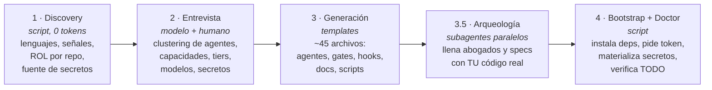
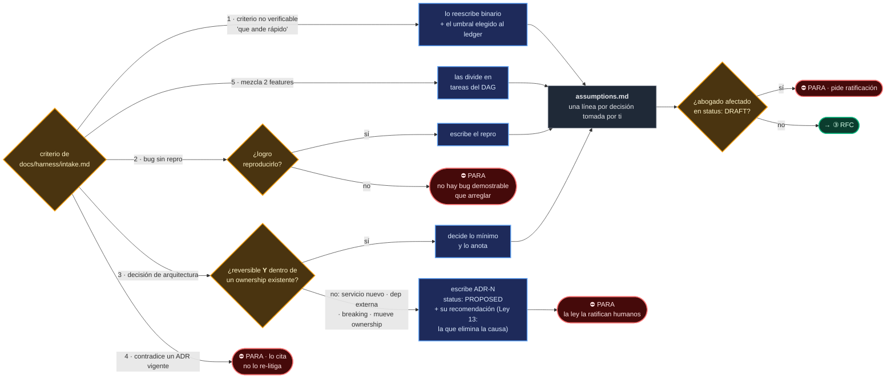
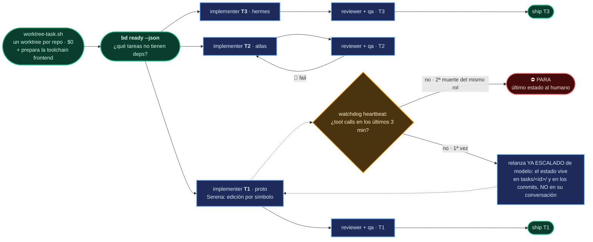
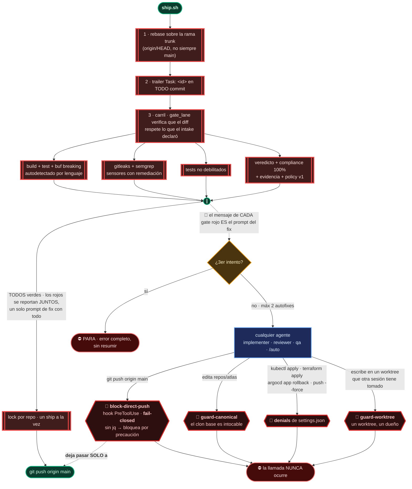
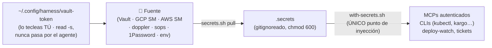

# harness-creator

🇬🇧 [English version](README.en.md)

**Instalador universal de harnesses de ingeniería agéntica multi-repo**, como plugin de Claude Code.

Le apuntas a una carpeta con tus repositorios y genera un *harness* completo y adaptado a tu stack: agentes con conocimiento real de tu código, gates deterministas que protegen `main`, un pipeline de trabajo de ticket a producción **dimensionado al blast radius** (una tarea chica corre con 2 sesiones LLM; una migración multi-servicio con el pipeline completo), memoria, secretos, self-healing nocturno y documentación viva. Funciona para cualquier proyecto, un SaaS multi-tenant de 24 repos o un monorepo chico, porque **descubre** tu stack en vez de asumirlo. Está orientado a Claude Code, pero genera `AGENTS.md` (el estándar multi-herramienta): Cursor, Kimi Code, Codex o cualquier otro agente pueden leer y operar el mismo harness.

> **Filosofía (una línea):** *los agentes proponen, los sistemas deterministas verifican.* Todo check que un script pueda hacer, lo hace un script; los modelos solo ponen juicio donde hay juicio. Y las leyes no son prosa: tienen hook o gate.
>
> **Corolario de velocidad:** como la seguridad vive en los gates, el canary y el rollback, y no en el número de fases LLM, el pipeline recorta deliberación sin recortar verificación: carriles por blast radius, gates en paralelo, reviewer y qa en simultáneo, prefetch determinista y arranques en caliente.

---

## Glosario: las diez palabras que necesitas antes de seguir

Si nunca trabajaste con agentes de código, esta sección te ahorra el resto del documento. Cada término trae qué significa y **por qué existe aquí**.

| Palabra | Qué significa | Por qué importa en este harness |
|---|---|---|
| **Harness** | El arnés: todo lo que rodea al modelo para que su trabajo sea confiable. Reglas, verificaciones automáticas, límites y memoria. | Un modelo suelto escribe código. Un modelo con harness escribe código **que alguien verificó**. Este repo no es un agente: es la fábrica que construye ese arnés alrededor de tus repos. |
| **Determinista** | Un programa que, con la misma entrada, da siempre la misma salida. Un script de shell es determinista; un modelo de lenguaje no. | Es la línea que divide todo el diseño. Lo que se puede comprobar con un script, lo comprueba un script (cuesta $0 y no se equivoca distinto cada vez). El modelo solo interviene donde hace falta criterio. |
| **Gate** | Una comprobación que **bloquea**. Si sale roja, el trabajo no avanza. Ejemplo: "los tests tienen que pasar antes de tocar `main`". | Es la diferencia entre pedir algo y garantizarlo. Un gate no se puede convencer ni negociar. |
| **Hook** | Un programa que se dispara **antes o después** de que un agente use una herramienta, y puede cancelarla. | Escribir "no hagas push a `main`" en un documento es una sugerencia que un agente puede racionalizar. Un hook intercepta la llamada y la cancela: la orden nunca llega a ejecutarse. |
| **Worktree** | Una copia de trabajo independiente del mismo repositorio de git, en otra carpeta y otra rama. | Cada tarea trabaja en el suyo. Dos tareas nunca se pisan los archivos, y el clon original queda intacto. |
| **Blast radius** | El "radio de explosión": cuánto puede romper un cambio si sale mal. Cambiar un texto tiene radio chico; mover una base de datos entre servicios tiene radio grande. | El pipeline se dimensiona a esto. Una tarea chica no paga el mismo peaje de ceremonia que una migración. |
| **Carril** (lane) | El tamaño de proceso que se le asigna a una tarea según su blast radius: `express`, `standard` o `full`. | Es el mecanismo concreto de lo anterior. En `express` una tarea usa 2 sesiones de modelo en vez de 6, con los **mismos** gates. |
| **DAG** | Grafo dirigido sin ciclos. En cristiano: una lista de tareas con sus dependencias, donde nada puede depender de sí mismo. | Dice qué se puede hacer **en paralelo** y qué tiene que esperar. Es la única autoridad sobre el orden de trabajo. |
| **Canary** | Desplegar el cambio primero a un grupo reducido (un cliente, un entorno) antes que a todos. | Si algo sale mal, sale mal en pequeño. Viene del canario en la mina: se entera antes que vos. |
| **Fail-open / fail-closed** | Qué hace un componente cuando **él mismo** falla. *Fail-closed* bloquea por precaución. *Fail-open* deja pasar. | No es un detalle: es una decisión de diseño por componente. Un hook de seguridad roto debe bloquear. Un hook de telemetría roto debe dejar pasar, porque tumbar un despliegue por un problema de estadísticas sería absurdo. |

<details>
<summary><b>Once términos más, para cuando llegues a las secciones técnicas</b> (click para abrir)</summary>

| Palabra | Qué significa | Por qué importa |
|---|---|---|
| **Agente / subagente** | Una sesión de modelo con un rol, instrucciones y herramientas propias. Un subagente es uno que otro agente lanzó. | El harness no usa "una IA": usa varias, cada una con un trabajo y un contexto acotado. |
| **Idempotente** | Que se puede repetir sin causar daño: correrlo dos veces deja el mismo resultado que correrlo una. | El instalador lo es. Si algo se interrumpe, lo vuelves a correr y retoma, sin duplicar ni romper lo que ya estaba. |
| **Ledger de supuestos** | Un archivo donde el agente anota cada cosa que **asumió**, con qué evidencia y qué costaría deshacerla. | Es lo primero que lees al final. En 30 segundos ves todas las decisiones que se tomaron sin vos. |
| **Compliance matrix** | Una tabla que aparea cada requisito con el test que lo demuestra. | "El review aprobó" es una opinión. "Requisitos cubiertos: 100%, y aquí está el test de cada uno" lo verifica una máquina. |
| **Evidencia** | El registro de que algo se ejecutó de verdad: qué comando, en qué commit exacto, con qué salida. | Impide que un agente diga "los tests pasan" sin haberlos corrido. La prueba queda atada al commit y caduca con él, así que se registra con el árbol limpio: si hubiera cambios sin commitear, el sello nombraría un commit y habría probado otra cosa. |
| **Spec / EARS** | La especificación del comportamiento del sistema. EARS es un formato de frase fija: *CUANDO ocurre X, EL SISTEMA DEBE hacer Y*. | Escrito así, un requisito no se puede interpretar de dos maneras, y se puede apuntar a él en una discusión. |
| **Spec-rot** | La podredumbre de la especificación: el documento dice una cosa y el código hace otra, porque nadie actualizó el documento. | Es el fracaso clásico de este enfoque. Aquí la fusión de la spec es automática al final de cada tarea, justamente para que no dependa de la disciplina de nadie. |
| **ADR** | *Architecture Decision Record*: un documento corto que registra una decisión importante, su contexto y sus alternativas. | Es donde vive la ley. Una decisión que no está en un ADR no existe, aunque se haya hablado en un chat. |
| **Rollback** | Volver a la versión anterior que funcionaba. | Ante un despliegue roto el orden no se negocia: primero se vuelve atrás, después se investiga. Diagnosticar con el incendio encendido es el peor uso posible de 20 minutos. |
| **Forge** | Dónde viven tus repositorios y su CI: GitHub, GitLab, Bitbucket. No es lo mismo que git, que es la herramienta. | El harness entrega su trabajo ahí (PRs, issues) y le pregunta por el estado del CI, así que tiene que saber con cuál habla. Se detecta del remote. |
| **Prefetch** | Preparar por adelantado, en segundo plano, lo que hará falta después. | Mientras el arquitecto piensa, los scripts ya clonan, instalan dependencias y arman resúmenes. Cuando arranca quien implementa, la mesa ya está puesta. |

</details>

---

## Índice

1. [Quickstart](#quickstart)
2. [Cómo funciona el instalador](#cómo-funciona-el-instalador)
3. [Qué genera: anatomía de una instancia](#qué-genera-anatomía-de-una-instancia)
4. [El diagrama maestro: qué pasa cuando corres `/auto`](#el-diagrama-maestro-qué-pasa-cuando-corres-auto)
5. [Cómo leer el diagrama](#cómo-leer-el-diagrama)
6. [El panel: `make ui`](#el-panel-make-ui)
7. [Componentes, explicados uno por uno](#componentes-explicados-uno-por-uno)
8. [Self-healing: los cronjobs](#self-healing-los-cronjobs)
9. [Secretos](#secretos)
10. [Qué tan flexible es](#qué-tan-flexible-es)
11. [Actualizaciones](#actualizaciones)
12. [Estructura de este repo](#estructura-de-este-repo)
13. [Tests](#tests)

---

## Quickstart

**Camino A, el wizard web (recomendado):**

```bash
brew install andresgarcia29/agm/harness
harness init          # abre el wizard en http://127.0.0.1:7180/#/init
```

El wizard te lleva de cero a harness: carpeta, GitHub (`gh` o token), clonar repos, requisitos, auto-discover, entrevista pre-llenada con evidencia, agentes y arqueología, MCPs con secretos certificados, primeras tareas, doctor en verde. Todo idempotente y reanudable: si algo muere, `harness init` retoma en el paso exacto. Scriptable sin interfaz: `harness discover` + `harness generate --answers answers.json`.

**Camino B, el plugin de Claude Code (la entrevista conversacional):**

```bash
# 1. Prepara el workspace: tus repos clonados bajo repos/
mkdir mi-workspace && cd mi-workspace
mkdir repos && git clone <tus-repos> repos/

# 2. Instala el plugin (dentro de una sesión de Claude Code)
/plugin marketplace add andresgarcia29/harness-creator
/plugin install harness-creator@harness

# 3. Instala el harness (entrevista guiada, ~10 min)
/harness-init .

# 4. Onboarding de una pasada (deps, credenciales, secretos, salud)
make init
```

Después de eso, el día a día es **una sola línea**:

```
/auto COR-123                                  # un ticket de Linear
/auto "agrega rate limiting por tenant al gateway, 100 req/min"   # o un prompt literal
/auto COR-123 --model deep                     # misma tarea, modelo elegido por ti
```

`/auto` corre el pipeline entero (enrichment, carril, RFC si aplica, implementación, review, ship, deploy, archive) dimensionado al blast radius: un cambio de 1 repo sin contratos va por el carril express, que salta el RFC, y `gate_lane` verifica que el diff cumpla esa promesa.

**Tu única intervención ocurre al principio.** El primer paso, el *enrichment*, investiga tu código, entiende la tarea y te hace **una sola ronda de preguntas**, solo si hay algo que tu propio repositorio no puede responder. A partir de ahí corre solo hasta el reporte final. Si prefieres conducir fase por fase, los comandos sueltos siguen ahí: `/feature`, `/rfc`, `/implement`, `/review`, `/ship`, `/archive`.

**Requisitos**: macOS o Linux, `git`, `jq` (`brew install jq`), Claude Code. Todo lo demás lo instala el bootstrap.

---

## Cómo funciona el instalador

Cinco fases. Las deterministas son scripts (cero tokens); el modelo solo interviene donde hay decisiones.



- **Discovery** (`scripts/discover.sh`): escanea `repos/` y produce `inventory.json`. Por repo: lenguajes, señales (buf, helm, argocd, kargo, docker) y un **rol inferido** (service, frontend, mobile, library, contracts, infra-module, infra-live, ci-library, docs). También detecta tu **fuente de secretos** (`.sops.yaml`, `doppler.yaml`, `op://`, terraform con secret managers, `VAULT_ADDR`).
- **Entrevista**: el instalador **recomienda con evidencia** ("detecté `buf.yaml` en `proto`, propongo el gate buf-breaking") y tú decides. Nunca pregunta lo que el inventario ya responde.
- **Generación**: instancia ~45 archivos desde templates. Idempotente: si algo existe, muestra el diff y pregunta.
- **Arqueología ligera**: un subagente por servicio lee lo denso y barato (README, migraciones, protos) y llena las constituciones de los abogados y las specs con **ownership, invariantes y requisitos reales, citando evidencia**. Todo queda en estado `DRAFT`: la arqueología propone, el humano ratifica.
- **Bootstrap + Doctor**: `make init` instala lo que falte, pide credenciales de forma interactiva (los valores jamás pasan por el agente), materializa secretos y termina en un reporte de salud donde **cada fallo trae su remediación exacta**.

**El instalador es idempotente**: `/harness-init .` sobre un workspace ya instalado entra en *modo update*. No re-pregunta nada, migra esquemas, y todo cambio se presenta como diff.

### La decisión clave: clustering dinámico de agentes

El instalador **no** crea un agente por repo. Crea *abogados* por dominio de ownership:

| Rol detectado | Regla |
|---|---|
| `service` (posee datos) | 1 abogado por servicio |
| `contracts` (proto) | sin abogado, es el árbitro; lo custodian el arquitecto y `buf` |
| `infra-module`, `infra-live`, `ci-library`, helm | **UN** solo abogado `infra` para todos |
| `frontend`, `mobile` | **UN** abogado `frontends` (no poseen datos; defienden contratos de consumo y experiencia) |
| `library` | sin abogado, la defienden sus consumidores |

Techo de ~12 agentes; si hay más servicios, propone agrupar por dominio de negocio. **20 módulos de terraform son 1 agente, no 20.** Más agentes no es mejor harness: cada agente es contexto y mantenimiento.

---

## Qué genera: anatomía de una instancia

```
mi-workspace/
├── README.md                 ← onboarding para HUMANOS (make init, de dónde sale el token)
├── CLAUDE.md                 ← mapa para Claude Code (≤110 líneas; las leyes, dónde está la verdad)
├── AGENTS.md                 ← el MISMO mapa en el estándar multi-herramienta (Cursor, Kimi, Codex)
├── manifest.yaml             ← lista canónica de repos + DAG de dependencias
├── models.yaml               ← LA perilla de modelos: provider + aliases fast|smart|deep + rol→alias
├── harness-answers.yaml      ← TODAS tus decisiones de la entrevista (insumo de updates)
├── harness-policy.json       ← las leyes ejecutables del flujo (fases, carriles, límites, paradas)
├── Makefile                  ← interfaz humana: init, doctor, secrets, wt, ship, watch
├── .mcp.json                 ← MCPs elegidos (los autenticados, envueltos en with-secrets)
├── .claude/
│   ├── agents/               ← architect, reviewer, implementer, qa + abogados por cluster
│   ├── commands/             ← /auto (todo el pipeline) + /feature /rfc /implement
│   │                           /review /ship /promote /archive
│   ├── hooks/                ← block-direct-push, guard-canonical, guard-worktree
│   │                           (leyes con dientes) + track-read, ui-emit,
│   │                           session-summary (observadores, fail-open)
│   ├── skills/               ← skill-creator (la guía) + las skills que el
│   │                           skill-miner extrae de tus procedimientos repetidos
│   └── settings.json         ← hooks registrados + denials (kubectl apply, terraform apply)
├── docs/
│   ├── constitution.md       ← principios innegociables, inyectados a TODOS los agentes
│   ├── architecture/map.md   ← ownership de datos por servicio (la Ley 3)
│   ├── harness/              ← pipeline.md, intake.md, testing-policy.md, cronjobs.md
│   ├── adr/                  ← decisiones; nada es oficial fuera de aquí
│   └── changelog/            ← digest diario generado
├── specs/<capability>/       ← specs maestras EARS + Gherkin, una por dominio
├── scripts/
│   ├── bootstrap.sh          ← onboarding: deps + token + secretos + doctor
│   ├── doctor.sh             ← salud total, cada fallo con remediación
│   ├── ship.sh               ← LA única puerta a main (gates)
│   ├── harness-policy.py     ← el motor de fases: transition, rollback, pause, validate-ship
│   ├── verdict-scaffold.sh   ← esqueleto determinista del veredicto (+ --rebase)
│   ├── evidence.py           ← corre y sella evidencia atada a un commit exacto
│   ├── harness-version.sh    ← make version: ¿al día? + estado de las tareas
│   ├── forge.sh              ← capa de forge: CI, issues y PRs (github · gitlab)
│   ├── worktree-task.sh      ← una tarea = un worktree por repo
│   ├── secrets.sh            ← materializa secretos desde tu fuente
│   ├── with-secrets.sh       ← único punto de inyección de secretos
│   ├── quiet.sh              ← trunca outputs ruidosos (economía de tokens)
│   ├── deploy-watch.sh       ← vigila Actions→Kargo→ArgoCD→smoke; rollback seguro
│   ├── ticket-pull/close.sh  ← puente Linear (GraphQL, cero tokens)
│   ├── ui/                   ← panel local de solo lectura (make ui)
│   └── cronjobs/             ← cron-runner + jobs de self-healing elegidos
├── semgrep/rules.yaml        ← sensores custom CON remediación en el mensaje
├── repos/                    ← tus clones (regenerables, protegidos por hook)
├── .harness/
│   ├── events.jsonl          ← bus de eventos del harness (lo lee el panel)
│   ├── sessions/<id>.md      ← resumen de cada sesión al cerrarse, derivado del bus
│   └── claims/               ← qué sesión tiene tomado cada worktree
├── worktrees/<task>/<repo>   ← donde se trabaja de verdad
└── tasks/<id>/               ← estado por tarea: task.md, enrichment.md, assumptions.md,
                                 state.json (fase + carril, lo mueve harness-policy.py),
                                 plan.md, veredictos, evidencia, ship.log, logs
```

---

## El diagrama maestro: qué pasa cuando corres `/auto`

Primero la **espina dorsal**: las tres entradas, dónde despierta cada agente, qué lo bloquea, y el hecho central: **todas las salidas hacia un humano están enumeradas en `/auto`, y están en un solo nodo rojo**. Cada bloque tiene su zoom en la sección siguiente. Los colores importan; la leyenda está debajo.

```mermaid
flowchart TD

E1["🎫 <b>COR-123</b><br/>ticket de Linear"]:::human
E2["💬 <b>'agrega rate limiting por<br/>tenant al gateway, 100 req/min'</b><br/>prompt literal"]:::human
E3["♻️ <b>AUTO-20260716-rate-limit</b><br/>task-id de una corrida muerta"]:::human

E1 --> P0
E2 --> P0
E3 --> P0

P0{"<b>① /auto · paso 0</b><br/>¿ticket, prompt o retomar?"}:::dec

P0 -->|"COR-N o URL"| TP(["<b>ticket-pull.sh</b> · GraphQL · $0<br/>materializa task.md · label → in-harness"]):::script
P0 -->|"texto libre"| PR["<b>redacta el intake</b> · id AUTO-fecha-slug<br/>criterios binarios · scope mínimo · repos vía grafo"]:::agent
P0 -->|"task-id ya existente"| RE(["<b>RETOMA</b> · entra por la 1ª fase<br/>sin artefacto válido · nada se re-genera"]):::script

TP --> TASK
PR --> TASK
TASK["<b>tasks/&lt;id&gt;/task.md</b>"]:::art --> ENR

ENR["<b>② ENRICHMENT</b> · la ÚNICA interacción contigo<br/>primero el TERRENO (grafo, briefs, ADR, ownership),<br/>después la tarea · resuelve con evidencia lo resoluble"]:::agent
ENR --> Q{"¿queda algo que<br/>SOLO tú sabes?"}:::dec
Q -->|"sí · máx 5 preguntas, UNA ronda,<br/>cada una con su default"| ASK(["🙋 <b>una ronda de preguntas</b><br/>el silencio es respuesta válida"]):::human
Q -->|"no · lo más común"| LED
ASK --> LED

LED["<b>task.md enriquecido</b> + <b>enrichment.md</b> (auditable)<br/><b>assumptions.md</b> · el ledger para lo que venga DESPUÉS<br/>SUPUESTO · PORQUE ⟨evidencia⟩ · SI ES FALSO ⟨costo⟩"]:::art

LED --> PARA
LED --> LANE{"<b>②b CARRIL</b> por blast radius<br/>señales deterministas del inventario/grafo<br/>en duda: el carril MAYOR"}:::dec

PARA(["<b>⛔ LAS 10 PARADAS DE EMERGENCIA</b><br/>ADR contradicho · decisión irreversible<br/>abogado DRAFT · bug irreproducible<br/>RFC sin converger · loop agotado<br/>gate rojo x2 · subagente muerto x2<br/>deploy 🔴 · ticket inexistente"]):::stop

LANE -->|"<b>express</b> · 1 repo · 1 dominio · sin contratos<br/>mini-plan del orquestador · SALTA el RFC"| IMP
LANE -->|"standard · architect sin abogados<br/>full · pipeline completo"| RFC["<b>③ RFC</b> · abogados SOLO de dominios cruzados, en PARALELO<br/>una respuesta JSON c/u · no implementan nunca<br/><b>architect</b> = hilo fino en <b>ultrathink</b>: descompone en probes,<br/>workers responden en paralelo, él sintetiza → plan.md · DAG · delta-spec<br/><b>plan-lint.sh</b> verde o no hay implement · <i>prefetch en background ($0)</i>"]:::agent
RFC -.-> PARA

RFC --> IMP["<b>④ IMPLEMENT</b> · bd ready manda · arranque en caliente<br/>(worktree+deps+brief ya prefetcheados) · 1 implementer =<br/>1 tarea = 1 worktree = 1 repo · lo paralelo NO se serializa<br/>watchdog por heartbeat (~3 min sin tool calls)<br/><b>ship.sh --precheck</b> antes de entregar: rojo NO llega a review"]:::agent
IMP -.-> PARA

IMP --> REV["<b>⑤ REVIEW</b> · encola al terminar, no al final<br/><b>reviewer ∥ qa</b> EN PARALELO · merge mecánico del campo qa<br/>reviewer: verdict.json + compliance matrix 100% · <b>ronda 1 exhaustiva</b><br/>re-review incremental REAL: <b>verdict-scaffold --rebase</b><br/>arrastra el juicio que el delta no tocó"]:::agent
REV -->|"🔴 fail · el error ES el prompt del fix"| IMP
REV -.-> PARA

REV --> CHK{"<b>autonomy</b> en harness-answers.yaml"}:::dec
CHK -->|"checkpoint · UNA pausa extra antes de main"| GO(["resumen de 10 líneas → 'go'"]):::human
CHK -->|"full · ninguna"| SHIP
GO --> SHIP

SHIP(["<b>⑥ ship.sh</b> · LA única puerta a main · $0<br/>serie: rebase → trailer → carril (gate_lane)<br/>EN PARALELO: build/test ∥ buf ∥ gitleaks ∥ semgrep<br/>∥ tests-no-debilitados ∥ veredicto+evidencia · luego lock → push"]):::script
HOOK{{"<b>🚫 hooks + denials</b> · fail-closed<br/>block-direct-push · guard-canonical · guard-worktree<br/>kubectl/terraform apply · push --force"}}:::hook
HOOK -.->|"bloquean a TODO agente"| IMP
HOOK -.->|"dejan pasar SOLO a"| SHIP
SHIP -->|"🔴 gate · máx 2 autofixes"| IMP
SHIP -.-> PARA

SHIP --> DW(["<b>⑦ deploy-watch.sh</b> · $0, solo CPU<br/>Actions → Kargo → ArgoCD health → smoke canary<br/>lo que NO pudo verificar se declara como supuesto"]):::script
DW -->|"🔴"| RB(["<b>ROLLBACK PRIMERO</b> · abort-to-stable o revert<br/>diagnóstico DESPUÉS · nunca argocd app rollback"]):::script
RB --> PARA
DW -->|"🟢 · quedan tareas en el DAG"| SHIP

DW -->|"🟢 · DAG completo"| ARCH["<b>⑧ /archive</b> · fusiona el delta-spec en la<br/>spec maestra ← por esto no hay spec-rot<br/>ticket-close.sh · mem_save"]:::agent

ARCH --> REP(["<b>REPORTE FINAL</b> · lo único que lees<br/>qué se shippeó · <b>el ledger completo</b><br/>paradas · costo ccusage"]):::human
REP -.->|"<b>/promote</b> semanal · el loop se cierra:<br/>supuesto falso → regla semgrep · decisión madura → ADR"| SHIP

classDef script fill:#0b3d2e,stroke:#10b981,stroke-width:2px,color:#d1fae5
classDef agent fill:#1e2a5a,stroke:#60a5fa,stroke-width:2px,color:#dbeafe
classDef dec fill:#4a3410,stroke:#f59e0b,stroke-width:2px,color:#fef3c7
classDef hook fill:#2d0f0f,stroke:#dc2626,stroke-width:3px,color:#fecaca
classDef stop fill:#450a0a,stroke:#f87171,stroke-width:3px,color:#fee2e2
classDef human fill:#3b1a4a,stroke:#c084fc,stroke-width:2px,color:#f3e8ff
classDef art fill:#1f2937,stroke:#9ca3af,stroke-width:1px,color:#e5e7eb
```



### Leyenda

| Forma y color | Qué es | Cuesta |
|---|---|---|
| 🟩 **verde, redondeado** | script determinista | **$0**, cero tokens, solo CPU |
| 🟦 **azul, rectángulo** | agente (LLM) | tokens, modelo según `models.yaml` |
| 🟨 **ámbar, rombo** | decisión que el sistema toma **solo** | nada |
| 🟥 **rojo, doble borde** | **gate** de `ship.sh`, bloquea el push | $0 |
| 🟥 **rojo oscuro, hexágono** | **hook o denial**, bloquea al agente antes de actuar | $0 |
| 🔴 **⛔ PARA** | las **10 salidas de emergencia** a un humano. La lista es cerrada | nada |
| 🟪 **morado** | los únicos puntos donde un humano toca el flujo: el enrichment al inicio y el reporte al final | nada |
| ⬜ **gris** | artefacto en disco (el estado real) | nada |

---

## Cómo leer el diagrama

Nueve bloques (los ocho del pipeline más el carril, que decide cuánta ceremonia merece cada tarea). Lo que sigue explica **por qué** cada uno es como es. El diagrama dice qué pasa; esto dice por qué.

### ① Entrada: tres formas de empezar, ninguna te hace trabajar

Un ticket de Linear, un prompt literal entre comillas, o el `task-id` de una corrida que se murió. `/auto` decide cuál es sin preguntarte. El tercer caso es el que más vas a agradecer: como **todo el estado vive en `tasks/<id>/` y en los commits del worktree, nunca en la conversación de un agente**, una sesión muerta a mitad del pipeline se retoma con `/auto <task-id>`, y entra por la primera fase cuyo artefacto falte. Un artefacto válido jamás se re-genera.

### ② Enrichment: la única vez que el harness te habla

Este es el paso que hace posible todo lo demás, y conviene entender el intercambio que propone: **el harness concentra al principio todo lo que necesita de ti, para no tener que interrumpirte después**. La alternativa, que es lo que hacen casi todas las herramientas, es preguntarte a mitad de vuelo, cuando ya perdiste el contexto de lo que pediste y la interrupción cuesta el doble.

Ocurre en cuatro tiempos:

**1. Entiende el terreno antes que la tarea.** El prefetch ya dejó la mesa puesta, así que el agente arranca por el grafo del código, los resúmenes por repositorio, el `CLAUDE.md` de cada repo afectado, el mapa de ownership y los ADR vigentes. La regla está escrita en el comando: *preguntarte algo que tu propio repositorio ya responde es trabajo suyo que te está cobrando a ti*.

**2. Entiende la tarea.** Valida el ticket contra el contrato de entrada. Un criterio que no se puede comprobar ("que ande rápido") lo reescribe binario ("p95 por debajo de 300 ms en `/x`, medido por el smoke"). Toda ambigüedad que la evidencia pueda resolver, la resuelve él: hay una precedencia estricta, *spec maestra > ADR vigente > el `CLAUDE.md` del repo > el patrón del código*, y ante empate gana la lectura más fácil de deshacer.

**3. Pregunta solo lo que la evidencia no puede responder.** Aquí está la barra de calidad, que es lo que separa esta fase de un formulario molesto. Una pregunta es legítima únicamente si cumple **las dos** condiciones: la respuesta **cambia lo que se construye**, y **no está** en ninguna de esas cuatro fuentes. Si las dos respuestas posibles llevan al mismo trabajo, no se pregunta. Y hay tres reglas duras:

- **Máximo cinco preguntas, todas en un solo mensaje.** No es una conversación, es una ronda. No hay segunda.
- **Cada pregunta trae el default** que el agente tomará si no contestas. El silencio es una respuesta válida y "usá los defaults" se contesta en una palabra. El pipeline nunca se queda trabado esperándote.
- **Si nada califica, no pregunta.** Lo dice en una línea y sigue. Fabricar preguntas para parecer diligente convierte esta fase en ceremonia, que es exactamente lo que vino a evitar.

**4. Enriquece.** Reescribe `tasks/<id>/task.md` con lo aprendido y deja en `tasks/<id>/enrichment.md` qué preguntó, qué le respondiste y qué cambió respecto de tu prompt original. Ese archivo es lo que hace auditable la fase: sin él, "enriquecí el prompt" sería una afirmación sin evidencia, y este harness no acepta afirmaciones sin evidencia en ningún otro lado.

Desde aquí y hasta el reporte final, el harness no te vuelve a hablar salvo que caiga en una de las diez paradas de emergencia.

**Lo que aparece después ya no se pregunta**, porque tú ya te fuiste. Va al **ledger de supuestos** (`tasks/<id>/assumptions.md`), una línea por decisión: qué asumió, con qué evidencia, y qué costaría deshacerlo si era falso. Es lo primero del reporte final. Y alimenta al sistema: un supuesto que resultó falso es material de `/promote`, que lo convierte en regla de semgrep o en ADR, para que el siguiente `/auto` ya no lo repita. Por eso la flecha punteada del reporte vuelve hacia los gates: **el loop se cierra**.

**Zoom: los cinco criterios de rebote, y qué hace `/auto` con cada uno.**



### ②b Carriles: el pipeline se dimensiona al blast radius

La seguridad de este harness vive en los gates deterministas, el canary y el rollback, **no en el número de fases LLM**. De ahí el cambio estructural de velocidad: arreglar un typo no paga el mismo peaje que una migración multi-servicio.

| Carril | Señales (deterministas: inventario, grafo, manifest) | Qué salta |
|---|---|---|
| **express** | 1 repo, 1 dominio, sin contratos ni migraciones ni infra | el RFC entero: el orquestador escribe mini-plan y delta-spec mínimo, luego implementer y reviewer. **2 sesiones LLM** |
| **standard** | 2 a 3 repos, dominios no cruzados, sin breaking | los abogados (no hay frontera que defender) |
| **full** | cruza ownership, breaking, servicio nuevo, migración | nada |

Tres redes lo hacen seguro. En duda entre dos carriles, gana el mayor. La clasificación es una *propuesta* que `ship.sh` verifica: **`gate_lane`** compara el diff real contra el carril declarado en `state.json`, y un express que tocó un `.proto` o una migración no pasa. Y escalar es barato y está pre-aprobado: `harness-policy.py escalate` sube el carril y re-encauza por `/rfc` conservando el worktree. **Equivocarse de carril cuesta una re-entrada, jamás un ship sin la deliberación que tocaba.** Los gates, la compliance matrix, la evidencia, el canary y el rollback son idénticos en los tres carriles: el carril recorta deliberación, nunca verificación.

### ③ RFC: por qué existen los abogados, y cuándo no

Un solo agente implementando una feature cruza fronteras de datos sin que nadie objete: no tiene con quién discutir. Los **abogados** (`svc-*`, `infra`, `frontends`) son un tech lead por dominio de ownership que **defiende invariantes en el RFC y nunca implementa**. Responden **una vez, en paralelo, en JSON**. No es una conversación, es un alegato.

La contraparte exacta: el abogado existe para defender fronteras, así que **si la tarea no cruza ninguna, no se convoca a ninguno** (carril standard). Un abogado leyendo diez minutos de contexto para responder "sin objeción" sobre un dominio que nadie tocó es puro costo, en tokens y en camino crítico. Mientras el architect redacta, el orquestador ya corre el **prefetch** en segundo plano ($0): worktrees, resúmenes por repo y warmup de dependencias, para que los implementers arranquen con la mesa puesta.

Cuando chocan, el desempate **no es el consenso ni la opinión del arquitecto**: es evidencia. Contratos, el repo proto es el árbitro. Datos, `docs/architecture/map.md`. Máximo 2 rondas; si no convergen, las posiciones van en limpio a un humano, porque un desacuerdo real entre dos dominios *es* una decisión de negocio, y esas no las toma un modelo.

**El arquitecto es un hilo fino que piensa hondo.** Son dos decisiones opuestas y deliberadas. Piensa hondo: todo artefacto de planeación (el plan, la síntesis del RFC, el mini-plan del carril express, los ADRs) se escribe en modo **ultrathink**, porque es lo único que van a ejecutar N implementers sin poder preguntarle nada; el loop de edición, en cambio, no lo usa nunca, porque ahí el valor está en el diff y pensar de más es latencia comprada. Y lee poco: en vez de abrir 20 archivos hasta llenar su ventana, **descompone la incertidumbre en sub-preguntas con alcance** (`probes.json`), unos workers baratos las responden en paralelo citando `archivo:línea`, y él sintetiza sobre ese paquete. Si le falta un dato, emite otra sonda; no abre el archivo. Máximo dos rondas, y lo que siga faltando después de la segunda no es un hueco de contexto: es una decisión que le toca a un humano.

Antes de que salga un solo implementer, el plan pasa por **`plan-lint.sh`** (determinista, $0): cada tarea declara repo, IDs de requisitos, archivos, criterios binarios, complejidad y dependencias; cero "TBD", "por definir" o "investigar si"; y cada requisito citado existe de verdad en el delta-spec. La razón es de velocidad, no de burocracia: **lo que el plan no decide lo decide un implementer solo y a ciegas, y vuelve como blocking una hora después**. Es la única revisión del plan que no cuesta una ronda.

La parada por **abogado en `DRAFT`** parece burocracia y es lo contrario: la constitución de un abogado la propuso la arqueología leyendo tu código, pero hasta que un humano la ratifica **nadie la firmó**. Litigar citando una ley sin firmar es teatro. Por eso `/auto` para ahí, y es la primera cosa que vas a ratificar después de instalar.

### ④ Implement: paralelo por defecto, contexto mínimo por diseño

Un implementer es una tarea, en un worktree, de un repo. Sesiones cortas y desechables que **nunca llegan a compactación de contexto**, y aislamiento que hace imposible el scope creep. `bd ready --json` (beads) dice qué tareas no tienen dependencias entre sí, y **todas esas arrancan a la vez**: serializar lo paralelizable es la forma más cara de perder tiempo.

El arranque es **en caliente**: el prefetch ya dejó el worktree, las dependencias instaladas y el resumen (`repo-brief.sh` destila estructura, comandos de test y convenciones a `.cache/briefs/<repo>.md`, cacheado por HEAD, $0 tokens). El implementer recibe su entrada del plan, sus criterios y el resumen, y **no explora el repo desde cero**: sus primeros minutos son de edición, no de arqueología. Serena cubre el nivel de símbolo.

Antes de entregar, el implementer **registra su propia evidencia** con `evidence.py --runner implementer` sobre el commit final, **con el árbol limpio**. Ese detalle no es ceremonia: todo el contrato de la evidencia es "este resultado pertenece a este commit", y con cambios sin commitear lo que corre es el commit más el working tree, mientras el sello diría solo el commit. `evidence.py` se niega a sellar en esas condiciones. No es burocracia y no lo puede hacer otro por él: `ship.sh` exige que al menos un runner de implementación aparezca en el veredicto, porque quien revisa no puede ser también quien demuestra. La evidencia queda atada al commit exacto, así que va después del último commit o caduca.

Como en el mismo workspace suelen correr varias sesiones a la vez, **`guard-worktree` reclama el worktree para quien escribe primero**. Otra sesión que intente escribir en el mismo árbol se bloquea con el aviso de quién lo tiene. Sin esa guarda, dos implementers en la misma carpeta se pisan archivos e índice de git, y el síntoma que ves después son "cambios que se deshacen solos", cuando ya es imposible saber cuál de las dos sesiones los perdió.

El **watchdog** es la lección de una crisis real, ahora por **heartbeat**: un agente sano llama herramientas constantemente, así que unos tres minutos sin una sola llamada significan atasco. Se interrumpe y se relanza **ya con el modelo de escalación**, porque repetir el mismo experimento con el mismo modelo es repetir el mismo atasco. Hay un límite duro de 10 minutos como respaldo.

**Antes de matar, comprueba si hay una llamada en vuelo.** "Sin tool calls nuevas" y "sin trabajar" no son lo mismo: un gate de navegador es UNA llamada bloqueante de nueve o diez minutos que, por definición, no produce eventos mientras corre. El bus emite el arranque de cada Bash, así que la comprobación es determinista, y el reloj se cuenta desde ahí. Matar a un agente sano cuesta doble: se pierde su trabajo en vuelo y se relanza con el modelo caro. Es seguro *precisamente* porque su conversación no era el estado: el estado son los commits. Dos muertes del mismo rol en la misma tarea sí escalan a un humano.

**Zoom: el fan-out real, y por qué el review no espera.**



T1 ya se está shippeando mientras T2 vuelve a implementación por un review rojo. Nadie espera a nadie: **el DAG es la única autoridad sobre el orden**.

Y antes de entregar, cada implementer corre **`ship.sh --precheck <task> <repo>`**: los mismos gates mecánicos del ship (build, tests, lint, gitleaks, tests no debilitados) sobre su worktree, sin veredicto y sin push. La aritmética es toda la razón: un test roto detectado por un script cuesta segundos y cero tokens; el mismo test roto detectado por un reviewer cuesta una ronda completa de 10 a 20 minutos. Por eso un precheck rojo **no consume presupuesto de loop** (el reviewer no vio nada) y `/review` simplemente no lanza a nadie hasta que el sello `precheck-<repo>.json` esté verde sobre el HEAD actual.

### ⑤ Review: contra el "listo" autodeclarado

El modo de fallo número uno de los agentes es declararse terminados. Contra eso, dos capas que no se pisan: el **reviewer** emite el JSON que `ship.sh` exige, con una **compliance matrix**, cada requisito del delta-spec apareado con el test que lo prueba. "El review aprobó" es difuso; "requisitos cubiertos: 100%" lo verifica una máquina. Y **qa** no lee código: ejercita tus criterios de aceptación como un usuario, con Playwright si hay frontend, local y en el canary.

Las dos capas corren **en paralelo**, porque qa ejercita comportamiento y no necesita el veredicto; serializarlas regalaba la fase entera al camino crítico. Cada una escribe su archivo (`verdict-<repo>.json`, `qa-<repo>.json`) y el merge del campo `qa` es mecánico (con `jq`, mismo commit obligatorio).

**El re-review incremental es un mecanismo, no una intención.** Cuando el implementer corrige y commitea, la evidencia caduca: está atada a un commit exacto, y cualquier commit nuevo la invalida entera. Eso está bien, es la prueba y caduca. Lo que no estaba bien era que el único camino de vuelta borraba también el **juicio**: la matriz de compliance completa, incluidos los requisitos que el arreglo ni rozó. Un blocking de una línea costaba un re-review entero. Ahora `verdict-scaffold.sh --rebase` separa las dos cosas: **regenera la evidencia** contra el HEAD nuevo y **arrastra el juicio** que el delta no tocó, marcado con `carried_from` para que sea auditable. Solo vuelve a pendiente lo que el cambio realmente afectó. El sesgo es deliberadamente conservador: si no se puede demostrar que una entrada es ajena al delta, se re-juzga, porque arrastrar de más sería un falso verde y arrastrar de menos solo cuesta una re-lectura.

**La ronda 1 es exhaustiva, y ese es el contrato anti-goteo.** El costo real de un review no es la pasada del reviewer: son las rondas que provoca. Un blocking que aparece en la ronda 3 y ya estaba a la vista en la ronda 1 le costó al proyecto dos ciclos completos de implementer. Por eso el reviewer revisa el diff entero antes de escribir su primer blocking y entrega la lista completa de una vez; en rondas siguientes solo puede abrir hallazgos nuevos por código que el arreglo tocó, por regresión, o por algo que el arreglo hizo observable. Lo que no impide shippear va a `non_blocking` y de ahí a un bead de seguimiento, **nunca a otra ronda**. Y si algo llega tarde igual se reporta (ocultar un defecto real sería peor), pero marcado `[tardío]`: esa cuenta sale en el reporte final junto con `review_rounds`, porque es la métrica que dice si el plan estuvo bien hecho.

Cada tarea encola su review **al terminar**, no al final de todas: T1 puede estar en review mientras T4 se implementa. Es un pipeline, no una barrera.

### ⑥ Ship: las leyes con dientes

`ship.sh` es la **única** puerta a main. En serie corre solo lo que tiene orden real (rebase, trailer, carril); **todo gate independiente corre en paralelo** (build y test, buf, gitleaks, semgrep, tests no debilitados, veredicto y evidencia) y los rojos se reportan **juntos**: el implementer recibe un solo prompt de arreglo con todos los errores, en vez de descubrirlos gate por gate en rondas sucesivas. Lo importante sigue siendo que **el mensaje de error de cada gate es el prompt del arreglo**: trae su remediación exacta, para que el agente corrija en una iteración.

Un gate que **no puede correr no reporta rojo**, y esa distinción cuesta rondas cuando falta. Ejemplo real y medido: un worktree recién creado nace sin `node_modules` ni los tipos que genera `astro sync`, así que el typecheck escupía ocho errores que parecían deuda vieja y eran fantasma. Con las dependencias instaladas el gate pasaba sin tocar una línea de código. Un rojo falso no cuesta una ronda nada más: enseña al agente a desconfiar de los gates, que es el activo que sostiene todo lo demás. Hoy el gate **prepara la toolchain él mismo** y sigue, y mantiene la frontera con una prueba en vez de una promesa: compara el árbol versionado antes y después, y si preparar movió un archivo bajo control de git (un lockfile desincronizado, por ejemplo), se detiene y te dice cuál. Preparar no es verificar; instalar dependencias no toca el artefacto que se publica, es la condición para poder mirarlo.



Los **hooks** son la diferencia entre una regla y una ley. "No hagas push a main" en un `CLAUDE.md` es una sugerencia que un agente puede racionalizar a las 3 de la mañana. `block-direct-push` es un hook PreToolUse que intercepta la llamada **antes de que ocurra**, y es *fail-closed*: si falta `jq`, bloquea por precaución. Mismo caso con `guard-canonical` (el clon de `repos/` es intocable; se trabaja en worktrees).

Fíjate en la asimetría del diagrama, porque es **todo** el diseño: el mismo hook que bloquea a *cualquier* agente es el que **deja pasar a `ship.sh`**. No hay dos caminos a main con distinta severidad. Hay uno solo, y está pavimentado de gates.

**El estado de la tarea también tiene ley.** `harness-policy.py` es el único que mueve las fases, y desde hace poco lo hace bajo un lock exclusivo, porque con varias sesiones abiertas dos comandos concurrentes sobre la misma tarea podían leer el mismo estado y pisarse el registro. Además, cada movimiento queda en `history[]`, y `validate-ship` comprueba que la fase actual sea la que dejó el último movimiento registrado. Editar `state.json` a mano deja de ser un atajo silencioso: falla con `POLICY-STATE-003` y te dice cómo reconstruir el movimiento. Para el caso legítimo de haberse adelantado existe `harness-policy.py rollback`, que solo va hacia atrás, exige un motivo, deja registro y **no cobra una ronda de review** que nunca ocurrió.

En tareas de varios repositorios hay una trampa que el harness ahora cierra: `ship.sh` se corre una vez por repo y exige estar en fase `review`, así que avanzar la fase antes de que el último repo haya publicado dejaba a los que faltaban sin camino de vuelta. `POLICY-SHIP-004` rechaza ese avance mientras quede algún repo con veredicto y sin entrada en `ship.log`, y te dice cuáles faltan.

### ⑦ Deploy: rollback primero, diagnóstico después

`deploy-watch.sh` es un script, así que **el camino verde no gasta un solo token**. Y no asume una sola forma de desplegar: **despacha por driver**. `gitops` sigue la cadena Actions, Kargo, salud de ArgoCD y smoke del canary; `actions` se queda en la conclusión del workflow, que es lo más universal y sirve sin Kubernetes de por medio; y `none` declara que este repo no se verifica por aquí. El driver sale de lo que declaraste en `harness-answers.yaml`, y si no, del `kind` del repo en el manifest. Un repo de terraform ya no recibe un modelo de Kubernetes: antes se le esperaba una app de ArgoCD que nunca iba a existir, y de ahí salía una propuesta de revertir commits correctos. En rojo, el orden no se negocia: **rollback primero** (Argo Rollouts abort-to-stable o revert en git, nunca `argocd app rollback`, que es un cañón) y el diagnóstico después, con producción ya sana. Un agente diagnosticando con el incendio encendido es el peor lugar posible para gastar 20 minutos.

**El nombre de la app de ArgoCD se resuelve, no se compone.** Deducirlo de un prefijo más el nombre del repo parece razonable y falla en cuanto el cluster no sigue esa convención: medido en uno real de 17 apps, el prefijo configurado no acertaba en **ninguna**. Entonces `argocd app wait` esperaba quince minutos por una app que no existía y de ahí salía una propuesta de revertir un deploy sano. La fuente de verdad es el cluster: se busca la Application cuyo `repoURL` apunta a este repo, con `kubectl`, que además no necesita el login del CLI. `ARGOCD_APP` fuerza un nombre si tu caso es raro, y sin cluster el script no inventa.

**Y "no pude mirar" no es "está roto".** La verificación tiene **tres** resultados, no dos: observé y está sano, observé y NO está sano, o no pude observar. Solo el segundo justifica proponer un rollback. El tercero (sin `kubectl`, sin credenciales, o una app que no aparece) se declara como supuesto y el watcher no propone nada destructivo, porque una acción irreversible colgada de un diagnóstico que el sistema no pudo hacer es el error más caro que puede cometer.

**Y el cierre dice lo que se verificó, no lo que el driver promete.** Si ningún tramo se pudo observar, el deploy no se declara verde: se dice que no hay evidencia ni de que esté sano ni de que esté roto. Un deploy del que no sabemos nada es exactamente eso, no un éxito.

Cuando un tramo **no se puede verificar**, el watcher lo dice en vez de callarse. Si Kargo no responde (por ejemplo, por un token vencido), el despliegue sigue apoyado en la salud de ArgoCD, pero se emite un **supuesto** al ledger: *la promoción no se verificó*. Aparece arriba del resumen de sesión, bajo "audita esto primero". El silencio de un verificador ciego se lee igual que un verde, y esa confusión es cara.

### ⑧ Archive: la pieza que evita el spec-rot

Cuando el canary queda verde, `/archive` **fusiona el delta-spec en la spec maestra automáticamente**. Esta es la razón por la que el SDD de este harness no muere: si esa fusión dependiera de la disciplina humana, en un trimestre las specs mentirían, y una spec podrida es peor que ninguna, porque los agentes la ejecutan con confianza.

### Las 10 paradas de emergencia: la lista es cerrada, y ese es el punto

Conviene separar dos cosas que se parecen y no son iguales:

- **El enrichment** es la interacción **planificada**: ocurre al principio, es una sola ronda, y muchas veces ni siquiera hace falta.
- **Las diez paradas** son salidas de **emergencia**: algo que el harness no tiene autoridad para decidir, o un presupuesto agotado.

`/auto` solo para en la lista cerrada que vive en su comando, y **cada caso es una ley del harness, no una preferencia**. Esa plantilla es la fuente de verdad: añadir o retirar una parada exige cambiar el contrato y sus pruebas, no corregir un número repetido en prosa.

La regla que lo hace funcionar es negativa: **si la razón para parar no está en esa lista, no es una razón, decide.** Interrumpirte a mitad de vuelo es un fallo de diseño, no prudencia. La red que sostiene esto no eres tú: son los gates deterministas, el canary y el rollback. Y `autonomy: checkpoint` en `harness-answers.yaml` te da **una** pausa extra, un resumen de diez líneas antes del primer ship a main, para las primeras semanas mientras le agarras confianza. Gradúa *cuándo se toca main*, no *cuánto piensa el agente*.

**Los presupuestos son tuyos y ahora sí se respetan.** `loop_budget` en `harness-answers.yaml` gobierna las iteraciones del loop implementer y reviewer. Hasta hace poco había un número distinto escondido en la política (un `3` fijo) que ganaba en silencio, así que subir el presupuesto no servía de nada y el pipeline paraba antes de lo pactado sin explicar por qué. Hoy el límite de la política se deriva de tu configuración.

---

## El panel: `make ui`

`/auto` corre solo, pero "solo" no debería significar "a ciegas". `make ui` abre el panel local (por defecto `127.0.0.1:7180`) que te deja ver, mientras el harness trabaja: **qué agentes están vivos ahora mismo** y en paralelo, en qué fase va cada tarea, el texto que van produciendo, tokens y costo por agente, el grafo de quién lanzó a quién, y **el ledger de supuestos** de cada tarea.

```
make ui          # o: make ui PORT=8080
```

Dos zonas en la barra lateral, y la distinción es la arquitectura entera:

- **OBSERVAR**: Resumen (qué te espera, la curva de concurrencia, las últimas decisiones), Tareas (pipeline, ledger de supuestos y la historia paso a paso que escriben `ship.sh` y `/auto`), Sesiones (cada terminal con su gantt de agentes, árbol de spawns y el texto por turno), Gastos (día por modelo, por sesión, tabla de precios).
- **OPERAR**: Nueva tarea (un formulario que escribe `tasks/<id>/task.md` y lanza `claude -p "/auto <id>"` headless con `--session-id` conocido, así la tarea aparece sola en Sesiones), responder a un agente que te espera (reanuda **su** sesión con `claude --resume`), Conexiones (Linear u OpenRouter: el token se **valida contra el proveedor antes de guardarse**, va a `~/.config/harness/` con `chmod 600`, y jamás se muestra ni pasa por un agente) y sincronizar precios reales desde OpenRouter para los modelos observados sin precio.

Además, al cerrarse cada sesión, el hook `session-summary.sh` deja en `.harness/sessions/<id>.md` un resumen legible de **lo que el harness decidió**: supuestos sin confirmar primero, luego paradas, gates en rojo, decisiones y cambios de fase. Es determinista a propósito, se deriva del bus de eventos y no de la memoria del agente, porque quien resume es el mismo que decidió y tiende a omitir justo lo que hay que auditar. Como el bus es compartido entre todas las sesiones del workspace, la atribución se hace por identificador de sesión para los eventos de Claude Code y por tarea para los del harness, y el propio resumen declara ese límite al pie.

### De dónde sale el panel: tres repos (ADR-0003)

El panel no vive en este repo. Es un stack de tres repositorios con una dependencia estrictamente unidireccional, el mismo DAG `infra → service → frontend` que el harness le impone a la plataforma del usuario:

| Repo | Rol |
|---|---|
| **harness-creator** (este) | Genera la *policy* (agentes, pipeline, gates, hooks, docs) y su salida en disco. No contiene el panel. |
| **harness-daemon** | Observador **por máquina**. Sirve el panel en `127.0.0.1` y es **dueño del contrato de API**. |
| **harness-ui** | Cliente **fleet** (Vite y React). Se conecta a N daemons por SSH; consume el contrato por codegen. |

**La ley de la dependencia:** el daemon *no contiene las reglas del harness*, las **lee como datos**. Su entrada es el **contrato de estado en disco** que este repo produce en cada workspace: `tasks/<id>/` (task.md, plan, veredictos, supuestos), `.beads/` (issues), `.harness/runs.jsonl` (procedencia de sesión a tarea) y los transcripts de los agentes. El daemon observa ese estado y lo reporta; la interfaz lo muestra. Cambiar la *forma* de ese estado en disco es un cambio de contrato que impacta al daemon, no un detalle interno de harness-creator.

**Auth:** ninguna a nivel de aplicación. El multi-máquina va por túneles SSH, así que las llaves SSH son la autenticación y cada daemon sigue siendo `127.0.0.1-only`. `make ui` prefiere el `harness` instalado por brew (el binario del daemon, versionado por su cuenta) sobre cualquier binario vendorizado; ver `templates/ui/panel.sh`.

**La unidad de ejecución es la máquina, no el contenedor.** Un harness completo por VPS, con **proyectos disjuntos** entre máquinas. Esto no es una limitación pendiente de levantar, es la decisión: toda la coordinación entre sesiones concurrentes vive en el filesystem local (el lock de `ship.sh` por repo, los claims de `guard-worktree`, el `flock` de `state.json`, el build slot, los `append` al bus). Sobre un volumen compartido en red esos primitivos no fallan limpio, se degradan: `mkdir` sigue siendo atómico pero el reclamo de locks huérfanos usa `kill -0` sobre un pid, y un pid que no existe en tu contenedor puede estar vivísimo en otro, o sea que le robas el lock a un `ship` en curso. Y `O_APPEND` no es atómico sobre NFS, así que el bus y `evidence.log` se entrelazan.

Con proyectos disjuntos por máquina, **cada primitivo sigue siendo válido sin tocar una línea**, y el multi-máquina se resuelve donde no hay que coordinar nada: agregando los ledgers en una vista de **solo lectura**. Por eso cada evento del bus y cada entrada de `runs.jsonl` llevan `host`: un pid solo identifica un proceso dentro de una máquina, y al juntar N ledgers "lo hizo el panel" no responde cuál. Se fija con `HARNESS_HOST_ID` cuando el hostname no dice nada útil.

**Disponibilidad:** lo que este repo genera funciona **completo y sin red** con el server vendorizado (`server.py`, stdlib de Python más frontend precompilado): tareas, agentes vivos, costos, ledger. El daemon en Go ([harness-daemon](https://github.com/andresgarcia29/harness-daemon)) y el cliente fleet ([harness-ui](https://github.com/andresgarcia29/harness-ui)) son repos aparte, **también open source (MIT)**, y aportan el multi-máquina y las terminales en vivo. `panel.sh` baja el binario de sus releases públicos y cae automáticamente a `server.py` si no está disponible.

### Las cinco leyes del panel

Un panel en un sistema cuya filosofía es "los agentes proponen, los sistemas deterministas verifican" tiene que ganarse su lugar. Estas son sus reglas, y explican casi todo su diseño:

1. **Operar crea trabajo, jamás merges** (ADR-0010 del daemon). El panel puede *crear* una tarea y *pasarle contexto* a un agente, exactamente lo que ya podías hacer desde una terminal, pero todo lo que lanza pasa por los mismos gates: a main solo se llega por `ship.sh`. No hay botón de aprobar, ni de mergear, ni de saltarse un gate; el operador tampoco puede editar `ship.sh`, hooks ni `settings.json` desde aquí. Crear trabajo no es publicar trabajo.
2. **Solo `127.0.0.1`.** Nunca `0.0.0.0`. Y como ahora hay endpoints que actúan: cada arranque genera un token anti-CSRF que viaja en el HTML y debe volver en el header `X-Corvux-Token` (un formulario de otra página no puede poner headers propios), y se verifica el header `Host` contra ataques de DNS rebinding. Los tres controles tienen test.
3. **Jamás muestra valores de secretos.** No lee `.secrets`, `connections` expone presencia (`true` o `false`) y nunca el valor, y todo texto pasa por redacción (GitHub, Vault, JWT, AWS, Slack, Linear) antes de salir. La ley de secretos también aplica a los píxeles. *(La suite mete un token de cada familia y verifica que sale `[REDACTADO]`, y ya cazó un bug real: el `\b` de `sed` no existe en macOS y cuatro familias viajaban sin redactar.)*
4. **Cero dependencias en tiempo de ejecución.** El frontend es React con shadcn/ui pero viaja **compilado y vendorizado** en `dist/`: el server es stdlib de Python sirviendo estáticos y el usuario jamás corre `npm install`. Node existe solo para construir el panel (repo `harness-ui`; el instalador lo trae con `scripts/sync-ui.sh`).
5. **Degrada, no explota.** Lee dos fuentes con dos niveles de confianza: `.harness/events.jsonl` y `tasks/` son **nuestros** (estables); los transcripts de Claude Code son **prestados** (formato interno, cambia entre versiones). Si el parseo falla, el panel sigue vivo con lo que el harness sí controla y te lo dice arriba en rojo.

El formulario de Nueva tarea escribe preferencias que `/auto` **respeta como ley**: `review_before_ship: true` fuerza una pausa antes del primer ship, `assumptions_ok: false` convierte cada ambigüedad en una parada en vez de un supuesto, `max_parallel` acota los implementers y `budget_usd` convierte pasarse de presupuesto en una parada.

### Lo que el panel no hace, y por qué

**No hay streaming token por token.** Lo medimos: el transcript de un agente vivo se quedó quieto 36 segundos y luego saltó 52 KB de golpe, porque Claude Code escribe los mensajes al **cerrarlos**. El panel muestra el texto por turno, que es lo más en vivo que existe sin mentir. Poner un efecto de máquina de escribir encima sería teatro, en la única herramienta cuyo trabajo es observar con honestidad.

**El costo es un estimado.** La báscula oficial sigue siendo `ccusage`; el panel calcula con `scripts/ui/pricing.json` (editable, se relee solo) para que veas la tendencia sin salir. Dos cosas que aprendimos construyéndolo, contra datos reales:

- Una respuesta de la API se escribe en **varios registros que repiten el mismo `usage`**. Sumarlos ingenuamente infla la cuenta. Se deduplica por `message.id`. *(Se cita por ahí un 4x de inflado; nosotros medimos 1.01x en transcripts reales: el error existe, la magnitud que circula no.)*
- El desglose `ephemeral_5m` y `ephemeral_1h` gana sobre el campo plano: la caché de 5 minutos se escribe a 1.25x y la de 1 hora a 2x, y el campo plano no los distingue.

**Y un aviso honesto:** el panel lee un formato que Anthropic documenta como **interno y sujeto a cambio entre versiones** (verificado contra Claude Code 2.1.211). Por eso los transcripts son la capa de *enriquecimiento*, nunca la de verdad: si un día cambian, pierdes las tarjetas de agentes y los tokens, no las fases, ni los gates, ni las tareas.

---

## Componentes, explicados uno por uno

### Los agentes (`.claude/agents/`)

| Agente | Qué es | Por qué existe |
|---|---|---|
| **abogados** (`svc-*`, `infra`, `frontends`) | Un "tech lead" por dominio que **defiende ownership e invariantes en los RFCs**. No implementa nunca. Su constitución la llenó la arqueología con datos reales de tu código y tú la ratificaste. **Se convocan solo cuando la tarea cruza fronteras de ownership** (carril full): sin frontera cruzada no hay litigio que valga sus tokens. | Sin abogados, un agente que implementa una feature cruza fronteras de datos sin que nadie objete. Con ellos, cada cambio multi-servicio se *litiga* citando specs, no opiniones. |
| **architect** | Convierte el RFC en un plan ejecutable: tareas por repo con dependencias (beads), orden de publicación, criterios por tarea. | Alguien tiene que sintetizar el debate y trazar el DAG. Modelo caro porque su salida la consumen N agentes aguas abajo. |
| **implementer** | Ejecuta una tarea, en un worktree, de un repo. Contexto mínimo: el plan y el `CLAUDE.md` del repo. | Sesiones cortas y desechables significan no llegar nunca a compactación de contexto. El aislamiento evita el scope creep. |
| **reviewer** | Emite el veredicto JSON que `ship.sh` exige: correctitud más **compliance matrix** (cada requisito del delta-spec con el test que lo prueba). | "El review aprobó" es difuso; "requisitos cubiertos: 100%" es verificable por máquina. |
| **qa** | Ejercita los criterios de aceptación **como usuario real** (Playwright en frontends), local y en el canary tras el despliegue. | El modo de fallo número uno de los agentes es el "completado" autodeclarado. QA no opina de código: comprueba comportamiento. |

### La capa SDD (Spec-Driven Development)

- **`docs/constitution.md`**: principios innegociables inyectados a *todos* los agentes: no asumas, código mínimo, cambios quirúrgicos (cada línea traza a la solicitud), ejecución verificable. Es el desempate de cualquier RFC. Incluye la regla de que **lo correcto va por encima de lo rápido**, con una aclaración que importa: el código mínimo habla del *alcance* (no construyas más de lo pedido) y esta regla habla de la *clase de arreglo* dentro de ese alcance (ataca la causa, no el síntoma). Ninguna cancela a la otra.
- **`specs/<capability>/spec.md`**: el comportamiento actual del sistema en notación EARS (`CUANDO <evento> EL SISTEMA DEBE <resultado>`) más escenarios Given/When/Then, cada requisito enlazado a su test. Es lo que los abogados **citan** ("esto viola AUTH-3").
- **Delta-specs**: cada RFC produce sus cambios como secciones ADDED, MODIFIED o REMOVED contra la spec maestra. El delta **es** la definición formal del blast radius. *(En el carril express lo redacta el orquestador, de 2 a 6 líneas EARS desde los criterios: express recorta sesiones LLM, jamás artefactos; la compliance matrix y `gate_evidence` operan igual en los tres carriles.)*
- **`/archive`**: cuando el despliegue queda verde, fusiona el delta en la spec maestra automáticamente. **Esta pieza es la razón por la que el SDD de este harness no muere de spec-rot.**

### Economía de tokens (el contexto es el recurso escaso)

| Herramienta | Qué es | Para qué sirve aquí |
|---|---|---|
| **Serena** (MCP) | Servidor que expone **LSP** (Language Server Protocol, el mismo motor de "ir a definición" o "encontrar referencias" de tu editor) como herramientas del agente. | El implementer navega y edita **por símbolo** (`find_symbol`, `find_referencing_symbols`) en vez de leer archivos completos o buscar texto. Es el ahorro de tokens más grande en implementación. En multi-repo se activa **por worktree**. |
| **Graphify** (CLI) | Knowledge graph del código cross-repo (Tree-sitter y detección de comunidades). | Las preguntas de *comprensión* ("¿quién consume este servicio?", "¿qué camino conecta A con B?") se responden con el grafo (~71 veces menos tokens, [cifra reportada por Graphify](https://github.com/Graphify-Labs/graphify)) en vez de con búsquedas masivas. Lo usan arquitecto y orquestador; los implementers no lo necesitan porque Serena cubre el nivel de símbolo. **El grafo se mantiene solo**: `graph-refresh.sh` corre en el prefetch de `/auto`, en harness-janitor y en `make graph`; el doctor avisa si graphify está instalado sin grafo construido. |
| **context7** (MCP) | Documentación de librerías bajo demanda, versionada. | El agente no inventa APIs ni repite búsquedas web de la misma librería. |
| **quiet.sh** | Envoltorio para CLIs ruidosos (`kubectl logs`, `gh run view`, `gcloud`). | Si la salida pasa de unas 120 líneas, muestra principio y final y guarda el volcado completo en `.cache/quiet/` para leerlo bajo demanda. |
| **repo-brief.sh** | Resumen determinista por repo (`.cache/briefs/<repo>.md`, cacheado por HEAD): stack, comandos de test, estructura, convenciones. | El arranque en frío de cada implementer o reviewer re-descubría lo mismo en cada tarea, y eso son minutos y miles de tokens de exploración. El resumen se genera una vez con $0 tokens y viaja en el prompt: el agente arranca editando, no explorando. |
| **Carriles** (express, standard, full) | El pipeline dimensionado al blast radius (ver ②b). | El ahorro más grande de todos: una tarea chica pasa de unas 6 sesiones LLM a 2. Menos sesiones son menos arranques en frío, o sea menos tokens **y** menos minutos, con los mismos gates. |
| **ccusage** | La báscula: costo por sesión y por tarea. | No optimizas lo que no mides. |
| **models.yaml + stamp-models.sh** | La perilla de modelos: aliases `fast`, `smart` y `deep` por proveedor (anthropic, vertex, bedrock, kimi, openrouter), rol a alias, overrides por agente. `make models` estampa; `resolve` traduce. | Cambiar un modelo, un agente o el proveedor entero es una línea y un comando. Nadie edita frontmatter a mano y el doctor detecta el drift. |

**La regla del catálogo (anti-consejo-vacío):** toda herramienta que un prompt cite debe tener su cadena completa: *quién la instala* (bootstrap, desde el catálogo), *quién la alimenta* (índices y configuraciones con ciclo de vida propio, como `graph-refresh.sh`), *quién la vigila* (el doctor, con remediación) y *quién la ejecuta de verdad* (un gate, un agente, o un detector de harness-cronjobs). Una herramienta citada sin esa cadena es un consejo vacío: la consulta falla y el agente cae al camino caro que la herramienta existía para evitar. Las capacidades sin consumidor automático (cosign, sloth, jscpd) lo declaran en su entrada del catálogo: no se vende lo que nadie corre.

### Modelos: una perilla, cinco proveedores

Todo el harness habla en **aliases** (`fast`, `smart`, `deep`) y su semántica es de roles, no de precio: **deep piensa** (plan, RFC, litigios, escalación), **smart produce** (todo el código, review, QA) y **fast despacha** lo muy específico y sin juicio (digest, triage). En Anthropic, deep y smart son el mismo modelo y lo que los separa es el esfuerzo de razonamiento (`ultrathink`), no el identificador; en proveedores con un tier de razonamiento aparte, el alias sí cambia de modelo. `models.yaml` documenta las reglas de uso del tier deep y traduce cada alias al identificador real del proveedor activo (Anthropic, Vertex, Bedrock, Kimi, MiniMax, OpenRouter). Tres niveles de control, todos de una línea:

```yaml
provider: anthropic        # ← cambiar de proveedor entero: ESTA línea
roles:
  implementer: smart       # ← cambiar un rol: esta línea + make models
overrides:
  svc-atlas: fast          # ← excepción por agente: una línea + make models
```

```
/auto COR-123 --model deep       # ← una sola tarea, sin tocar nada
```

`scripts/stamp-models.sh` materializa la política en el frontmatter de los agentes (determinista, $0 tokens), `resolve <alias|rol>` la traduce para headless y cronjobs, y `check` (lo corre el doctor) detecta si alguien editó un agente a mano.

### Multi-herramienta: Claude Code primero, nadie afuera

El harness está orientado a Claude Code (hooks, agentes, comandos nativos), pero **su capa de verdad es agnóstica**: gates, motor de política, worktrees y tickets son shell y Python que cualquier agente puede ejecutar. La instancia genera **`AGENTS.md`**, el estándar que leen Cursor, Kimi Code, Codex, Gemini CLI y compañía, con las leyes, el mapa de la verdad y una clave: los comandos de `.claude/commands/*.md` **son playbooks en markdown**, así que una herramienta sin slash-commands los abre y los sigue tal cual, y los agentes de `.claude/agents/` sirven como system prompts del rol. Una honestidad importante: los hooks que frenan el push directo solo corren en Claude Code. `AGENTS.md` lo advierte y recomienda protección de rama en el remoto como red equivalente para las demás herramientas.

### Skills en tres capas (lo custom sobrevive al update)

Una instancia mezcla skills de tres dueños, y la procedencia es **verificable, no de fe**: las **upstream** las trae el plugin (las renueva `harness update`); las **compartidas** viven en tus repos, se declaran en `skills.yaml` y las instala `make skills` con una marca `.managed` (repo, ref y sha exactos); las **locales** (`.claude/skills/<nombre>/` sin marca) no las toca nadie, ni el update ni el sync. En colisión de nombres la local siempre gana, con error explícito. Y hay promoción, el `/promote` de las skills: una local que probó su valor se muda al repo compartido y todas tus instancias la heredan. El doctor vigila el drift de la capa compartida.

### Memoria (tres tipos, tres lugares)

| Tipo | Dónde vive | Herramienta |
|---|---|---|
| **Semántica** (decisiones) | `docs/adr/`, git es la única verdad duradera | ADRs |
| **Estado del trabajo** (qué va cómo) | DAG de tareas respaldado en git | **beads** (`bd ready --json`): el plan del arquitecto son beads con dependencias |
| **Episódica** (qué aprendimos) | Base local con búsqueda de texto completo | **engram** (MCP): `mem_search` al iniciar la tarea, `mem_save` al cerrarla. Solo en perfiles de orquestador y arquitecto, nunca en implementers, por costo de contexto |

El ritual **`/promote`** (semanal) cierra el loop: *la memoria propone, git dispone*. Decisión madura, ADR; error repetido, regla de semgrep o gate; ruido, expira.

### Gates y hooks (las leyes con dientes)

- **`ship.sh`**: la única puerta a main. En serie lo que tiene orden real: rebase, trailer `Task:`, **carril** (`gate_lane`, el diff respeta lo que el intake declaró). Después, **en paralelo**: build y test por lenguaje más `buf breaking`, `gitleaks` y `semgrep`, **tests no debilitados**, y veredicto con compliance, **evidencia** y policy. Los gates de lenguaje cubren Go, Node/TS, Python, Dart, Rust, Java, Ruby, PHP, .NET y Elixir, y si no reconocen el stack **lo dicen**: un gate que no compiló ni testeó nada no puede salir en verde callado. Al final: lock por repo y push. Los rojos se reportan juntos y **el error de cada gate es un prompt**: incluye su remediación, para que el agente corrija todo en una iteración (máximo 2 rondas de autofix).
- **Gates activados por config**: la configuración del repo es el opt-in; con ella presente son gates duros, sin ella hay silencio. Son `import-linter` (fronteras de capas en Python, `.importlinter`), `go-arch-lint` (grafo de dependencias en Go, `.go-arch-lint.yml`) y `squawk` (lint de migraciones SQL nuevas del diff; las viejas no se re-litigan). Config presente sin herramienta instalada es un aviso honesto, jamás un gate fingido.

  Los dos gates de integridad existen porque nos hicieron una pregunta incómoda: *nuestros gates confían en cosas que el agente puede editar.*

  - **`gate_tests_untouched`**: el gate de test confía en la suite de tests, y la suite es un archivo. La forma más barata de pasar a verde no es arreglar el código: es borrar la aserción. Está medido en la literatura (en [SWE-Bench+](https://arxiv.org/abs/2410.06992), cerca del 31% de los parches "exitosos" pasaban gracias a tests débiles) y los harnesses que solo escriben *"no borres tests"* en prosa lo escriben porque no tienen gate. Este bloquea aserciones eliminadas, `skip`s añadidos y tests borrados, **salvo** que el delta-spec declare el cambio como `MODIFIED` o `REMOVED`, porque entonces no es trampa: es cumplir la spec. Los tests son el contrato; cambiar uno es un RFC.
  - **`gate_evidence`**: la compliance matrix la escribe un agente. Nada comprobaba que hubiera *abierto* el test que cita. O sea: **el verificador estaba proponiendo**, justo lo que la filosofía prohíbe. El hook `track-read.sh` registra qué artefactos se leyeron de verdad y el gate intersecta lo citado con lo leído: si un requisito dice `covered: true` citando un archivo que nadie abrió (o que no existe), no pasa. Cero LLM, cero opinión, es una intersección de conjuntos. Ese registro cubre tanto los archivos del worktree como los del workspace, para que un script o un ADR también puedan sustentar un requisito.
- **Hooks, en dos familias con leyes opuestas.** Los que **bloquean** son *fail-closed*: `block-direct-push` (ningún `git push` a la rama trunk sobrevive, y la rama trunk se resuelve de `origin/HEAD`: en un repo con `master` la ley aplica igual, cosa que antes no pasaba) y `guard-canonical` (el clon base es intocable, **y también `ship.sh`, los hooks y `settings.json`**, porque un agente atascado en un gate que "arregla" `ship.sh` no está pasando el gate: lo está borrando, y con él todos los demás para siempre). Sin `jq`, bloquean por precaución. Un tercero, `guard-worktree`, bloquea a una segunda sesión que intente escribir en un worktree ya reclamado, pero es *fail-open* ante sus propios problemas: coordina en vez de prohibir, y una colisión se recupera con git, así que frenar todas las escrituras por falta de `jq` sería peor que el problema. Los que **observan** son *fail-open* y asíncronos: `track-read.sh` (el libro de a bordo de la evidencia), `ui-emit.sh` (el bus del panel) y `session-summary.sh` (el resumen al cerrar). Salen 0 siempre: un hook de telemetría que puede tumbar el pipeline es un bug, no una feature.
- **Denials**: `kubectl apply`, `terraform apply`, `argocd app rollback`, `git push --force` y la regeneración ciega de snapshots están denegados a los agentes en `settings.json`. Escrituras de infraestructura, solo por GitOps.
- **semgrep/rules.yaml**: sensores propios donde **cada regla incluye su remediación en el mensaje**. Crece solo: el cronjob `rule-miner` extrae reglas nuevas de los bugs de cada mes.

### El canal de vuelta: un bug del harness no muere en tu máquina

El harness corre en la máquina de cada usuario, así que sus propias fallas se quedan ahí: el agente pone un parche local, sigue con su tarea, y el siguiente usuario tropieza con lo mismo. Por eso la instancia trae una **regla automática** (ley 12 del `CLAUDE.md`): si un artefacto **del plugin** falla o contradice lo que su propia cabecera documenta, el agente lo verifica y levanta el issue en este repo, sin que nadie se lo pida.

Esta regla tiene una compañera que conviene leer junto a ella. La **ley 13** dice que, cuando un agente te presente opciones, la que marque como recomendada debe ser **la que elimina la causa**, aunque cueste más trabajo, y nunca la más rápida. El atajo puede listarse, jamás como recomendado, y siempre con su deuda escrita. Y si el único camino corto rompe una ley del workspace, eso no es permiso para saltársela: significa que al harness le falta un camino, o sea que hay un bug del harness que reportar. Vienen de un caso real: ante una fase avanzada por error, un agente recomendó editar el estado a mano porque no existía vuelta atrás por línea de comandos. Hoy esa vuelta existe (`harness-policy.py rollback`) precisamente porque el hueco se reportó.

Lo delicado no es reportar: es no convertir el canal en spam. Por eso el juicio y la verificación están separados. El juicio lo pone la skill `harness-bug-report` (¿el repro se sostiene dos veces en una shell limpia? ¿es del plugin o de tu instancia? ¿le pasa a alguien más? ¿vale la pena arreglarlo?) y lo verificable lo hace `scripts/harness-bug.sh`, que es **fail-closed** y no publica nada si algo no cuadra:

| Verificación | Por qué existe |
|---|---|
| **Propiedad del artefacto** (plugin o instancia) | tu spec, tu paso custom o tu abogado no son bugs del plugin, aunque duelan igual |
| **Drift contra el template** (sha256) | un archivo que parcheaste no lo reproduce upstream: exige `--force` con justificación |
| **Versión al día** | reportar un bug ya corregido es la falla más común de estos canales |
| **Repro adjunto y no vacío** | un reporte sin repro es una queja |
| **Dedupe por huella** (local y búsqueda remota) | el mismo bug en 20 máquinas es un issue, no 20 |
| **Cuota de 3 issues cada 24 h** | una tormenta automática entierra los reportes reales |
| **Redacción de secretos** (los mismos patrones del bus, ya probados) | el repro suele ser la salida de un comando, y sale a un repo público |

Es la única acción del harness que publica algo hacia afuera, así que se declara en la entrevista y se apaga con una línea: `upstream_issues: off` en `harness-answers.yaml` (o `HARNESS_UPSTREAM_ISSUES=off`), y los hallazgos se te reportan a ti. Lo ya reportado se ve con `make bugs`.

---

## Self-healing: los cronjobs

Viven en un repo aparte, [andresgarcia29/harness-cronjobs](https://github.com/andresgarcia29/harness-cronjobs): su unidad de ejecucion no es "cada quien" sino "una vez", y con varias instalaciones el mismo hallazgo llegaba como N PRs duplicados. Arquitectura innegociable: **un detector determinista (script, cero LLM) produce hallazgos; el agente solo despierta si hay algo que arreglar**, con modelo y presupuesto en dólares definidos en `models.yaml`, y todo aterriza como PR o issue, jamás como push directo. El `cron-runner.sh` trae circuit breaker (3 fallos y se apaga avisando) y un registro de gasto que el digest reporta: **el harness se auto-audita**.


| Job | Detecta | El agente |
|---|---|---|
| **ci-doctor** | runs rojos en la rama trunk, vía la capa de forge (GitHub y GitLab). Los repos que no puede consultar los NOMBRA: un CI invisible no se reporta como limpio | arreglo quirúrgico o PR de revert |
| **dep-shepherd** | PRs de Renovate sin automerge | matriz de riesgo, búsqueda de imports reales, merge o arreglo |
| **vuln-watch** | vulnerabilidades nuevas (osv-scanner y trivy). Un scan que no pudo correr es un error, no un "limpio": la baseline no se toca, porque pisarla con un scan vacío haría que al día siguiente todo lo viejo reapareciera como nuevo | PR de actualización con tests |
| **flake-warden** | tests que pasan **y** fallan en el mismo commit, leyendo el JUnit XML con un parser (no con `grep`, que atribuía el fallo al test vecino y ponía en cuarentena a uno sano) | cuarentena inmediata y análisis de causa raíz |
| **daily-digest** | (siempre) | changelog del día y gasto de la noche a Slack |
| **dead-code-reaper** | código muerto (knip, vulture, deadcode) | borra en lotes con tests; falsos positivos a whitelist |
| **ratchet-keeper** | métricas que solo pueden mejorar | sube el piso o abre issue de regresión |
| **mutation-sentinel** | mutantes que ningún test mata | escribe el test que falta |
| **doc-gardener** | enlaces rotos, símbolos perdidos, diagramas desactualizados | PR de jardinería |
| **slo-watchdog** | burn-rate de SLOs (webhook) | diagnóstico de solo lectura y PR de revert |
| **harness-janitor** | worktrees, ramas y locks huérfanos, memoria inflada | destila la memoria |
| **rule-miner** | los bugs del mes (commits de fix o revert) | **extrae reglas de semgrep que los habrían atrapado**: el sistema mejora solo cada mes |
| **skill-miner** | supuestos idénticos en 3 o más tareas, decisiones y paradas repetidas en el bus | **empaqueta el procedimiento repetido como skill**, siguiendo la guía de skill-creator; el PR es la ratificación humana |

Corren donde elijas: crontab local, CronJobs de Kubernetes (manifiesto incluido, autenticación keyless por Workload Identity) o schedule de GitHub Actions. Son opcionales y se activan después con un update.

---

## Secretos

Reglas: **los valores jamás tocan el repo, el chat ni los logs**. Solo referencias.



- El **discovery detecta** tu fuente (señales: `.sops.yaml`, `doppler.yaml`, `op://`, secret managers en terraform, `VAULT_ADDR`) y la entrevista recomienda con evidencia.
- El generador **verifica el layout real** de tu Vault (nombres de rutas y campos, nunca valores) antes de escribir los mapeos.
- `make init` detecta el token **faltante o expirado** (lo valida con `vault token lookup`, no solo su existencia), te enseña cómo conseguir uno, te lo pide de forma interactiva y lo valida al guardarlo.
- La materialización es **honesta**: si una clave no se pudo leer, falla con el detalle, no dice "listo".

---

## Qué tan flexible es

El flujo es fijo (discovery, entrevista, generación, verificación); **todo lo demás es dato, no código**:

| Quieres | Tocas |
|---|---|
| Soportar una herramienta nueva (CLI o MCP) | agrega una entrada a `catalog/capabilities.yaml` (provider, bin/mcp, tier, profiles, detect, install); la entrevista la ofrecerá cuando su señal aparezca |
| Otro lenguaje o stack | el gate cubre Go, Node/TS, Python, Dart, Rust, Java (Maven y Gradle), Ruby, PHP, .NET y Elixir. Uno nuevo es una rama más en `run_lang_gates` (`ship.sh.tmpl`) y su marcador en `discover.sh` |
| Otro gestor de tickets | ya está: `linear` y `github` vienen implementados en `ticket-pull` y `ticket-close`, y se eligen en la entrevista. Agregar Jira o GitLab es una función más en esos dos scripts, con el mismo contrato de exits |
| Otro forge (GitLab, Bitbucket) | `scripts/forge.sh` despacha por forge: `github` (gh) y `gitlab` (glab) vienen implementados, y el forge se detecta del remote. Los detectores de [harness-cronjobs](https://github.com/andresgarcia29/harness-cronjobs), que vive aparte, entregan por esa capa |
| Que la rama trunk no se llame `main` | nada: se resuelve de `origin/HEAD` en cada repo. `HARNESS_BASE_BRANCH` fuerza otro nombre si tu remote no lo declara |
| Otra fuente de secretos | `secrets.sh` ya trae 7; una nueva es una función `pull_*` más |
| Cambiar el modelo de un rol, un agente o todo | una línea en `models.yaml` (roles u overrides, en aliases) más `make models` |
| Cambiar de proveedor | la línea `provider:` de `models.yaml` más `make models`; roles y comandos no se tocan |
| Modelo para una tarea puntual | `/auto <id> --model deep` (o `model:` en el frontmatter de `task.md`) |
| Usar el harness desde Cursor, Kimi Code u otro agente | ya está: `AGENTS.md` es el punto de entrada, y los comandos de `.claude/commands/` son playbooks legibles por cualquiera |
| Más o menos agentes | el clustering se decide en la entrevista y se corrige en `harness-answers.yaml` |
| Cuántas vueltas puede dar el loop antes de escalarte | `loop_budget` en `harness-answers.yaml`; de ahí sale también el límite que aplica el motor de política |
| Que `/auto` te pida un "go" antes de tocar main | `autonomy: checkpoint` o `full` en `harness-answers.yaml` |
| Endurecer o relajar qué bloquea el carril express | `LANE_GUARD_PATTERN` (variable de entorno de `ship.sh`) y las señales del paso de carril de `/auto`; las transiciones viven en `harness-policy.json` |
| Endurecer o relajar leyes | hooks y denials en `settings.json.tmpl`; gates en `ship.sh.tmpl` |

Lo **no** negociable, a propósito: push a main solo por gates, worktrees, valores de secretos fuera del chat, rollback seguro (nunca `argocd app rollback` automático, sino Argo Rollouts abort-to-stable o revert en git), y que la ley la ratifiquen humanos.

## Actualizaciones

Los arreglos se hacen en **este** repo y las instancias los reciben por diff:

```bash
make version                          # ¿hace falta? y qué hay en curso
/plugin marketplace update harness    # refresca el plugin
/harness-init .                       # en el workspace: modo update
make doctor                           # comprobación final
```

**`make version` contesta primero las dos preguntas que conviene hacerse juntas**: si tu instancia está atrás de upstream, y qué está pasando ahora mismo en el workspace (tareas con su fase, sesiones, worktrees tomados por quién, supuestos sin confirmar). Sobre todo, marca las tareas cuya fase **no coincide con su historial**, que es justo lo único que un update puede empeorar: `validate-ship` compara esas dos cosas y una tarea desalineada no puede publicar. Verlo antes cuesta dos comandos; verlo después cuesta un ship trabado.

Y cumple la regla de la casa: si no puede consultar la versión de upstream (sin `gh`, sin red, sin auth), **lo dice** en vez de reportar "al día". Su modo `--check` tiene tres salidas distintas, y la tercera existe precisamente para que un script no confunda "no pude comparar" con "estás al día".

### El número de versión no alcanza: el set de templates

Un número de versión lo escribe quien genera, y por lo tanto puede mentir sin proponérselo. Pasó en la forma más cara posible: un generador escribió `.harness-version` con la versión **nueva** habiendo generado desde templates **viejos**. Reportó "1 actualizado, 24 conflictos" y ninguno de esos 24 archivos traía los arreglos que el número prometía. Nada en la salida lo decía, así que la única forma de enterarse era resolver los 24 diffs a mano y notar que faltaban.

Por eso el repo publica **`templates/MANIFEST.sha256`**: el sha256 de cada uno de los 96 archivos que terminan dentro de una instancia, más un `digest:` que identifica al set completo. Y todo generador **debe** escribir ese digest en `.harness-templates` al generar.

Con eso, `make version` compara **contenido**, no solo números:

```
✅ instancia 0.47.0 · upstream 0.47.0: al día
⬆️  templates 200c9fe534c2 · upstream 4a1f88b0d213: DISTINTOS
```

Ese par de líneas es el caso que antes era invisible: la versión coincide y los archivos no. Hay un tercer estado, y es el más importante de los tres:

```
⚠️  esta instancia NO declara con qué set de templates se generó
```

Significa que quien la generó no dejó rastro de su fuente. No es un archivo faltante cualquiera: implica que **el número de versión de arriba no se puede creer**, porque nadie puede verificar qué contiene realmente la instancia. `make doctor` lo reporta igual, con esa misma remediación.

El manifiesto se verifica en cada corrida de la suite (`tests/test_docs.sh`). Un manifiesto desactualizado es peor que ninguno: afirmaría que una instancia se generó con un set que no es el que se usó, que es justo el fallo que existe para impedir. Si tocas un template, `scripts/templates-manifest.sh generate` lo pone al día.

El modo update **no re-pregunta** lo respondido, migra esquemas sin tocar tus decisiones, **reconcilia** (una respuesta nueva propaga diffs a manifest, `CLAUDE.md` y DAG) y distingue propiedad: los scripts del plugin se actualizan con upstream; tus answers, modelos, specs y constituciones son ley local y se conservan. Nada se pisa sin confirmación, con una excepción declarada: los **paquetes atados** (carriles, modelos, plan hondo con loop corto) se aceptan o rechazan juntos, porque a medias romperían la instancia. Al aplicar, el update re-estampa modelos y vuelve a correr el doctor.

> **Nota de migración.** Desde que `validate-ship` comprueba que la fase actual coincida con el último movimiento registrado, una tarea cuyo `state.json` se haya editado a mano fallará con `POLICY-STATE-003` al intentar publicar. Antes de actualizar conviene revisarlo:
>
> ```bash
> jq -r '"phase=\(.phase)  history[-1].to=\(.history[-1].to)"' tasks/<id>/state.json
> ```
>
> Si los dos valores difieren, devuelve `phase` al que declara el historial y rehaz el movimiento con `harness-policy.py rollback`, que sí deja registro.

## Estructura de este repo

```
.claude-plugin/    manifest del plugin + marketplace
commands/          /harness-init · /harness-doctor · /harness-update
skills/            harness-init/SKILL.md: el cerebro, fases, clustering, entrevista, tabla de generación
catalog/           capabilities.yaml (el menú): capacidades con detect/tier/profiles/install
scripts/           discover.sh · doctor.sh · templates-manifest.sh (deterministas, portables macOS/Linux, bash 3.2)
                   doctor.sh se COPIA a la instancia, así que cuenta como template
tests/             la suite (./tests/run.sh): ver "Tests" abajo
templates/         todo lo que se genera:
  ├── MANIFEST.sha256   la huella del set: sha256 por archivo + digest del conjunto.
  │                Todo generador escribe ese digest en .harness-templates de la
  │                instancia; sin ese rastro nadie puede saber qué contiene
  ├── CLAUDE.md, README, manifest, models, answers, settings, Makefile, semgrep
  ├── policy.json.tmpl  las leyes ejecutables del flujo (fases, carriles, límites, paradas)
  ├── agents/      architect · implementer · reviewer · qa · svc-agent (abogado genérico)
  ├── commands/    auto (pipeline autónomo: ticket o prompt → prod) · feature · rfc
  │                implement · review · ship · promote · archive
  ├── docs/        constitution · spec (EARS) · pipeline · intake · testing-policy · quality · ADR · cronjobs
  ├── scripts/     bootstrap · ship (+ --precheck) · harness-policy · verdict-scaffold · evidence
  │                forge (github|gitlab) · tickets (linear|github)
  │                plan-lint · worktree · repo-brief · stamp-models · secrets · with-secrets
  │                quiet · deploy-watch · tickets
  ├── skills/      skill-creator (guía para extraer y crear skills de instancia)
  ├── hooks/       block-direct-push · guard-canonical · guard-worktree (fail-closed: bloquean)
  │                track-read · ui-emit · session-summary (fail-open: observan)
  ├── ui/          server.py · pricing.json · web/ (fuente React) · dist/ (build vendorizado)
```

## Tests

```
./tests/run.sh        # todo (~40 s: el lock prueba su gracia de 15 s en tiempo real)
./tests/run.sh fast   # salta el test lento del lock
```

La suite prueba **el código real de los templates**, no copias ni mocks del sistema bajo prueba, y cada test crea su workspace temporal y lo borra: nada toca tu workspace ni la red.

La tabla de abajo no los lista todos (son 37 archivos): están los que explican mejor qué se protege y por qué.

| Test | Qué protege |
|---|---|
| `test_emit.sh` | El bus: forma del evento, `ok` booleano, **redacción de las 7 familias de secretos**, fail-open, y que se pueda cargar desde `sh` o `zsh` con `set -u` |
| `test_track_read.sh` | La evidencia: la tarea se deriva de la RUTA tanto en `worktrees/<id>/` como en `tasks/<id>/` (ahí viven los artefactos más citables: el sello del precheck, los manifiestos de evidencia, el delta-spec), los archivos sueltos del workspace se atribuyen por sesión, fuera del workspace no hay evidencia, y los identificadores maliciosos no construyen rutas |
| `test_session_summary.sh` | El resumen de fin de sesión: sale del ledger y no de la memoria del agente, **no reclama el trabajo de las otras sesiones** del workspace, sobrevive a la rotación del bus, y es fail-open ante un bus vacío, corrupto o ausente |
| `test_guard_worktree.sh` | Un worktree, un dueño: el segundo que escribe se bloquea con el aviso de quién lo tiene, el reclamo caduca si su dueño deja de trabajar, y fuera del worktree el hook no opina |
| `test_ship_lock.sh` | El lock de ship: las dos ventanas de muerte que costaron un lock inmortal, y que un dueño vivo jamás pierde su lock |
| `test_ship_gates.sh` | Los gates de `ship.sh` extraídos del template real: `gate_lane` (un express que toca contratos o migraciones no pasa), los gates paralelos (un rojo no esconde a los demás), el gate de tipos (se prepara la toolchain solo, pero se detiene si preparar tocó un archivo versionado; y se niega si no encuentra qué verificar) y `check_verdict` (cada rechazo nombra su causa) |
| `test_verdict_scaffold.sh` | El esqueleto del veredicto: el reviewer solo pone juicio, los campos mecánicos salen de fuentes verificables, y **`--rebase` conserva el juicio ajeno al delta** y re-juzga solo lo que el cambio tocó |
| `test_policy.py` | El motor de fases: carriles y transiciones, presupuesto de review derivado de `loop_budget`, `rollback` solo hacia atrás y con motivo, `POLICY-SHIP-004` (no avanzar con repos sin publicar), `POLICY-STATE-003` (una fase que nadie declaró no publica) y exclusión mutua entre sesiones |
| `test_deploy_watch.sh` | El tramo de Kargo: cuando no se puede verificar, se declara como supuesto en el ledger en vez de enterrarse en un log |
| `test_stamp_models.sh` | La perilla de modelos: rol a alias a identificador, overrides por agente, cambio de proveedor en una línea, `resolve`, `check` detecta drift con remediación, y un alias inexistente falla en vez de estampar basura |
| `test_graph_refresh.sh` | El ciclo de vida del grafo: fail-open sin binario, build inicial, refresco incremental, y cero llamadas cuando ningún HEAD cambió |
| `test_discover.sh` | La fase 1 contra fixtures reales: cada familia de rol se infiere bien (es la entrada del clustering) y el caso vacío falla con remediación en vez de inventariar mentiras |
| `test_doctor.sh` | El doctor no miente en ninguna dirección: workspace roto es salida distinta de cero con remediación por fallo, drift de modelos detectado, y existen los checks de cadena completa |
| `test_plan_lint.sh` | El plan es ejecutable o no es plan: una tarea sin archivos o con complejidad inventada es roja, un requisito que el delta-spec no define es rojo, y la prosa legítima en español no se confunde con un TODO de código |
| `test_precheck.sh` | `ship.sh --precheck`: corre los gates mecánicos sin exigir veredicto, deja sello atado al HEAD revisado, y no toca la rama trunk ni el lock de ship |
| `test_silent_green.sh` | Lo que no se pudo verificar NO sale verde: el materializador de secretos que decía "listo" con todas las claves fallidas, el scan de vulnerabilidades que sin red reportaba "limpio" **y destruía su baseline**, el lint de migraciones que se saltaba en silencio, y el doctor que nunca podía validar la vigencia del token |
| `test_prompt_gate_contract.sh` | Que ningún gate exija algo que el prompt del responsable no pide: el esquema del DAG se corre CONTRA el validador real, y cada comando del flujo manual mueve la fase que le toca |
| `test_vendor_neutrality.sh` | Que esto siga siendo un instalador universal: ratchet de nombre de cliente, y cada eje que varía entre proyectos (secretos, package managers, lenguajes, modelos, deploy) con al menos dos implementaciones. Un eje cableado a un vendor no pasa |
| `test_forge_tickets.sh` | Los dos ejes que faltaban: tickets en Linear y GitHub con el mismo contrato (incluido que el sobre de contenido no confiable sobreviva al driver nuevo), y la capa de forge con drivers de GitHub y GitLab |
| `test_base_branch.sh` | Que la rama trunk no se llame `main` por decreto: el pipeline completo sobre un repo con `master`, y que una rama base inválida FALLE en vez de dejar pasar todos los gates de diff en verde |
| `test_concurrency.sh` | Diez sesiones sobre el mismo workspace: escrituras atómicas donde otras sesiones están leyendo, el lock del grafo, y que un fetch fallido no desinstale skills |
| `test_worktree_task.sh` | Que `--rm` no destruya trabajo sin publicar, incluido el caso multi-repo donde shippear un repo se llevaba la rama lista del otro |
| `test_dead_knobs.sh` | Que una opción que se pregunta haga algo: el flujo a main, el tier de un MCP, los perfiles de memoria y el alias de escalación |
| `test_ui_emit.sh` | El par arranque/cierre de cada llamada, que es lo que le permite al watchdog distinguir "atascado" de "trabajando en algo lento" |
| `test_docs.sh` | Que las leyes existan y no se caigan en una reescritura: la ley 13, la fase de enrichment con su barra de calidad, el `.gitignore` de la instancia como template verificable, y el ratchet de guion largo |
| `test_server.py` y `test_op_http.py` | El panel: modelo sin precio nunca hereda tarifa ajena, normalización del bus, y todo el plano de operar (validación, dedupe, tokens con permisos 600, rechazo por token, Host y CSRF) |

La suite ya se pagó el primer día: cazó que el `\b` de `sed` no existe en macOS (cuatro familias de secretos viajaban sin redactar), seis templates sin bit de ejecución, y un `_record_run` que dependía en silencio del orden de llamadas.

## Canon de referencia

Este diseño destila: OpenAI *Harness engineering* · Anthropic *Effective harnesses for long-running agents* y *Building effective agents* · Böckeler (martinfowler.com) *harness engineering + sensors* · Stripe *Minions* · Yegge *beads/Gas Town* · GitHub Spec Kit / OpenSpec / Kiro (EARS) · Hashimoto *My AI Adoption Journey* · Manus *Context engineering*.

---

**Licencia**: MIT · **Autor**: Andres Garcia · Construido iterando contra una instalación real: cada fricción de la primera instancia se convirtió en una versión de este plugin.
